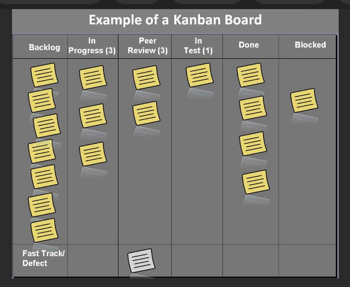

# Unit 1 **Agile Methodology**

1. The *Agile software development is group of software development methods based on iterative and incremental* where requirments and solution was through collaboration between self organizing cross functional teams.

2. *Agile software development promotes adaptive planning, evolutionary development, timebox iterative approach* and encourages rapid and flexinle response to change

## Theories for Agile Management

Why Agile?

    1. Making changes was hard
    2. No focus on clients
    3. Hard to measure project progress
    4. Until end of project, no working software is released or produced
    5. Wasn't suitable for long and ongoing project

Agile Process model

    "Agile process model" refers to the Software development based on iterative development
    
    "Agile" is much swift and versatile than traditional software development methods

Phases of Agile Model:

    1. Requirement gathering
    2. Design requirements
    3. Construction and iteration
    4. Testing
    5. Deployment
    6. Feedback

1. Traditional vs Agile Model

    | Traditional | Agile |
    |-------------|-------|
    |In traditional approach estimates once done are not revised| Agile estimates and plans are revisited in every iteration, which brings it more close to reality|
    |In traditional approach, the project manager will create a project plan for tasks with all the dependencies mapped out and team members assigned|It’s a complete team effort, complete team in involved|
    |Estimating in Traditional project management is usually task-based|Estimating in agile project management is typically feature-based, such as "find a flight by source and destination city," are estimated in their entirety|
    |Users are not involved much|Users are involved from the very beginning|
    | More towards Sequential | Iterative |

## Different Types of Agile Methodologies

1. The Kanban system

        a. The phrase ‘Kanban,' which comes from the Japanese language, means “visual board or signboard” and is linked to the concept of “just in time”! 
        b. Initially established as a lean manufacturing method, the Kanban concept has gradually found its way into agile software development teams. 
        c. This method develops and manages projects using visual methods
        d. Kanban projects are managed with the use of a Kanban Board, which is separated into columns to illustrate the software development process flow. 
        e. This increases team visibility by allowing them to see progress through each stage of production and prepare for impending activities in order to deliver the product "just in time"!

    

2. Scrum: A software development methodology

        a. The agile scrum development approach, which is portrayed through numerous development cycles, is one of the most common agile methodology examples. 
        b. Scrum, like Kanban, divides the development process into stages or cycles called sprints. Each sprint's development time is maximised and devoted, allowing only one sprint to be managed at a time. 
        c. Scrum and agile techniques emphasise ongoing deliverables, therefore this strategy allows designers to alter priorities to guarantee that any sprints that are incomplete or overdue receive further attention. 
        d. The Scrum Team has dedicated project responsibilities such as a scrum master and a product owner, with daily scrums where activities are harmonised to determine the best method to implement the sprint

3. XP (Extreme Programming)

        a. Extreme Programming (XP) is a software development process that prioritises collaboration, communication, and feedback. 
        b. It emphasises continuous improvement and client happiness. This strategy, like scrum, makes use of sprints, or short development cycles. This is created by a group of people in order to produce a productive and efficient workplace
        c. In Extreme Programming, the project is tested from the beginning by gathering input that improves the system's output. This also serves as a spot check to ensure that any consumer requests are easily implemented.
        d. In a circumstance where clients have frequent and fluctuating expectations, the Extreme Programming technique comes in handy.

4. Crystal

        a. Crystal is a series of smaller agile development approaches that include Crystal Yellow, Crystal Clear, Crystal Red, Crystal Orange, and more, and was introduced by Mr Alistair Cockburn, one of the key figures in establishing the Agile credo for software development. 
        b. Each has its own unique structure, which is defined by criteria including system criticality, team size, and project priorities. 
        c. The type of crystal agile methodology is chosen according to the nature of the project or system criticalities, such as Comfort (C), Essential Money (E), Discretionary Money (D), and Life (L). Crystal, like other Agile approaches, focuses on timely product delivery, regularity, minimal administration with high user interaction, and customer satisfaction. 
        d. The Crystal family believes that each system or project is unique, necessitating the use of a variety of techniques, processes, and policies to obtain the best results, giving them the title of agile methodology's lightest approaches.

5. Dynamic Systems Development Method (DSDM)

        a. The Dynamic Systems Development Method was created in response to the demand for a common industry charter for the rapid delivery of software. 
        b. DSDM provides a comprehensive structure that can be developed and adjusted to plan, execute, manage, and expand software development processes. 
        c. The DSDM believes that project modifications should always be expected, and quality and timely delivery should never be negotiated, based on a business-driven strategy and eight principles.

6. Lean

        a. Although it is a deeply adaptive, evolving methodology with the absence of fixed principles, laws, or techniques.
        b. It is an iterative, agile methodology that leads the team on addressing client values through persuasive value stream mapping
        c. In comparison to the hierarchical flow of control, Lean offers each individual and small team decision-making authority

    The **Core Lean Principles** are

    * Uninterrupted advancement
    * Respect for other people
    * Eradicate waste
    * Rapid delivery
    * Knowledge-making and
    * Defer commitment

## Agile Manifesto and Principles

Manifesto for **Agile Software Development**

        Individuals and interactions over processes and tools
        Working software over comprehensive documentation
        Customer collaboration over contract negotiation
        Responding to change over following a plan

The **Agile principles**

        a. Welcome changing requirements, even late in development. 
        
        b. Agile processes harness change for the customer's competitive advantage.

        c. Deliver working software frequently, from a couple of weeks to a couple of months, with a preference to the shorter timescale.

        d. Business people and developers must work together daily throughout the project.

        e. Build projects around motivated individuals. 
        
        f. Give them the environment and support they need, and trust them to get the job done.

        g. The most efficient and effective method of conveying information to and within a development team is face-to-face conversation.

        h. Working software is the primary measure of progress. Agile processes promote sustainable development. The sponsors, developers, and users should be able to maintain a constant pace indefinitely.

        i. Continuous attention to technical excellence and good design enhances agility.

        j. Simplicity--the art of maximizing the amount of work not done--is essential.

        k. The best architectures, requirements, and designs emerge from self-organizing teams.

        l. At regular intervals, the team reflects on how to become more effective, then tunes and adjusts its behavior accordingly

## Agile Project Management

    a. Definition: Agile project management is an iterative approach to software development projects and ensures feedback can be acted on quickly.
 
    b. The responsive changes can be made at each stage of a sprint or product cycle. 

    c. This allows project teams to adopt agile project management methodologies to work quickly and collaboratively within the timeframe and budget of a project.

## Agile Project Interactions

Iteractions can be done by,

        a. Face-to-Face: Face-to-face communication will usually be the most effective way of communicating, either with individuals or with a small-to-medium sized group (as a workshop or a meeting). 
        b. Conferencing: We can either use VC (Video conference) or Teleconference (Phone call)
        c. Chat facilities: For quick interchange of short pieces of information, this can be very effective
        d. Email: It is also an effective channel for broadcasting information to a large group where getting people together is not justifiable, provided email best practice is followed.
        e. Collaborative workspaces: Eg slack
        f. Documents: These are still important in DSDM, for capturing and managing more formal information and artefacts which need to be shared and managed, for example a risk log 

## Ethics in Agile Teams

    Commitment: 
        a. It's not enough to be assigned to a team and agree to try this new agile thing, and it's not enough simply to be dedicated. 
        b. One must also be committed to doing whatever is necessary to meet the goals outlined and to take the authority to do so to heart. 
        c. It means "to carry into action deliberately" (Merriam-Webster) or, as Yoda says, "Do, or do not. There is no try."

    Focus: 
        a. Don't get sidetracked. Remember what you committed to do, and focus your energies on fulfilling that promise. 
        b. Distractions are not limited to the obvious things like email and unrelated meetings. They may also be things like creating documentation

    Openness: 
        a. Openness is about keeping the project status highly visible to everyone all the time. 
        b. Anyone who is interested should be able to look at a wall, a wiki page, or a dashboard in an agile project management tool and see how many features have been completed, what's currently being worked on, and the goals of the iteration and release.
        c. Communication: People on the team must talk to each other. This gets harder to do the more geographically separated the team is, but with tools like Skype, teams can talk to one another easily and cheaply. 
        d. The point is that team members must not rely on email and documentation alone. Verbal communication is required to clarify ideas, solve complex problems, answer questions quickly, and help team members coordinate work efforts.

    Simplicity: 
        a. "What is the simplest thing that could possibly work?" Then they should do that thing. Because agile approaches develop code in increments each iteration, the thought is that it is better to develop something simple that may have to be expanded later if needed, rather than spend a large amount of time now developing a solution that's more complicated and may, in fact, not be necessary.

    Feedback: 
        a. As stated earlier, our number one obligation is to provide value to the customer. 
        b. In order to do that, we must obtain frequent feedback from the customer or customer representative in order to make sure that the product we are building is meeting their expectations. And if it is not, we have the information we need now in order to make corrections. 
        c. Extending this meaning of feedback to include feedback from the system itself in the form of unit, functional, and performance tests run frequently in each iteration.

    Courage: In order to accept the authority and accountability for the delivery of the product, the team members all need courage. From the courage to make decisions to the courage to say no, this is a foundational value that gives rise to all the others.

    Respect: 
        a. Each team member must begin by agreeing that everyone deserves to be treated with respect. 
        b. Many teams clarify this with working agreements that outline ways in which they choose to work together.

## Agility in Design and Testing

1. Agility in design

2. Agility in testing

## Agile Documentations

## Agile Drivers, Capabilities and Values
