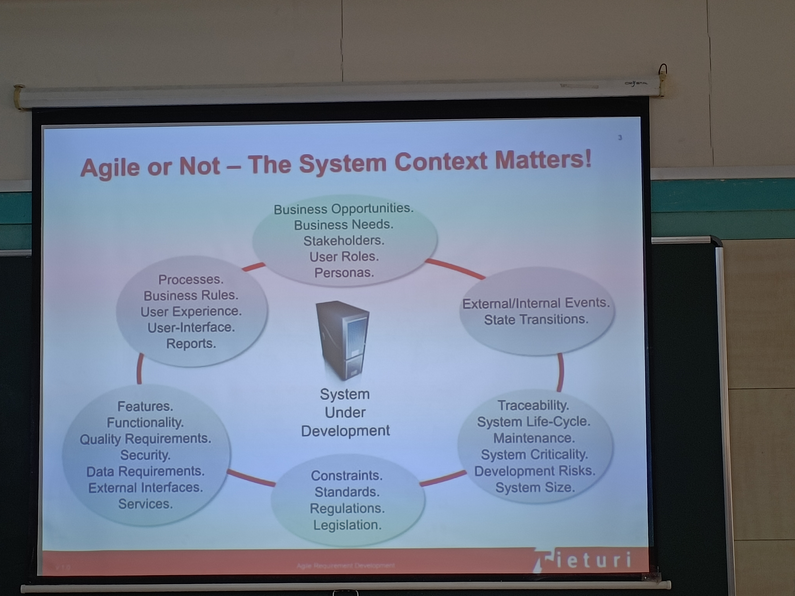
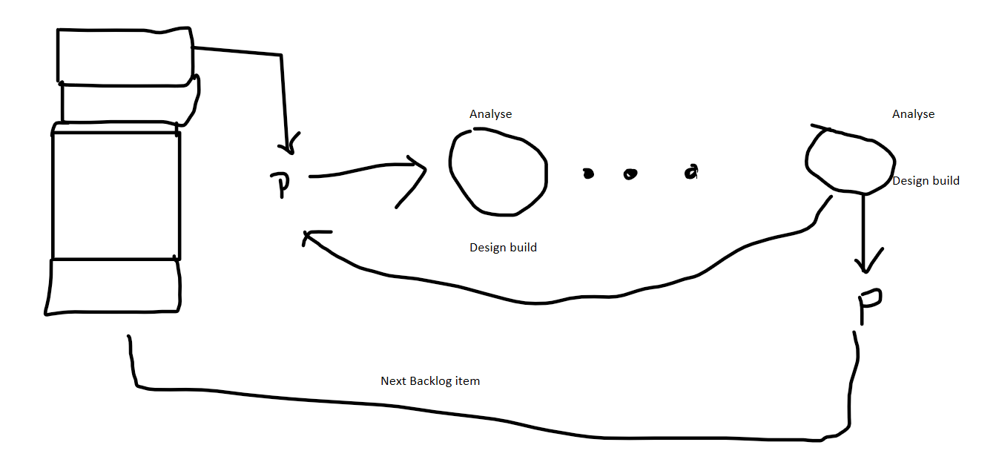

# Unit 2 *Agile Processes*

## Agile on different levels

A. Steering development

B. Requirements Development

    1. Requiremnt Analysis

    2. Requiremnt Elication 

For analysis of requirements UML Diagrams are used example **storyboard**, **Use Case Diagram**

C. Architectures Design *implimentation*

D. Testing

## Some Agile practice

* Team **Efforts**

## SCRUM

    1. Scrum is a framework for project management commonly used in software development, although it has been used in other fields including research, sales, marketing and advanced technologies
    2. Scrum is based on iterative incremental development, in which requirements and solutions are delivered in short cycles called sprints

There are three roles in Scrum: Scrum Master, Product Owner, and Development Team.

* The Scrum Master is responsible for ensuring a Scrum team is operating as effectively as possible with Scrum values. This means they keep the team on track, plan and lead meetings, and work out any obstacles the team might face.

* The Product Owner ensures the Scrum team aligns with overall product goals. They understand the business needs and customer expectations, and prioritize the work for the Development Team.

* The Development Team delivers the work through the sprint. They are self-organizing and cross-functional, meaning they decide how to do their work and have all the skills needed to complete it

Very **Important**

What is sprint?

    1. A sprint is a time-boxed period of work that lasts one month or less
    2. The Scrum guide states that the sprint length should be limited to one calendar month (4 weeks), but there is no lower limit prescribed
    3. However, it is ideal to have 2-week sprints, as they allow for more frequent feedback and adaptation
    4.  A sprint should be long enough to produce a potentially releasable product increment, but short enough to limit risk
    5. Sprint planning meet: product backlog -> Sprint backlog -> Task -> Development in Progress -> Done

The **SCRUM PRACTICES**

* Product & release backlog

* Burn-down chart

* Sprint backlog

* Sprint planning

* Scrum master + sprint

Note:

* Sprint Backlog

## Crystal

    1. Crystal is an agile framework that focuses on the interaction among individuals rather than on the processes and tools used
    2. It is based on two core beliefs: teams can find ways on their own to improve and optimize their workflows, and every project is unique and always changing, which is why that project’s team is best suited to determine how it will work
    3. Crystal is not a single methodology, but a family of methods that vary according to the size, complexity, and criticality of the project

## SCRUM VS CRYSTAL

| Scrum | Crystal |
| ----- | ------- |
| Scrum is more disciplined and does not allow any further changes to be taken up within the sprint scope | Crystal is more permissive and accepts changes as per project and team size requirement |
| Scrum delivers as per the priority of backlog items, meaning it focuses on delivering value to the customer | Crystal delivers as per criticality, meaning it adapts to the level of risk involved in the project |
|Scrum has defined roles (Scrum Master, Product Owner, Development Team) and events (Sprint Planning, Daily Scrum, Sprint Review, Sprint Retrospective) that must be followed by every team | Crystal does not prescribe any set engineering methods or roles, but it is a combination of several agile methodologies that can be tailored to suit different situations |

## Feature-driven development

    1. Feature-driven development (FDD) is an agile framework that organizes software development around making progress on features
    2. Features are more akin to user stories in Scrum
    3. FDD blends a number of industry-recognized best practices into a cohesive whole

FDD has eight core practices that are driven from a customer’s perspective. They are:

* Develop an overall model
* Build a feature list
* Plan by feature
* Design by feature
* Build by feature
* Inspect code regularly
* Report progress visually
* Promote domain experts

## Adaptive software development

    1. Adaptive Software Development (ASD) is an agile framework that grew out of Rapid Application Development (RAD)
    2. It aims to enable teams to quickly and effectively adapt to changing requirements or market needs by evolving their products with lightweight planning and continuous learning

ASD has a three-phase approach: speculate, collaborate and learn

    In each phase, there are specific activities and practices that help teams deliver software that meets customer needs and expectations

* Speculate:

    1. This is where the project is initiated and planned.
    2. The project plan uses project features as a basis for estimation and scheduling. The team sets up a vision, mission, goals and constraints for the project.
    3. The speculation phase acknowledges that uncertainty is inevitable and plans are subject to change.

* Collaborate

        1. This is where the team works together to deliver software features that meet customer needs. It involves communication, cooperation, feedback and self-organization among team members1. 
        2. The team also collaborates with customers and stakeholders to ensure alignment of expectations and requirements. 
        3. The collaborate phase emphasizes that people are more important than processes or tools.

* Learn:

        1. This is where the team reflects on their work and learns from their successes and failures. It involves reviewing, evaluating, measuring and reporting on project outcomes. 
        2. The team also learns from customer feedback and adapts their plans accordingly. 
        3. The learn phase emphasizes that continuous improvement is essential for delivering quality software.

## Extreme Programming

* Extreme programming (XP) is a software development methodology intended to improve software quality and responsiveness to changing customer requirements

* It is a type of agile software development that advocates frequent releases in short development cycles, intended to improve productivity and introduce checkpoints at which new customer requirements can be adopted

* Some of the core values of XP are communication, simplicity, feedback, respect, and courage

* XP also implements a set of engineering practices such as test-driven development, pair programming, refactoring, continuous integration, and collective ownership

* XP aims to produce higher quality software and higher quality of life for the development team

* XP Lifecycle

    1. XP is an agile methodology that is based on the principle of iterative cycles

    2. It repeats several times during a project until the final product is done

    3. XP lifecycle includes

        A. Planning: This is the first stage where the customer defines their requirements and priorities, and the development team estimates time and cost for each feature

        B. Designing: This is the stage where the developers design simple and elegant solutions for each feature, using diagrams, models, prototypes, or code snippets

        C. Coding: This is the stage where the developers write clean and testable code for each feature, following coding standards and conventions, using pair programming and refactoring techniques

        D. Testing: This is the stage where the developers write automated unit tests and acceptance tests for each feature, using test-driven development approach, ensuring high code coverage and quality

        E. Listening: This is the stage where the developers get feedback from the customer and stakeholders on each feature, using continuous integration and delivery tools, ensuring that they meet their expectations and needs

        These stages are repeated for each iteration until all features are completed

* XP Roles

    1. These are the different types of stakeholders that participate in XP projects. They have different responsibilities and expectations

    2. Some of the common roles are

            A. The whole team: This is the self-organized, cross-functional, and co-located group of developers, testers, customers, and coaches that work together to deliver working software

            B. XP coach: This is the person who guides and mentors the team on XP values, principles, and practices. They also help resolve conflicts and remove impediments

            C. On-site customer: This is the person who represents the end-users’ needs and expectations. They write user stories, prioritize features, provide feedback, and accept working software

            D. Programmer: This is the person who writes clean and testable code for each feature, following coding standards and conventions, using pair programming and refactoring techniques

            E. Tester: This is the person who writes automated unit tests and acceptance tests for each feature, using test-driven development approach, ensuring high code coverage and quality

            F. XP tracker: This is the person who monitors and measures the progress and performance of the team using metrics such as velocity, burn-down charts, defect rates etc

            G. Sponsor: This is the person who provides funding and resources for the project. They also support the team’s decisions and protect them from external interference

* XP Practices

    1. There are 12 core practices in XP

            A. Planning game: This is a practice where the customer defines their requirements as user stories with estimates provided by developers. The team then selects a subset of stories for each iteration based on their priorities

            B. Small releases: This is a practice where the team delivers working software to customers frequently (every one or two weeks), with minimal features that provide value

            C. Metaphor: This is a practice where the team uses a common vocabulary to describe the system architecture and design using simple analogies or examples

            D. Simple design: This is a practice where the team designs simple solutions for each feature that meet current requirements without adding unnecessary complexity or functionality

            E. Test-driven development (TDD): This is a practice where developers write automated tests before writing code, and then write code to pass those tests. TDD ensures high code quality and prevents defects

            D. Refactoring: This is a practice where developers improve the structure of existing code without changing its behavior. Refactoring eliminates duplication, reduces complexity, and enhances readability of code

            E. Pair programming: This is a practice where two developers work together on one computer, one writing code while the other reviewing it. Pair programming increases productivity, quality, and knowledge sharing among developers

            F. Collective ownership: This is a practice where every developer can modify any part of the code base without asking for permission or approval. Collective ownership encourages collaboration, responsibility, and accountability among developers

            G. Continuous integration: This is a practice where developers integrate their code changes into a shared repository several times a day, and run automated tests to ensure that the system works as expected. Continuous integration detects integration errors early, reduces rework, and speeds up delivery time

            H. Coding standards: This is a practice where developers follow consistent rules for formatting, naming, commenting, and documenting their code. Coding standards improve readability, maintainability, and communication among developers

            I. Customer feedback: This is a practice where customers provide frequent feedback on working software delivered by the team at regular intervals. Customer feedback helps validate requirements, adjust priorities, and improve quality of software products.
