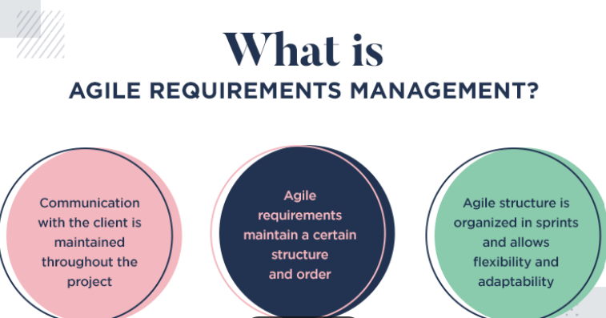

# Unit 3

## Impact of Agile Processes in RE

* Agile processes resolve a paradox of RE – the need to formulate a clear vision of a system in a world of constantly changing requirements

* Agile processes rely on iterative development and frequent communication and feedback with customers and stakeholders

* However, agile RE also faces some challenges such as minimal documentation, negligence of non-functional requirements, difficulties for requirements prioritization and inadequacy of the user stories format

## Current Agile Practices

Agile practices are specific ways in which organizations, teams, and individuals can adopt and use the agile mindset based on the 4 values and 12 principles in the Manifesto for Agile Software Development. Some of these practices include

* Keeping teams small and cross-functional

* Collaborating with the customer and stakeholders

* Keeping a product backlog and prioritizing it

* Estimating and forecasting using story points, planning poker, etc.

* Delivering working software frequently and iteratively

* Testing continuously and automating tests

* Reviewing and retrospecting regularly

* Adapting to changing requirements and feedback

## Variance

In project management, variance can be used to assess the performance of a project in terms of schedule, cost, scope, and quality. In agile project management, variance can be calculated differently depending on the context and the metrics used

* One way to calculate schedule variance in agile is to use the earned value management (EVM) method

* This method compares the budgeted cost of work performed (BCWP) with the budgeted cost of work scheduled (BCWS) using monetary values

        Schedule Variance (SV) = BCWP - BCWS

* A positive SV means that the project is ahead of schedule, while a negative SV means that it is behind schedule

* Another way to calculate schedule variance in agile is to use story points

* Story points are a relative measure of effort or complexity assigned to each backlog item by the team

        Schedule Variance (SV) = Actual Story Points Completed - Planned Story Points

* A positive SV means that the team completed more story points than planned, while a negative SV means that they completed less

However, some agile practitioners argue that schedule variance is not a useful metric for agile projects because it does not reflect the value delivered by the team or the customer satisfaction

They suggest that instead of focusing on schedule variance, agile teams should focus on delivering working software frequently and iteratively, testing continuously and automating tests, reviewing and retrospecting regularly, and adapting to changing requirements and feedback

## RE ( Requirement Engineering ) using Agile

Some of the characteristics of RE using agile are

* Requirements are expressed as user stories that capture who needs what and why

* User stories are prioritized and estimated by the team and stored in a product backlog

* User stories are refined and clarified through conversations with stakeholders

* User stories are implemented and tested in short iterations or sprints
* User stories are validated by stakeholders through demonstrations and reviews

* User stories are adapted to changing needs and expectations

Some of the benefits of RE using agile are

* Requirements are more aligned with customer value and business goals

* Requirements are more flexible and responsive to change

* Requirements are more testable and verifiable

* Requirements are more transparent and visible to all parties

## Managing Unstable requirements using agile

Managing unstable requirements using agile is a challenge that many software projects face

Unstable requirements are those that change frequently or unpredictably due to various factors such as changing customer needs, market conditions, technology evolution, or feedback from users

    "Unstable requirements can cause delays, rework, waste, and dissatisfaction for both the development team and the stakeholders"

Agile methods can also help to cope with unstable requirements by adopting some principles and practices such as

* Embracing change as an opportunity for improvement and innovation

* Delivering working software frequently and incrementally

* Collaborating closely with stakeholders throughout the project lifecycle

* Prioritizing requirements based on value and urgency

* Refining and clarifying requirements through conversations and feedback

* Refactoring and testing code continuously to ensure quality and maintainability

Some of the tools that can support managing unstable requirements using agile are

* Work items: These are artifacts that capture requirements as user stories, tasks, bugs, features, epics, etc. Work items can be created, updated, tracked, prioritized, assigned, linked, commented on using Azure DevOps

* Backlogs: These are lists of work items that represent the scope of work for a project or a team. Backlogs can be organized into different levels such as product backlog (for all work items), iteration backlog (for work items planned for a sprint), portfolio backlog (for work items grouped by themes or objectives) using Azure DevOps

* Boards: These are visual representations of work items that show their status and progress. Boards can be customized to suit different workflows and preferences using Azure DevOps

## Requirement Eliciation

Requirements elicitation is a part of the requirements engineering process, usually followed by analysis and specification of the requirements

It is the practice of researching and discovering the requirements of a system from users, customers, and other stakeholders

Some of the common steps involved in requirements elicitation are

* Preparing for elicitation: This involves collecting relevant documentation, identifying stakeholders, defining objectives, planning activities, and selecting methods for elicitation

* Eliciting software requirements: This involves conducting a series of meetings with various stakeholders using different techniques such as interviews, surveys, workshops, observation, prototyping, etc. to gather information about their needs, expectations, preferences, constraints, assumptions, etc

* Documenting software requirements: This involves recording and organizing the information obtained from elicitation using different formats such as user stories, use cases, scenarios, diagrams, models etc. to create a clear and consistent representation of the requirements

* Validating software requirements: This involves reviewing and verifying the documented requirements with stakeholders using different techniques such as feedback sessions , inspections , testing , etc. to ensure that they are complete , correct , consistent , feasible , testable , traceable , etc

## Agile Requirements Abstraction Model

* The Agile Requirements Abstraction Model (ARAM) is a process model that visualizes and guides the work with requirements all the way from project inception to an adequate product backlog

* It is a process model that bridges traditional requirements engineering and Agile practices

* The goal is to create well-defined and validated requirements in a backlog structure of multiple abstraction levels

## Requirements Management in Agile Environment

* Agile requirements management is a new approach to requirements management that is focused on value and eliminates the need for extensive documentation that has the potential to slow down the project itself

* Instead, it focuses on a collaborative environment that will ensure that everyone is on the same page regarding software features

* Agile requirements management has been growing in popularity over the past few years, with design teams enjoying the added freedom and fresh take on requirements

* The agile way of doing things is all about breaking down the long processes, boosting communication and gaining freedom in the project

## Agile requirement  prioritization

* Agile prioritization is the act of deciding in what order the agile team will work on the requirements in a project

* There are several techniques for agile prioritization, such as

        Must– The must requirements is given the topmost priority.
        Should– Next priority is given to the requirements that are highly desirable, though not mandatory.
        Could– The next priority is given to the requirement that is nice to have.
        Won’t– And the final consideration is given to the requirements which will not work in the process at that point of time

* Weighted Shortest Job First (WSJF): It is a prioritization model used to sequence jobs (for example, Features, Capabilities, and Epics) to produce maximum economic benefit. In SAFe, WSJF is estimated as the Cost of Delay (CoD) divided by the job duration

* Pairwise Comparison: This method involves comparing each requirement with every other requirement and assigning a priority score to each

## Agile Requirements Modeling and Generation

* Agile Requirements Modeling won’t provide development teams with a succinct solution, but it will act as a guide for the final product

* In order to overcome this disadvantage, the Requirements Generation Model (a plan-driven Requirements Engineering model) can be adapted to an agile environment in order to structure the Agile Requirements Engineering process

* Concurrency in Agile Requirements Generation is supported by the Agile Requirements Generation Model

* Each story of one feature can be decomposed into tasks in parallel. Multiple tasks can be developed and tested concurrently

* The advantage of concurrency is that the development of the product progresses faster. As multiple teams are involved and simultaneous efforts to develop the product are made, the product is developed faster
