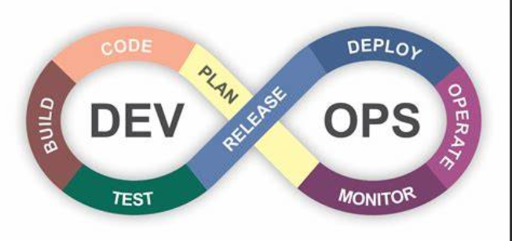

# Unit 4 Devops

## Devops timeline

## What is devops?

    1. DevOps is a software development practice that promotes collaboration between development and operations, resulting in faster and more reliable software delivery
    2. Commonly referred to as a culture, DevOps connects people, process, and technology to deliver continuous value
    3. DevOps integrates and automates the work of software development and IT operations using various tools and stages, such as planning, coding, testing, deploying and monitoring
    4. DevOps is an evolution of the agile model of software development and addresses the gap between developers and operations

## Terms in devops

### Plan

    Software such as docs, MS office, etc are used

### Code + Build

    NPM, Github, Gitlab, NodeJS etc are used

### Test

    Azure

### Release

    Jetkins

### Deploy

    Puppet, chef etc

### Operate

    Slack, splunk etc

### Monitor

    Grafana, graylogs etc

## Devops Roadmap

1. Version Control System

    1. A version control system is a software tool that helps track and manage changes to software code over time
    2. Version control systems also facilitate collaboration among developers, as they can work on different parts of the code without conflicting or overwriting each other’s work

2. Continuous Integration & deployment

    1. Continuous integration (CI) and continuous deployment (CD) are two related practices that aim to improve the software development and delivery process
    2. CI is the practice of integrating code changes from multiple developers into a main repository frequently and automatically, and running automated tests to ensure quality and compatibility

3. Infrastructure as Code (IaC)

    1. Infrastructure as Code (IaC) is a method of defining and provisioning IT infrastructure using code files that describe the desired state and configuration of the resources
    2. IaC enables developers and IT teams to automate and scale the creation and management of infrastructure, such as servers, networks, storage, and databases

4. Configuration management

    1. Configuration management (CM) is a process for establishing and maintaining consistency of a product’s performance, functional, and physical attributes with its requirements, design, and operational information throughout its life
    2. In software development, configuration management is a practice that tracks and controls changes to the software code and its dependencies, such as libraries, frameworks, and configuration files

5. Containerization

    1. Containerization has two distinct meanings. In computing, containerization is a method of packaging software code with only the operating system libraries and dependencies required to run it, creating a single lightweight executable unit called a container
    2. Containers can run on any infrastructure, regardless of the operating system or platform, and are more portable and resource-efficient than virtual machines

6. Observability/ Monitoring

    1. Observability and monitoring are related but distinct concepts that help IT teams to understand and manage the performance and health of their systems. Monitoring is the act of collecting and analyzing predefined data from individual systems, such as metrics, logs, and traces, and translating them into actionable insights
    2. Monitoring tools use dashboards, alerts, and reports to show system performance and usage, and help IT teams to identify or troubleshoot issues

Note: Linux should be perfect

## Devops Skills

DevOps skills are the technical and non-technical abilities that a DevOps engineer needs to perform their role effectively.

* Automation skills

    1. Automation skills are the skills that enable a DevOps engineer to automate various aspects of the software development and delivery process, such as testing, integration, deployment, and monitoring. Automation skills include knowledge of tools and frameworks that support automation, such as Jenkins, GitLab, Azure DevOps, and Travis CI

* Functional Skills

    1. Functional skills are the skills that enable a DevOps engineer to understand the business requirements and goals of the software project, and to communicate and collaborate effectively with other stakeholders. Functional skills include knowledge of agile methodologies, such as Scrum and Kanban, that support DevOps principles

* Technical skills

    1. Technical skills are the skills that enable a DevOps engineer to design, develop, deploy, and maintain high-quality software applications. Technical skills include knowledge of cloud computing platforms and services, such as AWS, GCP, and Azure
    2. Hard skills are YAML, Virtualization, Terraform, Containers, K8, Rancher, Helm & cloud

## Tasks of Devops Engineer

1. Be an excellent sysadmin

2. Deploy virtualization

3. Hands on experience in network & storage

4. knowledge of coding

5. Soft skills

6. Understanding of automation skills

7. Knowledge of Testing

8. Security

## Devops issues

    1. Defects can be released into production

    2. Issues related to environment can be there

## Devops Delivery Pipelines

* When preparing to implement the DevOps methodology, you should assess the tools you have on hand to determine which ones, if any, can support the application delivery process and what additional tools you might need.

* Some of benefits are

    1. Faster delivery of features and bug fixes

    2. Higher quality and reliability of software

    3. Improved collaboration and communication among teams

    4. Reduced costs and risks of software development

Some of the tools that can help you create a DevOps delivery pipeline are

* Azure Pipelines: A cloud-based service that provides continuous integration and continuous delivery for any platform and cloud

* Jenkins: An open source automation server that can run various tasks such as building, testing and deploying software

* Docker: A platform that enables you to create, run and share applications using containers

* Ansible: A tool that automates configuration management, application deployment and orchestration

* Prometheus: A tool that monitors and alerts on the performance and availability of your systems and application

## Devops lifecycle

1. Green is Dev & Yellow is Ops

2. Integration is a development practice that integrates not only the code but all other stages and components of the DevOps ecosystem and reports frequently By integrating regularly, we can detect the errors quickly, and locate them more easily

3. A DevOps ecosystem consists of various tools and services that support different aspects of the DevOps lifecycle, such as planning, development, testing, delivery and operations

4. Some of the categories of tools in a DevOps ecosystem are

    1. Source control: Tools that manage and track changes to code, such as Git, Azure Repos, GitHub, etc

    2. Build automation: Tools that compile, test and package code into executable artifacts, such as Jenkins, Azure Pipelines, Maven, Gradle, etc

    3. Containerization: Tools that create and run applications using isolated environments, such as Docker, Kubernetes, Azure Container Registry, etc

    4. Configuration management: Tools that automate the provisioning and configuration of infrastructure and applications, such as Ansible, Chef, Puppet, Terraform, etc

    5. Monitoring: Tools that collect and analyze metrics and logs from systems and applications, such as Prometheus, Grafana, Azure Monitor, Splunk, etc

Note: CI (continous integration is till build) & CD (continuous deployment is after that)

## Continuous Things

Devops **lifecycle divides the SDLC lifecycle** into **Continous Development, Continuous Testing, Continuous Deployment, Continuous Integration**

* Continuous Development

        Executable file is created after CD

* Continuous Integration

        Using Jetkins CI can be done

* Continuous Deployment

        Code is built, the environment or the application is containerized & is pushed on to the desired server

* Continuous Testing

        Integration tools send the failure message to developer or pushes the code to production

* Continuous Monitoring

        This stage monitors the deployed application for bugs or crashes. It also collects user feedback

Questions

1. Explain devops

2. Devops benefits
