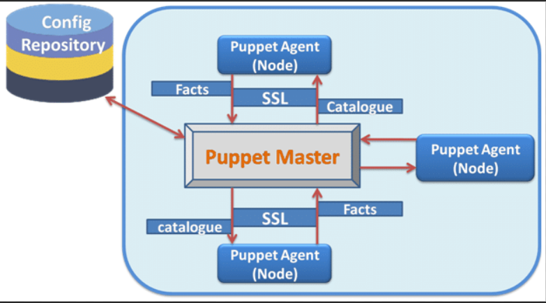

# Unit 6 Puppet

## Puppet Introduction

* Puppet is an open-source configuration management tool that helps you automate the management of your servers

* Puppet uses a declarative language called Puppet DSL to define the desired state of your servers

* Puppet then automatically applies the necessary changes to bring your servers into the desired state

### What puppet can do?

    1. Automate the deployment of new servers
    2. Keep your servers up to date with the latest software
    3. Ensure that your servers are configured consistently
    4. Solve problems quickly and easily

## Puppet Architecture



* Puppet has a client-server architecture.

* The client is called the Puppet agent, and the server is called the Puppet master

* The Puppet agent is installed on each server that you want to manage. The Puppet agent periodically checks in with the Puppet master to get its configuration

* The Puppet master is responsible for storing the configuration of all of the servers that it manages

* The Puppet master and the Puppet agents communicate using a secure protocol called SSL. This ensures that the communication between the two is secure and cannot be intercepted by unauthorized parties

* Puppet uses a declarative language called Puppet DSL to define the desired state of your servers

* Puppet then automatically applies the necessary changes to bring your servers into the desired state

### Components of Puppet architecture

    1. Puppet Master: The Puppet master is the central server in a Puppet deployment. It stores all of the configuration data for the managed nodes, and it coordinates the communication between the nodes and the modules.
    2. Puppet Agent: The Puppet agent is installed on each managed node. It is responsible for communicating with the Puppet master, retrieving its configuration, and applying the configuration to the node.
    3. Puppet Modules: Puppet modules are reusable blocks of configuration code that can be used to configure a wide variety of systems. They are stored on the Puppet master, and they are retrieved by the Puppet agents when they need to configure a new system.
    4. Puppet Facter: Puppet Facter is a service that runs on each managed node. It collects information about the node, such as its operating system, hardware, and software, and it makes this information available to the Puppet master and the Puppet agents.

## Basic Puppet Terminologies

1. Agent: A Puppet agent is a software component that runs on a managed node. It is responsible for communicating with the Puppet master, retrieving its configuration, and applying the configuration to the node.

2. Catalog: A catalog is a collection of resources that define the desired state of a node. It is generated by the Puppet master and sent to the agent.

3. Certificate: A certificate is a digital file that binds a public key to a hostname or IP address. It is used to authenticate the identity of the Puppet agent to the Puppet master.

4. Facter: Facter is a service that runs on each managed node. It collects information about the node, such as its operating system, hardware, and software, and it makes this information available to the Puppet master and the Puppet agents.

5. Manifest: A manifest is a file that contains Puppet code. It is used to define the desired state of a node.

6. Module: A module is a collection of manifests that can be used to configure a particular type of system. Modules are stored on the Puppet master and are retrieved by the Puppet agents when they need to configure a new system.

7. Puppet master: The Puppet master is the central server in a Puppet deployment. It stores all of the configuration data for the managed nodes, and it coordinates the communication between the nodes and the modules.

8. Puppet resource: A Puppet resource is a unit of configuration that can be managed by Puppet. Resources can be files, directories, packages, services, users, groups, and more.
Puppet run: A Puppet run is the process of a Puppet agent retrieving its configuration from the Puppet master and applying it to the node.

9. Rakefile: A Rakefile is a file that contains Rake tasks. Rake tasks are used to automate common tasks, such as running Puppet runs, managing Puppet modules, and generating documentation.

10. SSL: SSL (Secure Sockets Layer) is a cryptographic protocol that is used to secure communications between two parties. Puppet uses SSL to secure the communication between the Puppet master and the Puppet agents.

11. Variable: A variable is a named value that can be used in Puppet code. Variables can be used to make Puppet code more reusable and to improve its performance.

## Puppet Language Constructs

* Puppet Language Constructs are the building blocks of Puppet code

* They allow you to express complex logic and control flow in a concise and readable way

* Some of the most common Puppet Language Constructs include

        1. Variables: Variables store values that can be used throughout your code
        2. Conditionals: Conditionals allow you to execute different code depending on the value of a variable or expression
        3. Loops: Loops allow you to execute the same block of code multiple times
        4. Functions: Functions allow you to group together related code and reuse it throughout your application
        5. Classes: Classes are a way of grouping together related resources and defining their desired state
        6. Templates: Templates are a way of generating text from data

## Puppet Module


* Puppet Module is a collection of files, classes, templates, and resources. Each module handles a specific task in your infrastructure, such as installing and configuring a piece of software. Since modules allow you to divide your code into multiple manifests, it is very helpful in organizing your puppet code

* Modules serve as the basic building blocks of Puppet and are reusable and shareable. Modules contain Puppet classes, defined types, tasks, task plans, functions, resource types and providers, and plug-ins such as custom types or facts

* Modules must be installed in the Puppet modulepath

* You can download and install modules from the Puppet Forge

## Puppet Environment

* In Puppet, an environment is a logical grouping of nodes that share a common set of configuration data

* Puppet environments are implemented by creating a separate directory for each environment under the Puppet code directory.

* This directory contains the manifests and modules that define the desired state of the nodes in that environment.

* When a node is in a particular environment, Puppet will only apply the manifests and modules that are in the corresponding environment directory

* Puppet environments can also be used to control access to nodes

### Benefits of using Puppet environments

1. Organization: Environments can help you organize your nodes by function, environment, or other criteria. This can make it easier to manage your nodes and to find the information you need.
2. Control: Environments can be used to control access to nodes. This can help you to ensure that only authorized users have access to sensitive nodes.
3. Efficiency: Environments can help you to be more efficient with your configuration management. By using environments, you can avoid having to apply the same configuration to multiple nodes.
4. Security: Environments can help you to improve the security of your configuration management. By using environments, you can isolate nodes from each other and prevent unauthorized changes from being made.

## Node Classification


* Node Classification in puppet is the action of assigning classes to nodes, each class containing the resources we want to manage on a node

* You can classify nodes using an **external node classifier (ENC)**, which is a script or application that tells Puppet which classes a node must have. It can replace or work in concert with the node definitions in the main site manifest (site.pp)

* An external node classifier can reference any data source you want, including PuppetDB

* Node groups are organized in a parent-child hierarchy and nodes inherit classes, parameters, variables, and rules from their ancestor groups

## Classes in puppet

* A class is a named block of Puppet code that is stored in a module

* Classes are used to group together related resources and define their desired state

* When a node is being configured by Puppet, the classes that are defined in the node's manifest file are applied in order. This allows you to define a hierarchy of classes, where each class can depend on the resources that are defined in other classes

```puppet
class web_server {

  package { 'apache2':
    ensure => installed,
  }

  service { 'apache2':
    ensure => running,
    enable => true,
  }

  file { '/etc/apache2/sites-available/default':
    ensure => file,
    source => 'puppet:///modules/web_server/default.conf',
  }
}
```

## Puppet Templates

* Puppet Template is a document that combines code, data, and literal text to produce a final rendered output

* The goal of a template is to manage a complicated piece of text with simple inputs. In Puppet, you’ll usually use templates to manage the content of configuration files (via the content attribute of the file resource type)

* Puppet supports two templating languages: Embedded Puppet (EPP) and Embedded Ruby (ERB). EPP uses Puppet expressions in special tags, while ERB uses Ruby code in tags

* You can use Puppet variables in both EPP and ERB templates to customize their output

* EPP files should have the .epp extension, and ERB files should have the .erb extension
