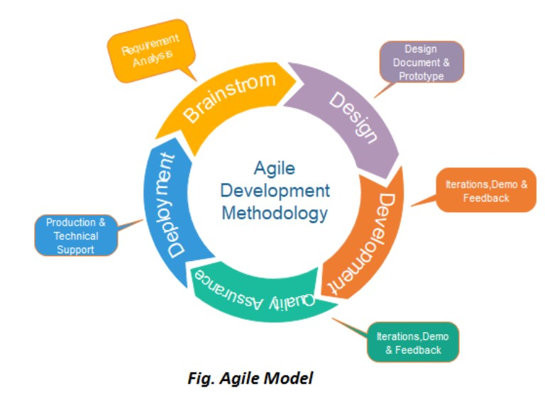

# Lecture 4 (13 FEB)

## Name --> Siddharth Sutar

## Div --> C

## Roll no --> 323054 & PRN No --> 22010517

Q1. What is agile methods?

    a. It refers to quick adaptable something which is a software development approach based on iterative development is referred as agile process model
    b. Agile approaches divide project into smaller iterative parts/sections to avoid long term planning
    c. There are four sections
        i. Interaction between individuals and groups about processes and tools
        ii. Working software take precedence throughout documentation
        iii. Collaboration with customer is preferred over contract negotitaions
        iv. Adapting to change with accordance with strategy

Q2. What are the phases of agile model?

    i. Requirement gathering
        a. In this phase, you must define the requirements. 
        b. We should explain business opportunities and plan the time and effort needed to build the project. Based on this information, you can evaluate technical and economic feasibility
    ii. Designing the the requirements
        a. When you have identified the project, work with stakeholders to define requirements. 
        b. We can use the user flow diagram or the high-level UML diagram to show the work of new features and show how it will apply to your existing system
    iii. Develop iteration
        a. When the team defines the requirements, the work begins.
        b. Designers and developers start working on their project, which aims to deploy a working product
        c. The product will undergo various stages of improvement, so it includes simple, minimal functionality
    iv. Test
        a. In this phase, the Quality Assurance team examines the product's performance and looks for the bug.
    v. Deployment
        a. In this phase, the team issues a product for the user's work environment
    vi. Review / Feedback
        a. After releasing the product, the last step is feedback. In this, the team receives feedback about the product and works through the feedback

Q3. What are agile testing methods

    i. Scrum
        a. The agile scrum development approach, which is portrayed through numerous development cycles, is one of the most common agile methodology examples. 
        b. Scrum, like Kanban, divides the development process into stages or cycles called sprints. Each sprint's development time is maximised and devoted, allowing only one sprint to be managed at a time. 
        c. Scrum and agile techniques emphasise ongoing deliverables, therefore this strategy allows designers to alter priorities to guarantee that any sprints that are incomplete or overdue receive further attention. 
        d. The Scrum Team has dedicated project responsibilities such as a scrum master and a product owner, with daily scrums where activities are harmonised to determine the best method to implement the sprint
    ii. Crystal
        a. Crystal is a series of smaller agile development approaches that include Crystal Yellow, Crystal Clear, Crystal Red, Crystal Orange, and more, and was introduced by Mr Alistair Cockburn, one of the key figures in establishing the Agile credo for software development. 
        b. Each has its own unique structure, which is defined by criteria including system criticality, team size, and project priorities. 
        c. The type of crystal agile methodology is chosen according to the nature of the project or system criticalities, such as Comfort (C), Essential Money (E), Discretionary Money (D), and Life (L). Crystal, like other Agile approaches, focuses on timely product delivery, regularity, minimal administration with high user interaction, and customer satisfaction. 
        d. The Crystal family believes that each system or project is unique, necessitating the use of a variety of techniques, processes, and policies to obtain the best results, giving them the title of agile methodology's lightest approaches.
    iii. Dynamic software development methods
        a. The Dynamic Systems Development Method was created in response to the demand for a common industry charter for the rapid delivery of software. 
        b. DSDM provides a comprehensive structure that can be developed and adjusted to plan, execute, manage, and expand software development processes. 
        c. The DSDM believes that project modifications should always be expected, and quality and timely delivery should never be negotiated, based on a business-driven strategy and eight principles.
    iv. Feature driven development
        a. Feature-driven development (FDD) is an iterative and incremental software development process. It is a lightweight[according to whom?] or Agile method for developing software
        b. Feature-driven development (FDD) is an iterative and incremental software development process. It is a lightweight[according to whom?] or Agile method for developing software
        c. The FDD project starts with a high-level walkthrough of the scope of the system and its context.
    v. Lean software development
        a. Although it is a deeply adaptive, evolving methodology with the absence of fixed principles, laws, or techniques.
        b. It is an iterative, agile methodology that leads the team on addressing client values through persuasive value stream mapping
        c. In comparison to the hierarchical flow of control, Lean offers each individual and small team decision-making authority
    vi. Kanban
        a. The phrase ‘Kanban,' which comes from the Japanese language, means “visual board or signboard” and is linked to the concept of “just in time”! 
        b. Initially established as a lean manufacturing method, the Kanban concept has gradually found its way into agile software development teams. 
        c. This method develops and manages projects using visual methods
        d. Kanban projects are managed with the use of a Kanban Board, which is separated into columns to illustrate the software development process flow. 
        e. This increases team visibility by allowing them to see progress through each stage of production and prepare for impending activities in order to deliver the product "just in time"!

