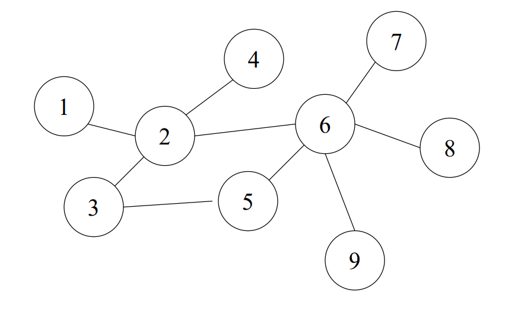
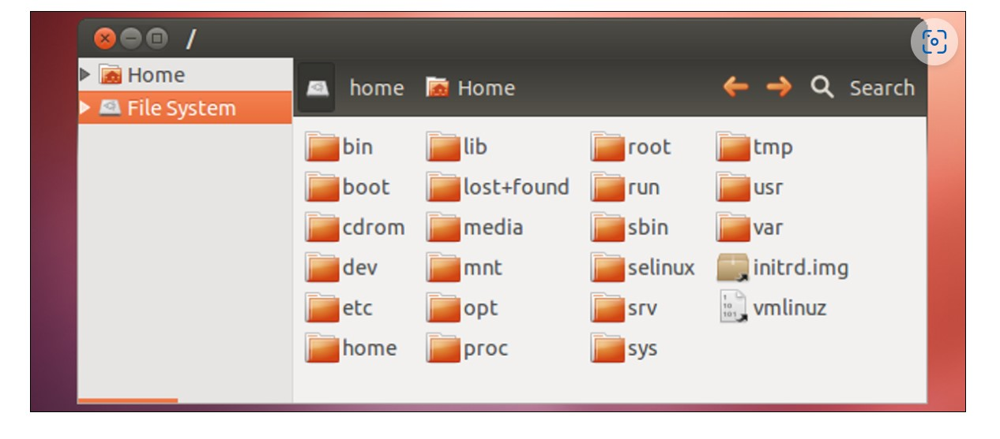

# Cloud Computing

## Unit 1

### Networking part

* Network – collection of nodes and links that
cooperate for communication

* Nodes – computer systems

* Links – connections for transmitting data

* Protocol – standards for formatting and
interpreting data and control information

Note: Nodes can have address



* This network is connected by wires which has Attenuation, Delay, Noise & Nodes can be faulty as well

How Data is taken accross network

* Split up big files into small pieces called as packets

* Each packet is sent individually

* For packet forwarding routes are used

### TCP & OSI layers

* OSI layers


    Each layer abstracts the services of various lower layers, providing a
uniform interface to higher layers

* TCP layer

    Provide reliability, ordering on the unreliable, unordered IP

     When you send
data using TCP, you think about bytes,
not about packets

Here Connections are identified by the tuple:
{

    – IP source address

    – IP destination address

    – TCP source port

    – TCP destination port 
}

    1. Allows multiple connections
    2. Well known ports for some applications: (web: 80, telnet: 23, mail:25, dns: 53)
    3. TCP's sliding window is known for better performance & simple reliability

Note:


The **IP SUBNETING**

The *subnet mask* divides the IP address into the host and network addresses, defining which parts belong to the device and which to the network.

An IP address and a subnet mask provide complete information and numerical identification to any device connecting to the network. Therefore, both types of addresses are always used in conjunction and have a length of 32 bits. These 32 bits are further split into four sections. Each portion is referred to as an Octet and includes 8 bits.

For example:- 192.168.100.1 255.255.255.0.

Here 192.168.100.1 is IP Address and 255.255.255.0 is Subnet Mask.

When you put the IP address and the subnet mask together, you can separate the network and host parts of the address. Here subnet mask is 255.255.255.0, so 192.168.100.0 will become Network Address, and the Host Address will become 0.0.0.1

### Firewall

A firewall is a network security device that monitors and controls incoming and outgoing network traffic based on a set of security rules

> What firewall does?

    1. A firewall typically establishes a barrier between a trusted network and an untrusted network, such as the Internet
    2. Firewalls can help prevent malicious activity and unauthorized access to a network

### Stateful Multilayer

* Stateful multilayer inspection firewalls
combine the aspects of the other three types
of firewalls

* They filter packets at the network layer,
determine whether session packets are
legitimate and evaluate contents of packets
at the application layer

### Level of transformation

    Problem -> Algorithm -> PL -> Runtime System -> ISA (Architecture) -> Microarchitecture -> logic -> circuit -> electron

Note: **Linux kernel resides in /boot/vmlinuz**

(vm = virtual memory, lin = linux, z = zip)

### Operating System

    It provides memory management, file management, Hardware Abstraction layer, Scheduling and other facilities

### Linux File System



### Shell Script & All About shell


> The “Shell” is simply another program on top of the kernel which provides a basic human-OS interface

* It is a command interpreter

* Types of shell

1. sh Bourne Shell (Original Shell) (Steven Bourne of AT&T)
2. bash Bourne Again Shell (GNU Improved Bourne Shell)
3. csh C-Shell (C-like Syntax)(Bill Joy of Univ. of California)
4. ksh Korn-Shell (Bourne+some C-shell)(David Korn of
AT&T)
5. tcsh Turbo C-Shell (More User Friendly C-Shell).

* Scripting

        A shell script is a script written for the shell

* Two key ingredients

    1. UNIX/LINUX commands

    2. Shell programming syntax

* Commands

    1. cd Change the current directory

    2. chmod Change the file permissions

    3. chown Change owner of file

    4. chgrp Change group

    5. cp Copy a file from one location to another

    6. ls List contents of a directory

    7. mkdir Make a directory

    8. mv Move or rename a file or directory

    9. find Find files

    10. locate File locating program that uses the slocate database

    11. pwd Print or list the present working directory with full path

    12. rmdir Remove a directory. The directory must be empty

    13. touch Change file timestamps to the current time. Make the file if it doesn't exist

    14. vi Editor with a command mode and text mode

    15. gedit GUI Text Editor

    16. tail Look at the last 10 lines of a file

    17. head Look at the first 10 lines of a file

```bash
#! /bin/sh
# The first example of a shell script
directory=`pwd`
echo Hello World!
echo The date today is `date`
echo The current directory is $directory
```

Output:

    $ ./myfirstscript.sh
    
    Hello World!
    The date today is Mon Mar 8 15:20:09 EST 2010
    The current directory is /netscr/shubin/test

Note: chmod command must be used to change the files’ mode to be executable

We can **declare variables, use positional parameters, write functions & use loops** in shell script

1. Positional parameters

        ▪ When a shell script is invoked with a set of command line parameters each of these parameters are copied into special variables that can be accessed.
        ▪ $0 This variable that contains the name of the script $1, $2, ….. $n 1 st, 2nd 3 rd command line parameter
        ▪ $# Number of command line parameters
        ▪ $$ process ID of the shell
        ▪ $@ same as $* but as a list one at a time (see for loops later )
        ▪ $? Return code ‘exit code’ of the last command
        ▪ Shift command: This shell command shifts the positional parameters by  one towards the beginning and drops $1 from the list. After a shift $2 becomes $1 , and so on … It is a useful command for processing the input parameters one at a time.

2. Variables

    ```bash
    # Ashell variable take on the generalized form 
    # variable=value (except in the C shell).
    $ set x=37; echo $x
    37
    $ unset x; echo $x
    x: Undefined variable.
    ```

3. Operators

    

    Note: for equal we use eq here, for > we will gt, for < it is lt, ne means not equals, in case of numbers

4. If else

        if command executes successfully 
        then
        execute command 
        elif this command executes successfully 
        then
        execute this command 
        and execute this command 
        else
        execute default command
        fi

    Example

    ```bash
    if [ “$1” == “Monday” ] 
    then
        echo “The typed argument is Monday.”
    elif [ “$1” == “Tuesday” ]
    then 
        echo “Typed argument is Tuesday”
    else
        echo “Typed argument is neither Monday nor Tuesday”
    fi
    ```

5. File operations

    

6. loops

    for loop

    ```bash
    for i in 3 2 5 7 
    do
        echo " $i times 5 is $(( $i * 5 )) "
    done
    ```

    while loop

    ```bash
    while test "$i" -gt 0 # can also be while [ $i > 0 ]
    do
        i=`expr $i - 1`
    done

    ```

7. Function

    ```bash
    #!/bin/sh 
    sum() {
    x=`expr $1 + $2`
    echo $x
    }
    sum 5 3
    echo "The sum of 4 and 7 is `sum 4 7`"
    ```
