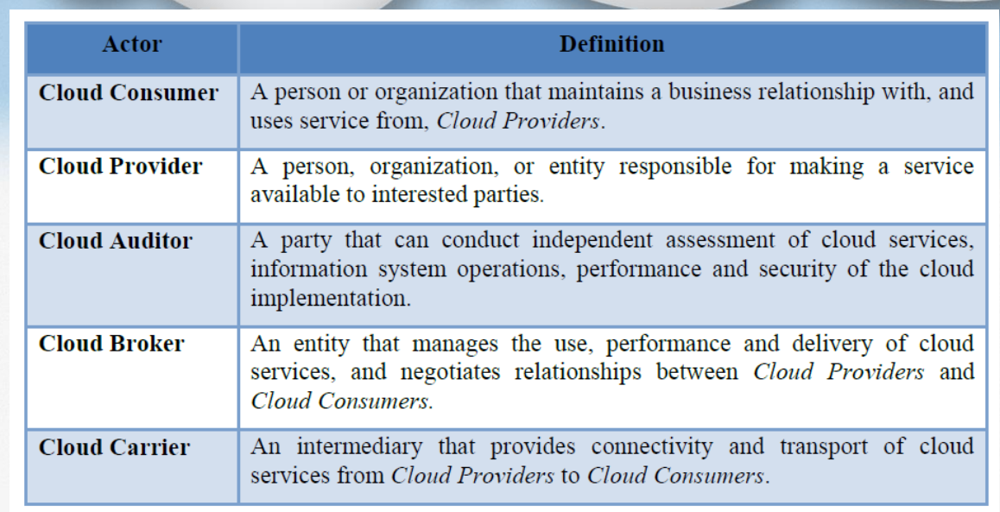
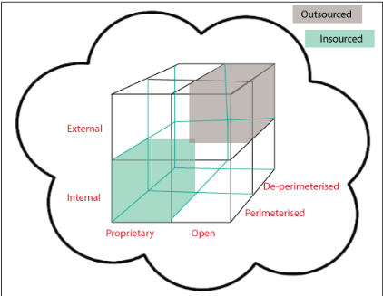
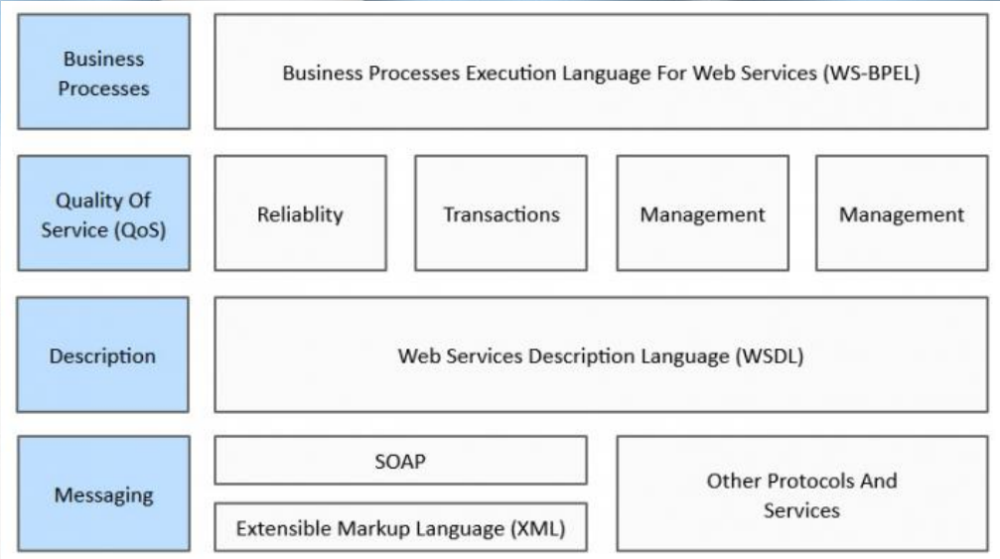
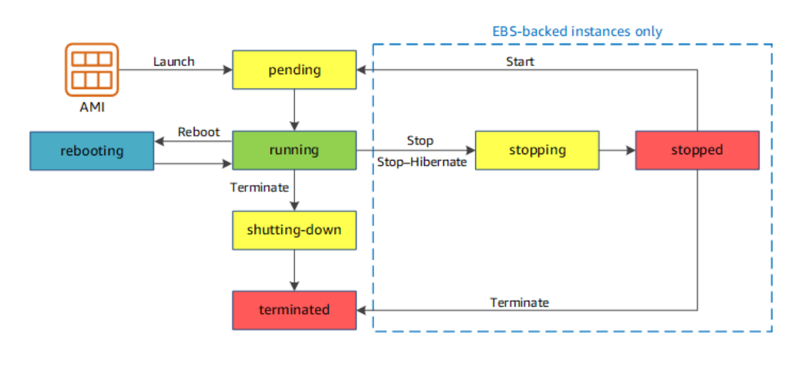
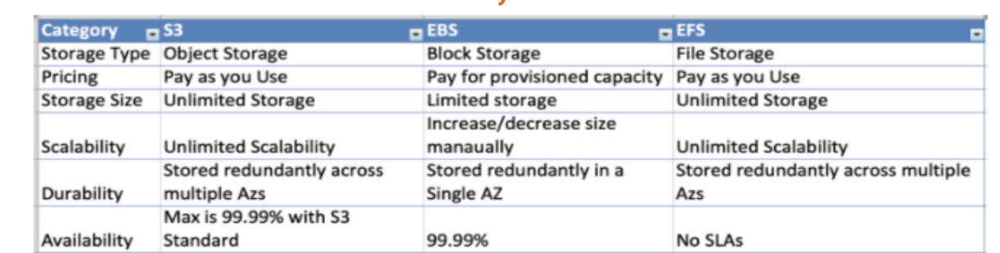
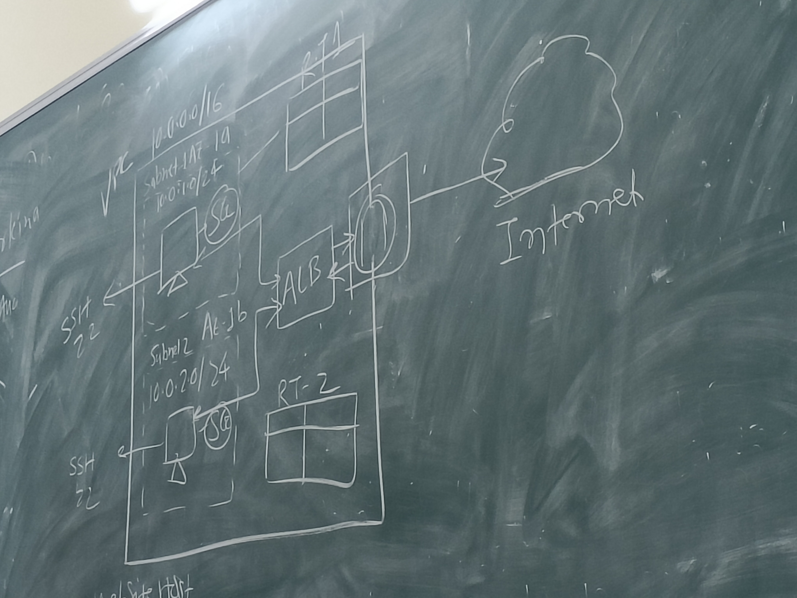

# Cloud Computing

## Unit 2 **AWS**

Q1. What is cloud computing?

        “Cloud computing is a specialized form of 
        distributed computing that introduces utilization 
        models for remotely provisioning scalable and 
        measured resources”

> Difference between “Cloud” and Internet :

1. As a specific environment used to remotely provision IT resources, a
cloud has a finite boundary.
whereas the Internet provides open access to many Web-based IT
resources, a cloud is typically privately owned and offers access to IT
resources that is metered.

2. Much of the internet is dedicated to the access of content-based IT
resources published via the World Wide Web,
on the other hand, are dedicated to supplying back-end processing
capabilities and user-based access to these capabilities.

Roles in **Cloud Computing**

* Cloud Carrier Activities

        1. Cloud Distribution: The process of transporting cloud data between Cloud Providers and Cloud Consumers
        2. Cloud Access – To make contact with or gain access to Cloud Services

* Cloud Provider Activities

        1. Service Deployment – All of the activities and organization needed to make a cloud service available
        2. Service Orchestration - Refers to the arrangement, coordination and management of cloud infrastructure to provide different cloud services to meet IT and business requirements
        3. Cloud Service Management – Cloud Service Management includes all the service-related functions that are necessary for the management and operations of those services required by or proposed to customers.
        4. Security: When it comes to security it's always about integrity, Confidentiality & availability
        5. Privacy - Information privacy is the assured, proper, and consistent collection, processing, communication, use and disposition of disposition of personal information (PI) and personally-identifiable information (PII) throughout its life cycle

## Cloud Cube Model

The cloud cube model is a framework for classifying cloud-based networks according to four dimensions

1. Physical location of data (Internal/External)

        This dimension indicates whether the data is stored internally (within the organization’s boundary) or externally (outside the organization’s boundary). This affects data sovereignty, privacy and compliance issues

2. Ownership (Proprietary/Open)

        This dimension indicates whether the cloud service is proprietary (owned by a specific vendor) or open (based on open standards and interoperability). This affects data portability, vendor lock-in and innovation potential

3. Security range (De-Perimeterized/Perimeterized)

        This dimension indicates whether the cloud service is de-perimeterized (relying on end-to-end encryption and identity management) or perimeterized (relying on firewalls and network boundaries). This affects security risks, trust levels and collaboration opportunities

4. Exposure (Insourced/Outsourced)

        This dimension indicates whether the cloud service is insourced (managed by internal staff) or outsourced (managed by external providers). This affects cost efficiency, operational control and service quality

    

## Service Oriented Architecture

* Service-oriented architecture (SOA) is a style of software design where services are provided to the other components by application components, through a communication protocol over a network.

* A SOA service is a discrete unit of functionality that can be accessed remotely and acted upon and updated independently, such as retrieving a credit card statement online. SOA is also intended to be independent of vendors, products and technologies

### Four Properties of SOA

* It logically represents a business activity with a specified outcome

* It is self-contained

* It is a black box for its consumers, meaning the consumer does not have to be 
aware of the service's inner workings

* It may consist of other underlying services

    

### Five Layers of SOA

1. Consumer Interface Layer: These are GUI based apps for end users accessing the applications

2. Business Process Layer: These are business-use cases in terms of application

3. Services Layer: These are whole-enterprise, in service inventory

4. Service Component Layer: are used to build the services, such as functional and technical libraries

5. Operational Systems Layer: It contains the data model.

* Core values of SOA

        1) Business value is given more importance than technical strategy.
        2) Strategic goals are given more importance than project-specific 
        benefits.
        3) Intrinsic interoperability is given more importance than custom 
        integration.
        4) Shared services are given more importance than specific-purpose 
        implementations.
        5) Flexibility is given more importance than optimization.
        6) Evolutionary refinement is given more importance than pursuit of 
        initial perfection.

### Microservices

* Microservices are a way of designing software applications as a collection of small, independent services that communicate over well-defined APIs

* Each service has its own technology stack, database and data model, and is owned by a small team that can develop, test and deploy it independently

* Microservices enable faster innovation, scalability, reliability and flexibility than traditional monolithic applications

* Features

        1. Decoupling: Microservices are loosely coupled and can work independently. They don’t depend on other services and any change made to one of them will not affect the working of other services

        2. Componentization: Microservices can be easily replaced and upgraded as independent components. They have their own technology stack, database and data model

        3. Business alignment: Microservices are aligned with business domains and capabilities. They are owned by small, self-contained teams that can deliver value faster and more efficiently

        4. Scalability: Microservices can scale horizontally with standard solutions like load balancers and messaging. They can handle increased demand by adding more instances of a service without affecting other services

        5. Resilience: Microservices can handle failures gracefully and recover quickly. They use techniques like circuit breakers, fallbacks, timeouts and retries to avoid cascading failures across services 

        6. API gateway: Microservices communicate with clients, and often each other, using lightweight protocols, often over messaging or HTTP. An API gateway is a component that provides a single entry point for all external requests and handles routing, authentication, authorization, monitoring and load balancing

## More About the cloud & AWS

* AWS IS A CLOUD PLATFORM

Cloud has

1. Services

        It can be 
            i. Software as service
            ii. Platform as service
            iii. Infrastructure as service

2. Deploy models

        a. They can be 
            i. Public
            ii. Private
            iii. Hybrid (Public + Private)
            iv. Community

3. 5-Essential characteristics

        a. On demand useage
        b. Ubiquitoues access
        c. Multitenancy (and resource pooling)
        d. Elasticity
        e. Measured usage
        f. Resiliency (Robust to its own failure)

## On-Premise & Cloud

On-Premises means we own the server

Cloud means someone else owns the server

## AWS SERVICES

* AWS HAS

1. Az's

        Availability zones are multiple zones where servers are located. So that one crashes one can work

        if US-East is one region then AZ's will be us-east1

2. Region

        1. Physical Location in the world with multiple Availability Zones (AZ’s).
        2. Every region is physically isolated from and independent of every other region in terms of location, power, water supply
        3. Every Region has 2 AZ's

3. Edge Locations

        1. An Edge location is a data center owned by a trusted partner of AWS which has a direct connection to AWS network
        2. These location serve requests for CloudFront & Route 53. Requests going to either of these services will be routed to the nearest edge location automatically

* AWS Login

        1. The AWS Login process is similar to any other platform just that we have provide a credit card/debit card information to fully use aws

## IAM

        1. IAM has user, group and roles
        2. Specific roles have specific access for certain time
        3. Instead of using root account create a IAM user 
        4. Never share your root or IAM credentials
        5. Policies are written in JSON (JavaScript Object Notation)

## EC2

* How to Create a EC2 instance

        Step 1: Login to your AWS console and choose Launch Instance from the EC2 dashboard.
        Step 2: Choose an Amazon Machine Image (AMI) that contains the operating system and software configuration for your instance.
        Step 3: Choose an EC2 instance type that defines the CPU, memory, storage and networking capacity for your instance.
        Step 4: Configure instance details such as number of instances, network, subnet, security group, key pair and user data.
        Step 5: Add storage volume for your instance. You can use the default settings or modify them as per your needs.
        Step 6: Tag your instance with a name and other metadata that helps you identify and manage it.
        Step 7: Review your instance settings and launch it. You will need to select an existing key pair or create a new one to connect to your instance

* About EC2

        1. EC2 stands for Elastic Compute Cloud, which means you can scale your compute capacity up or down as per your needs
        2. An EC2 instance is a virtual server that runs on AWS cloud platform
        3. You can pay only for what you use with flexible pricing options like on-demand, spot, reserved and savings plans
        4. You can choose from a variety of instance types that offer different combinations of CPU, memory, disk and networking for your applications

* Instance Lifecycle

  

## NAT

        1. IPs are not exposed to outside world
        2. NAT always should be in public

## VPC

        1. Region based service
        2. According to need we create VPC

## SG

        1. Instance level
        2. Stateful

Note: Inbound: Goes towards to machine, Outbound: Goes away from the machine

## NACAL

        1. Subnet level rules
        2. Stateless

## VPC paring

        1. Comunicates between VPCs

Note: AWS has 5 address reserved

## S3

* An S3 bucket is a public cloud storage resource available in AWS Simple Storage Service (S3), an object storage offering

* An S3 bucket is similar to a file folder that stores objects, which consist of data and its descriptive metadata

* Main Advantages

        1. Storage
        2. It uses cloudfront (Edge location) & cloudformation (But we will be using Teraform)

* S3 Comparision

  

## Important cloud service

* Compute (EC2 and lambda)

* Storage (EFS, EBS, S3)

* N/W (VPC, SH)

* Database

## Lambda service

        a. It is serverless service
        b. Server's cost is saved
        c. You can secure your buckets and objects with features like encryption, access control policies, versioning and lifecycle management
        d. You can choose from different storage classes that offer different levels of durability, availability and cost for your objects  

## Case Study

### Cloud architecture

1. Make a VPC

2. Create subnets

3. Create route tables. Link route to subnets

4. Create security groups

5. Create instances

6. Create a common SG to be assigned to both

7. Create load balancer and Target Group

8. Add rules HTTP to SG
