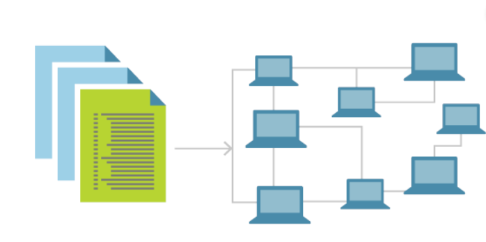
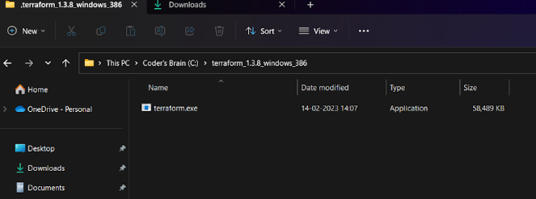

# Unit 3 Terraform

## Infrastructure as code

        1. Infrastructure as code (IaC) is an approach to infrastructure automation that uses a high-level descriptive coding language to define and deploy IT infrastructure, such as networks, virtual machines, load balancers, and connection topologies
        2. IaC enables developers to provision and manage infrastructure with greater speed, less risk, and reduced cost by eliminating manual processes and ensuring consistency across environments
        3. IaC is also a key DevOps practice that supports continuous delivery and rapid scaling of cloud applications

## Declarative vs Imperative

| Declarative | Imperative |
| - | - |
| Declarative IaC defines the desired state of the infrastructure, such as what resources are needed and what properties they should have, and lets an IaC tool figure out how to achieve that state  | Imperative IaC specifies a list of commands or steps that an IaC tool should follow to create or modify the infrastructure |
|  Declarative IaC is often more concise, adaptable, and idempotent than imperative | Imperative IaC is often less concise, adaptable, and idempotent than Declarative |
| The biggest drawback of the declarative approach is that you give up a lot of control over the individual steps in the provisioning process |  This gives you control over how you accomplish infrastructure tasks, which is ideal when you need to make small changes |

## Idempotence and Consistency

* Idempotence and consistency are two important principles for designing and implementing data pipelines, which are processes that transform and move data from one source to another

* Idempotence means that an operation can be repeated multiple times without changing the result of the operation beyond the first time it is executed

* Consistency means that the operation has a predictable and reliable outcome, regardless of how many times it is executed

* Idempotence and consistency help ensure that data is processed accurately and efficiently, even if there are failures or retries in the pipeline

* Some of Idempotence and consistency techniques are

        1. Logging: Maintaining a record of all operations that have been performed, including inputs and outputs, allows the system to avoid repeating operations that have already been done
        2. Hashing: Computing a checksum or hash value of the inputs and outputs of each operation allows the system to detect changes in the inputs or outputs and avoid repeating operations that haven’t changed
        3. Versioning: By versioning data, the system can revert to a previous version in case of an error, or to avoid data loss
        4. Keying: By using unique keys, such as primary keys in a database, the system can identify whether an operation has already been performed and avoid repeating it
        5. Error handling: Error handling should be designed to be idempotent as well, to ensure that the system does not become stuck in an error state and can recover from errors in a consistent and predictable manner

## Benefits of Iac

Infrastructure as code (IaC) is a practice of automating and managing IT infrastructure using code or scripts, instead of manual processes

1. Consistent configurations: IaC ensures that the infrastructure is provisioned and configured in a repeatable and predictable way, avoiding errors and inconsistencies that can arise from manual interventions

2. Decreased risk: IaC reduces the chances of human error, configuration drift, or unauthorized changes that can compromise the security, reliability, or performance of the infrastructure

3. Stronger security and faster recovery: IaC enables applying security policies and best practices across the infrastructure, as well as restoring it quickly in case of a disaster or an incident

4. Faster deployment: IaC accelerates the provisioning and deployment of infrastructure resources, enabling faster delivery of applications and services to customers

5. Improved accountability: IaC allows tracking and auditing all changes made to the infrastructure using version control systems and logs

6. Increased operational efficiency: IaC eliminates redundant and tedious tasks, freeing up time and resources for more value-added activities

7. Financial savings: IaC helps optimize the utilization and cost of infrastructure resources by enabling scaling up or down on demand, avoiding overprovisioning or underutilization

When to use IaC?

* You use a large amount of IaaS resources.
* Your infrastructure is rented from many different providers or platforms.
* You need to make regular adjustments to your infrastructure.
* You need proper documentation of changes made to your infrastructure.
* You want to optimize collaboration between administrators and developers

## Terraform vs Other platforms

1. Terraform

        1. The top infrastructure as code (IaC) solution for managing infrastructure across a variety of clouds, including AWS, Azure, GCP, Oracle Cloud, Alibaba Cloud
        2. Terraform may be utilized to facilitate any infrastructure provisioning and management use cases across many platforms and providers.

2. Ansible

        1. It is an agentless solution that works with both cloud and on-premises systems and may be used by SSH or WinRM
        2. It has limitations when it comes to maintaining that infrastructure but shines at provisioning infrastructure and configuration management

3. Chef/Puppet

        A. Chef
                i. Chef was created with stronger collaboration features to be readily integrated into DevOps methods. It is used for configuration management and is Best used for Deploying and configuring applications using a pull-based approach.
        
        B. Puppet
                i.  Puppet developed as a result of focusing on pure process automation. Currently, Puppet has automatic observers built in to detect configuration drift

## Best Iac Practices

* Avoid automating everything right away

* Check and keep an eye on your setups

* Give as much detail as you can about the atmosphere you wish to create

## Understand Terraform basics

### Terraform Datatypes

Terraform supports a number of types, including string, number, bool, list, map, set, object, tuple, and any.

### Input Variables

The input variables can be of types

* Primitive Types

  1. string
  2. number
  3. boolean

* Complex Types

1. List: A Terraform list variable is a sequence of similar values indexed by numbers

   

2. Map: A map is a collection of values where each value is identified by a string label.In the example below is a map variable named managed_disk_type to define the type of storage we want to use based on the region in Azure

   

3. Object: An object is a structural type that can contain different types of values, unlike map, list. It is a collection of named attributes that each have their own type

   

### Output Variables

* Outputs allow us to define values in the configuration that we want to share with other resources or modules. For example, we could pass on the output information for the public IP address of a server
to another process.

* An output variable is defined by using an output block with a label. The label must be unique as it can be used to reference the output’s value. Let’s define an output to show us the public IP address of the server. Add this to any of the *.tf files.

  

### How does terraform work?

Terraform is a tool that allows you to define and manage your infrastructure as code using a declarative language called HashiCorp Configuration Language (HCL). The basic commands will be explained furthur here we will se what happens in backend

1. Terraform communicates with various APIs of cloud platforms and other services to create, modify, or delete resources according to your configuration as Terraform supports many providers that enable it to work with different types of resources and services

2. Terraform keeps track of the current state of your infrastructure in a state file, which records what resources exist and their properties

3. Terraform uses this state file to determine what changes need to be made to your infrastructure based on your configuration

4. Terraform also provides other commands and features that help you manage your infrastructure, such as formatting, validating, importing, outputting, testing, debugging, etc

### Describe how Terraform finds and fetches providers, provisioners?

1. Terraform providers are plugins that allow Terraform to interact with various APIs of cloud platforms and other services

2. Terraform provisioners are a legacy feature that allow Terraform to execute scripts on local or remote machines as part of resource creation or destruction

3. Terraform finds and fetches providers when initializing a working directory using the terraform init command.

4. It can automatically download providers from a Terraform registry, such as the public Terraform Registry or a private registry, or load them from a local mirror or cache

5. Terraform does not find or fetch provisioners automatically. You must install them manually on your system and make sure they are available on your PATH

6. Provisioners are not recommended for most use cases, as they introduce complexity and uncertainty into Terraform configurations. Instead, you should use other solutions such as configuration management tools, cloud-init, or custom images

Note:

         If you are using a persistent working directory, you must reinitialize whenever you change a configuration’s providers

### When to use local-exec or remote-exec?

1. When you need to run a command that is not supported by any existing provider or module.
2. When you need to perform a one-time task that does not affect the ongoing state of the resource.
3. When you need to interact with an external system that is not managed by Terraform.

Now let's see

When to not use local-exec or remote-exec?

        1. You want to ensure consistency and reliability of your infrastructure using code1.
        2. You want to avoid configuration drift and unauthorized changes to your resources1.
        3. You want to leverage existing tools and best practices for configuration management1

Note:

        1. The local-exec and remote-exec provisioners are legacy features of Terraform that allow you to execute scripts on local or remote machines as part of resource creation or destruction

        2. The local-exec provisioner invokes a local executable after a resource is created. This invokes a process on the machine running Terraform, not on the resource

### Basic Workflow setup & Installation

We will launching an aws instance using terraform

* You can download terraform from [Terraform Website](https://www.terraform.io/)

* Download and extract it somewhere

  

* Add it to path

  

* Check Whether it is properly installed or not

  

* Download [AWS command line](https://aws.amazon.com/cli/) tool & install it

* Login to aws & find IAM service

  

* Make sure you have a user created for this purpose. Also generate it's access keys

  

* Add secret key & access key to aws cli (I have already added it so I will just press enter here)

  

* Create a folder named anything & create a terraform .tf file

  

* Go to AWS & copy ami id for a linux machine

  

* As terraform works like JSON we can specify our variable & object in the same .tf file

  

### Terraform commands

For demonstration purposes we will use the 4 basic commands of Terraform

        1. terraform init: 
                i. This command initializes a working directory containing Terraform configuration files.
                ii. It downloads any required providers and modules, and creates a local state file to track the resources

        2. terraform plan: 
                i. This command shows what actions Terraform will take to apply your configuration, such as which resources will be created, modified, or destroyed. 
                ii. It does not make any changes to the actual infrastructure

        3. terraform apply: 
                i. This command executes the actions proposed by terraform plan and makes changes to the infrastructure. 
                ii. It requires confirmation before applying unless a saved plan file is given as an argument

        4. terraform destroy: 
                i. This command destroys all the resources managed by Terraform in your configuration. 
                ii. It requires confirmation before destroying unless -auto-approve is specified

1. Using terraform init

   

2. Using terraform plan

   

3. Using terraform apply (use this when output variables are not defined)

   

   

4. Using terraform destroy

   

   

## Link for terraform questions

[Link 1](https://developer.hashicorp.com/terraform/tutorials/certification/associate-questions)
