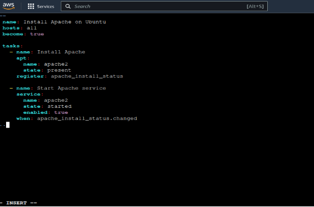

# Unit 4 Ansible

## YAML

### Simple Example

```YAML
    name: Siddharth
    rollNo: 323054
    college: viit
```

### Comments

```YAML
    # This is YAML SCRIPT
```

### Objects

```YAML
    STUDENT1:
        name: Siddharth
        rollNo: 323054
        college: viit

    STUDENT2:
        _______
        _______
```

### LIST

```YAML
    # WAY 1 to write list

    STUDENT1:
        name: Siddharth
        rollNo: 323054
        college: viit
        Subjects:
            - AMD
            - CC
            - DAA
            - SDA
            - EEF
      
    # WAY 2 to write list
  
    STUDENT2:
        name: Siddharth
        rollNo: 323054
        college: viit
        Subjects: [ AMD, CC, DAA, SDA, EEF ]
```

### variables in yaml

#### Strings

```YAML
    # 1
    name: "Siddharth"
    # 2
    name2: 'Sidd'
    # 3
    name3: Siddharth
    # String pipe
    name4: |
        This is first line
        This is second line
        This is third line
    # Multiple lines are written but considered as single line
    name5: >
        This is first line
        This is second line
        This is third line
```

#### Numbers

```YAML
    num1: 23
    num2: 123.1
    num3: 0.1
```

#### Boolean

```YAML
    isTrue: true
    isFalse: No
    isFalse: off
```

#### Start & end

```YAML
    # Start
    _ _ _
  
    . . .
    # End
```

Sample Script

```YAML
    - STUDENT1:
        rollno: 23
        name: "Sidd"
        address:
            - Street: laxminagar
            - Area: Kondhwa
            - Pin: 411048
        Phone: [1234,5678]
    - STUDENT2:
        ____
        ____
        ____
```

## Ansible

* Configuration Management Tool
* It has two things Ansible tower & Ansible Galaxy

### Ansible workflow


* It is a agentless tool
* Host & master can be same

### Terminologies

1. Ad-boc command

   Single commands
2. Playbook

   1. Collection of multiple commands
   2. One playbook cantains of many plays

   
3. Modules

   1. Certains commands but not the collection
4. Roles

   1. Well Organized structure of files

### Ansible workflow example

Note: before starting you need to have another machine whether aws instance or another user on ubuntu

1. Make a folder
2. Take sudo access
3. Make SSH keys & copy them from master to target
4. Paste the keys in system files of target
5. Write ansible playbook for the task
6. Before running the task make sure you have hosts file in which you have to add the private ip address of EC2 instances which
7. Run the playbook

### Example ansible playbook & Plugin configuration

* Playbook for EC2

```yaml
- hosts: localhost
  roles:
          - { role: ec2_host , key_dest: "/root/.ssh/key.pem" , region: "ap-south-1" , image_id: "ami-0ebc1ac48dfd14136" , count: "3" , tag_name: "from-ansible" , port: "80" }
```

* Plugin for EC2

```yaml
plugin: amazon.aws.aws_ec2
regions:
  - ap-south-1
keyed_groups:
  # add hosts to tag_Name_value groups for each aws_ec2 host's tags.Name variable
  - key: tags.Name
    prefix: tag_Name_
    separator: ""
hostnames:
  - ip-address
```

### Example Playbook for Apache Server



## Roles

* Roles is a Directory Structure
* It is used when project becomes too big
* Ansible roles are a way of organizing and reusing Ansible playbooks.
* They allow you to group related tasks, variables, files, templates, and handlers into a standard directory structure
* You can then use roles in your playbooks to apply the same configuration to different hosts or environments. Roles also help you share your Ansible code with other users through Ansible Galaxy
