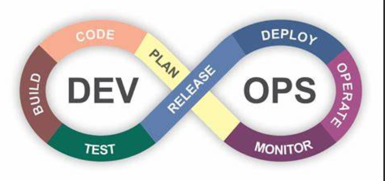
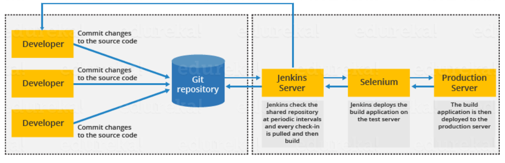

# Unit 6 Devops

## Devops culture

DevOps Culture is a term that refers to the organizational culture shift that emphasizes continuous learning and continuous improvement, especially through team autonomy, fast feedback, high empathy and trust, and cross-team collaboration

It involves cultivating multidisciplinary teams who take accountability for the entire lifecycle of a product

DevOps Culture also values shared responsibility between development and operations for the products they create and maintain

Note:

1. At the heart of DevOps culture is increased transparency, communication, and collaboration between teams that traditionally worked in siloes

2. A DevOps team culture values fast feedback that can help with continuous improvement of a unified development and operations team

## Continuous Delivery/Continuous Integration

Continuous Integration and Continuous Delivery (CI/CD) are two related processes that help software development teams deliver code changes more frequently and reliably

### Continuous Integration

1. Continuous Integration (CI) is the process of automating and integrating code changes and updates from many team members during software development

2. In CI, automated tools confirm that software code is valid and error-free before it’s integrated, which helps detect bugs and speed up new releases

### Continuous Delivery

1. Continuous Delivery (CD) is the ability to push new software into production multiple times per day, automating the delivery of applications to infrastructure environments

2. CD is part of DevOps, which helps shorten the software development lifecycle

3. CD helps teams use automation effectively to rapidly push code changes to each environment

### Continuous Deployment

1. Continuous Deployment is an extension of CD, where code is deployed to production environments automatically, without human intervention

2. The deployment automatically launches and distributes software to end users

3. Continuous Deployment requires a high level of confidence in the testing and automation processes

## Tools used in devOps

Devops has a lifecycle that consists of eight phases: **continuous development**, **continuous integration**, **continuous testing**, **continuous deployment**, **continuous delivery**, **continuous monitoring**, **continuous feedback**, and **continuous planning**

* Version control tools such as Git, GitHub, Bitbucket, and SVN that help to track and manage changes to the code.

* Devops automation tools such as Jenkins, Bamboo, CircleCI, and Travis CI that help to automate the build, test, and deployment processes.

* Performance monitoring tools such as New Relic, Datadog, Prometheus, and Grafana that help to monitor the performance of applications and infrastructure.

* Container management tools such as Docker, Kubernetes, OpenShift, and Rancher that help to package, deploy, and manage distributed applications.

* Configuration management tools such as Ansible, Chef, Puppet, and SaltStack that help to ensure consistent and reliable system functionality

## Git & Github

* Git is a version control system that helps you keep track of the changes you make to your code and files. It also allows you to collaborate with other developers by merging your changes and resolving conflicts

* GitHub is a website that hosts Git repositories online. It helps you share your code and files with others, access them remotely, and contribute to open source projects

* A Git repository is a folder that contains your code and files, along with some hidden files that store the history of your changes

* Some basic Git commands are:

        git init: This creates a new Git repository in your current folder.
        git add: This adds your changes to the staging area, which is a temporary area where you prepare your changes for committing.
        git commit: This saves your changes to the local repository with a message describing what you did.
        git push: This uploads your changes to the remote repository on GitHub or another source.
        git pull: This downloads the latest changes from the remote repository and merges them with your local repository.
        git clone: This copies an existing repository from GitHub or another source to your local machine

## Automated Testing

* Automation Testing is a technique of testing software products with special tools and frameworks that reduce human intervention and increase quality.

* Automation Testing uses automation software to execute test cases, enter test data, compare expected and actual results, and generate test reports

* Automation Testing is important because it can:

        1. Save time and money by reducing manual testing efforts
        2. Increase speed and accuracy by eliminating human errors
        3. Enhance test coverage and effectiveness by testing more scenarios and detecting bugs earlier
        4. Support continuous testing and integration by running tests on multiple platforms and environments

* Some of the types of tests that can be automated are

        1. Functional Testing: This tests the functionality of the software against the requirements and specifications
        2. Regression Testing: This tests the software after changes or updates to ensure that no new bugs are introduced
        3. Performance Testing: This tests the speed, scalability, and reliability of the software under different loads and conditions
        4. Security Testing: This tests the security and vulnerability of the software against malicious attacks
        5. UI Testing: This tests the user interface and usability of the software from the user’s perspective

* Some tools are a follows

        1. Selenium: This is a popular open-source tool for web automation testing that supports multiple languages, browsers, and platforms
        2. UFT: This is a commercial tool for functional and regression testing that supports GUI and API testing
        3. TestNG: This is a testing framework for Java that provides annotations, assertions, parallel execution, and reporting features
        4. Cucumber: This is a tool for behavior-driven development (BDD) that allows writing test cases in plain English using Gherkin syntax
        5. JMeter: This is an open-source tool for performance testing that can simulate heavy loads and generate graphs and reports

## Automated Monitoring

Automated Monitoring helps to detect and resolve issues quickly, reduce downtime, improve customer satisfaction, and optimize IT operations

* Some of the benefits of Automated Monitoring are

        1. It saves time and money by reducing manual monitoring efforts and human errors
        2. It increases speed and accuracy by providing real-time data and alerts
        3. It enhances effectiveness by covering more scenarios and metrics
        4. It supports continuous testing and integration by running tests on multiple platforms and environments

* Some of the tools which can be used

        1. IBM Cloud Application Performance Management: This is a cloud-based solution that monitors the performance and availability of applications across hybrid environments. It provides end-to-end visibility, diagnostics, analytics, and alerts

        2. Amazon CloudWatch: This is a service that monitors and manages AWS resources and applications. It collects metrics, logs, events, and alarms from various sources and provides dashboards, graphs, and reports

        3. Opsview: This is a platform that monitors IT infrastructure, applications, networks, and cloud services. It provides auto-discovery, configuration management, notifications, reports, and integrations with other tools

        4. WhatsUp Gold: This is a tool that monitors network devices, servers, applications, virtual machines, cloud services, and traffic flows. It provides discovery, mapping, alerting, reporting, and troubleshooting features

## Maven

* Maven is a project management and comprehension tool that provides developers a complete build lifecycle framework.

* Maven is based on a project object model (POM) that describes the project structure, dependencies, plugins, goals, and other configurations

* Advantages of Maven

        1. Simplify the build process by automating tasks such as compilation, testing, packaging, deployment, and documentation
        2. Provide a uniform build system that can be shared across different projects
        3. Manage dependencies and versions of libraries and plugins from a central repository
        4. Generate quality project information such as reports, metrics, logs, and cross-references
        5. Encourage best practices development such as modularization, reuse, and testing

* Basic Features of Maven

  1. Maven Archetypes: These are templates that help to create new projects based on predefined structures and configurations
  2. Maven Plugins: These are extensions that provide additional functionality and goals for Maven projects
  3. Maven Lifecycle: This is a sequence of phases that define the order of execution of goals for a Maven project
  4. Maven Profiles: These are sets of configuration values that can be activated or deactivated based on certain conditions
  5. Maven Repositories: These are locations where Maven stores or retrieves artifacts such as JARs, WARs, POMs, etc

## Jenkins

### What is Jenkins?

* Jenkins is a tool that is used for automation, and it is an open-source server that allows all the developers to build, test and deploy software. It works or runs on java as it is written in java. By using Jenkins we can make a continuous integration of projects(jobs) or end-to-endpoint automation

* Jenkins can also distribute work across multiple machines, helping drive builds, tests and deployments across multiple platforms faster. Jenkins is used to build and test your software projects continuously making it easier for developers to integrate changes to the project, and making it easier for users to obtain a fresh build. Jenkins can be easily set up and configured via its web interface, which includes on-the-fly error checks and built-in help

* Possible steps executed by Jenkins

        1. Perform a software build using a build system like Gradle or Maven Apache
        2. Execute a shell script
        3. Archive a build result
        4. Running software tests

* The problems before jenkins came to existance

        1. Developer teams have to wait till the complete software is developed for the test results.
        2. There is a high prospect that the test results might show multiple bugs. It was tough for developers to locate those bugs because they have to check the entire source code of the application.
        3. It slows the software delivery process.
        4. Continuous feedback pertaining to things like architectural or coding issues, build failures, test status and file release uploads was missing due to which the quality of software can go down.
        5. The whole process was manual which increases the threat of frequent failure.

* Jenkins use case

  

### How jenkins works?

1. First of all, a developer commits the code to the source code repository. Meanwhile, the Jenkins checks the repository at regular intervals for changes.

2. Soon after a commit occurs, the Jenkins server finds the changes that have occurred in the source code repository. Jenkins will draw those changes and will start preparing a new build.
If the build fails, then the concerned team will be notified.

3. If built is successful, then Jenkins server deploys the built in the test server.
After testing, Jenkins server generates a feedback and then notifies the developers about the build and test results.

4. It will continue to verify the source code repository for changes made in the source code and the whole process keeps on repeating.

### Jenkins architecture

* Jenkins Master

        1. The main server of Jenkins is the Jenkins Master. 
        2. It is a web dashboard which is nothing but powered from a war file. 
        3. By default it runs on 8080 port

* Jenkins Slave

        1. Jenkins slave is used to execute the build jobs dispatched by the master
        2. We can configure a project to always run on a particular slave machine, or particular type of slave machine, or simple let the Jenkins to pick the next available slave/node

### Advantages of Jenkins

1. It is an open source tool.
2. It is free of cost.
3. It does not require additional installations or components. Means it is easy to install.
4. Easily configurable.

### Disadvantage of Jenkins

1. Its interface is out dated and not user friendly compared to current user interface trends.
2. Not easy to maintain it because it runs on a server and requires some skills as server administrator to monitor its activity.

## Some Questions you can refer to

Devops?

What is CI/CD Pipeline?

What are phases in devops?

Difference between Continous deployment and Continous delivery?

Advantages of devops?

Difference between devops and agile?
