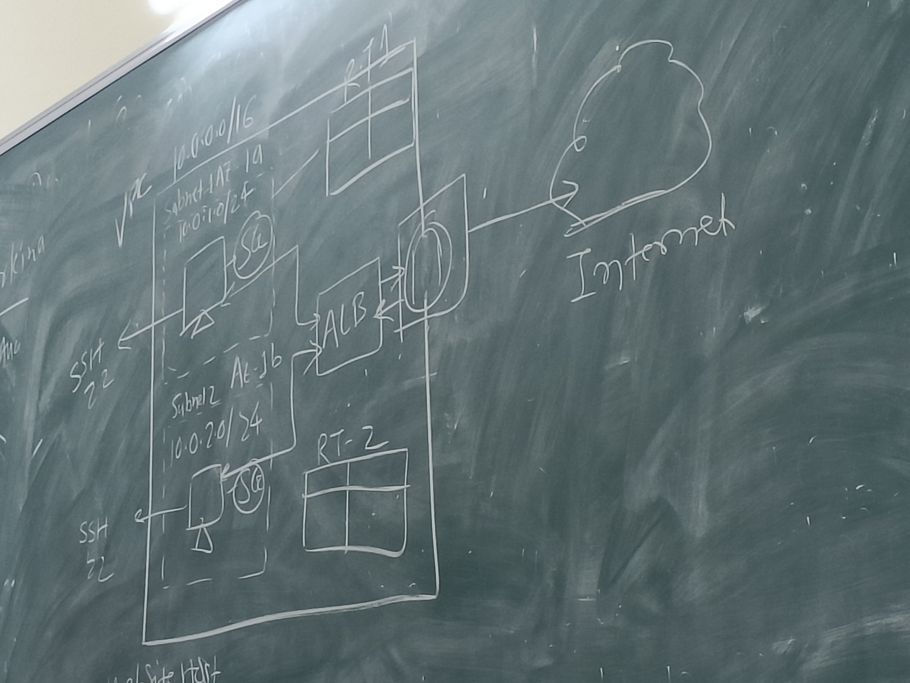

# Lecture 5

## Unit 2 **AWS**

## NAT

        1. IPs are not exposed to outside world
        2. NAT always should be in public

## VPC

        1. Region based service
        2. According to need we create VPC

## SG

        1. Instance level
        2. Stateful

Note: Inbound: Goes towards to machine, Outbound: Goes away from the machine

## NACAL

        1. Subnet level rules
        2. Stateless

## VPC paring

        1. Comunicates between VPCs

Note: AWS has 5 address reserved

## Case Study

### Cloud architecture

1. Make a VPC

2. Create subnets

3. Create route tables. Link route to subnets

4. Create security groups

5. Create instances

6. Create a common SG to be assigned to both

7. Create load balancer and Target Group

8. Add rules HTTP to SG
