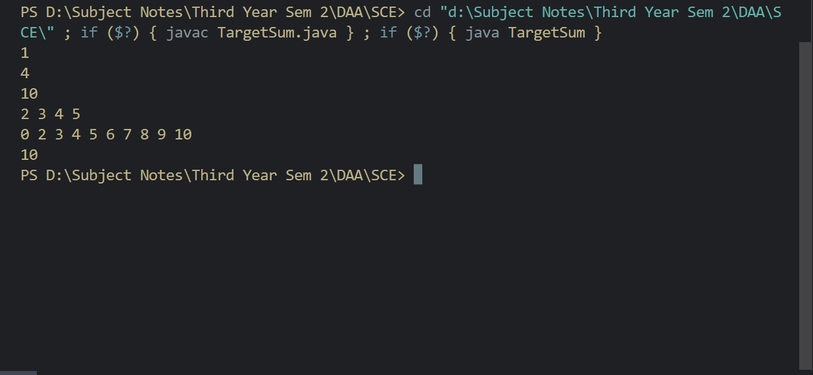

# DAA SCE

## Q1. Given an array of integers and a target sum, determine the sum nearest to but not exceeding the target that can be created. To create the sum, use any element of your array zero or more times. For example, array =[2,3,4 ]if  and your target sum is 10 , you might select [2,2,2,2,2]  [2,2,3,3] or [3,3,3,1] . In this case, you can arrive at exactly the target. It must return an integer that represents the sum nearest to without exceeding the target value

### Aim

To return an integer that represents the sum nearest to without exceeding the target value

### Approach

1. We will have a hashset where we will recording all the values given to us without repeatation.

2. After storing it to a hashset we will pass the hashset to getTarget function

3. In getTarget function we will be creating a boolean array of length equals to targetValue. All the values in array are filled with false

4. We need to make the first value true & then we will be iterating through a loop till i <= target. For each value of i we will check whether it's addition with the hashset value is less than or equal to target if so the we will be marking that boolean indez as true

   ```Java
   for(int i = 0; i <= target; i++) {
      it = map.iterator();
      while(it.hasNext()){
            a = it.next();
            if((i + a) <= target){
               sum[i + a] = true;
            }
      }
   }
   ```

5. Then we will iterate over the boolean array in a reverse fashion &  get the top index which is close to target

6. We have also recorded how our sum variable reaches to the target value in chosen array

### CODE

```Java
import java.util.ArrayList;
import java.util.Arrays;
import java.util.HashSet;
import java.util.Scanner;
import java.util.Iterator;
import java.util.List;

public class TargetSum{
    public static int getTarget(HashSet<Integer> map,int target) {
        Iterator<Integer> it = map.iterator();
        boolean[] sum = new boolean[target + 1];
        Arrays.fill(sum,false);
        sum[0] = true;
        int a = 0;
        List<Integer> chosen = new ArrayList<Integer>();

        for(int i = 0; i <= target; i++) {
            it = map.iterator();
            while(it.hasNext()){
                a = it.next();
                if((i + a) <= target){
                    sum[i + a] = true;
                }
            }
        }

        for(int i = 0; i <= target; i++) {
            if(sum[i] == true){
                chosen.add(i);
            }
        }

        for(int i = 0; i < chosen.size(); i++) {
            System.out.print(chosen.get(i) + " ");
        }
        System.out.println();

        chosen.clear();

        for(int i = target; i >= 0; i--){
            if(sum[i] == true){
                return i;
            }
        }

        return target;
    }

    public static void main(String[] args) {
        Scanner sc = new Scanner(System.in);
        
        int T = sc.nextInt();
        HashSet<Integer> map = new HashSet<Integer>();

        while((--T) >= 0){
            int N = sc.nextInt();
            int target = sc.nextInt();
            
            for(int i = 0; i < N; i++){
                map.add(sc.nextInt());
            }

            System.out.println(getTarget(map, target));

            map.clear();
        }
        
        sc.close();
    }
}
```

### OUTPUT



### CONCLUSION 1

We found the target via using the elements from array multiple time or only the elements of array

## Q2. Amortized Analysis

### Meaning


### What is Amortized Analysis?

* Amortized analysis is a method used to analyze the performance of algorithms that perform a sequence of operations, where each individual operation may be fast, but the sequence of operations may be slow as a whole

* The motivation for amortized analysis is that looking at the worst-case run time can be too pessimistic

* Amortized analysis requires knowledge of which series of operations are possible

* This is most commonly the case with data structures, which have state that persists between operations

### Basic Idea

The *basic idea is that a worst-case operation can alter the state in such a way that the worst case cannot occur again for a long time, thus “amortizing” its cost*

### When to use Amortized Analysis?

* This analysis is used when the occasional operation is very slow, but most of the operations which are executing very frequently are faster

### Data structures needed

* Hash Tables

* Disjoint Sets

* Dynamic arrays

### Two Approaches

1. The Aggregate Method

    1. Determine the worst-case cost of our entire sequence of operations, T(n)
    2. Divide this cost by the number of operations in the sequence, n
    3. AOC (Amortized Operation Cost) = T(n)/n
    4. Example

   

        1. Here we can see Ci is the cost of operation.
        2. We can define this as Ci = i + 1 when i is power of 2 else it is 1
        3. To find AOC we need to find T(n)
        4. T(n) = SUM(Ci)
           T(n) = SUM(i + 1) + SUM(1)
           T(n) = SUM(i) + SUM(1) + SUM(1)
           T(n) = SUM(i + n)
        5. we can solve our first summation by recognizing that i can be a power of 2 at most log2n times in the sequence. So, we can transform this sum to have a new index j, which iterates over a range from 0 to log2n, and adds the value of 2j. If this step is a bit confusing, check out this page for a more detailed step through
        6. T(n) = SUM(FROM 0 to log(n) to the base 2)(2^j) + n
           T(n) <= 2n + n
           T(n) <= 3n
        7. Limitation: As we can see, this method is very straight forward. However, it only works when we have a concrete definition of how much our sequence will cost. This is not ideal

2. The Accounting Method

    1. For this method, we think about amortized cost as being a “charge” that we assign to each operation.
    2. Each time we encounter an operation, we try to pay for it using this “charge”.
    3. If the operation actually costs less than our “charge”, we stash the change in a bank account. If the operation actually costs more than our “charge”, we can dip into our bank account to cover the cost.
    4. The idea is that we want to save enough money during our “cheaper” operations to pay for any “expensive” operations we might encounter later on.

    5. This means that our amortized operation cost has an upper bound of 3.  Refer image 2

    

    

### Advantages of amortized analysis

1. More accurate predictions: Amortized analysis provides a more accurate prediction of the average-case complexity of an algorithm over a sequence of operations, rather than just the worst-case complexity of individual operations.
2. Provides insight into algorithm behavior: By analyzing the amortized cost of an algorithm, we can gain insight into how it behaves over a longer period of time and how it handles different types of inputs.
3. Helps in algorithm design: Amortized analysis can be used as a tool for designing algorithms that are efficient over a sequence of operations.
4. Useful in dynamic data structures: Amortized analysis is particularly useful in dynamic data structures like heaps, stacks, and queues, where the cost of an operation may depend on the current state of the data structure.

### Disadvantages of amortized analysis

1. Complexity: Amortized analysis can be complex, especially when multiple operations are involved, making it difficult to implement and understand.
Limited applicability: Amortized analysis may not be suitable for all types of algorithms, especially those with highly unpredictable behavior or those that depend on external factors like network latency or I/O operations.
2. Lack of precision: Although amortized analysis provides a more accurate prediction of average-case complexity than worst-case analysis, it may not always provide a precise estimate of the actual performance of an algorithm, especially in cases where there is high variance in the cost of operations.

### CONCLUSION 2

We explored how amortized analysis can help us prove that a sequence of operations is actually quite efficient, even though its individual operations suffer an expensive worst-case cost.

## Q3. Concurrent algorithm for finding squares ( Vedic Mathematics )

### AIM

To write a Concurrent algorithm for finding squares using vedic maths

### Solved Example

Duplex Example ( value = 478 )

    duplex(4) = 4^2 = 16
    duplex(47) = 2 x 4 x 7 = 56
    duplex(478) = 2 x 4 x 8 + 7 ^ 2 = 113
    duplex(78) = 2 x 7 x 8 = 112
    duplex(8) = 8 ^ 2 = 64

### APPROACH

1. The approach is to use string and character & typecast them whenever needed.
2. We will be using the duplex method in vedic maths to find out the square
3. Firstly break the numbers into characters but it would be done incrementally like first one character we will pass to duplex function then we will pass two characters to duplex function
4. After that we will pass the characters decreamentally to the duplex function
5. We get an array of Integers in a certain order
6. In order to get square we will be tranversing the arraylist in reverse order we need to see that only single elements remain in each slot except the first we can add remaining elements next slot
7. By join this array into a string we get the square
8. Further for concurrency we have used multithreading to do this work

### Code

```Java
import java.time.Duration;
import java.time.Instant;
import java.util.ArrayList;
import java.util.List;
import java.util.Scanner;

class Calculate implements Runnable {
    public String num;

    Calculate(String number) {
        this.num = number;
    }

    public int duplex(char[] arr) {
        if (arr.length == 1) {
            return (arr[0] - '0') * (arr[0] - '0');
        } else if (arr.length == 2) {
            return 2 * (arr[0] - '0') * (arr[1] - '0');
        } else if (arr.length == 3) {
            return 2 * (arr[0] - '0') * (arr[2] - '0') + (arr[1] - '0') * (arr[1] - '0');
        } else if (arr.length == 4) {
            return 2 * (arr[0] - '0') * (arr[3] - '0') + 2 * (arr[1] - '0') * (arr[2] - '0');
        } else if (arr.length == 5) {
            return 2 * (arr[0] - '0') * (arr[3] - '0') + 2 * (arr[1] - '0') * (arr[2] - '0');
        } else if (arr.length == 6) {
            return 2 * (arr[0] - '0') * (arr[5] - '0') + 2 * (arr[1] - '0') * (arr[4] - '0')
                    + 2 * (arr[2] - '0') * (arr[3] - '0');
        } else if (arr.length == 7) {
            return 2 * (arr[0] - '0') * (arr[6] - '0') + 2 * (arr[1] - '0') * (arr[5] - '0')
                    + 2 * (arr[2] - '0') * (arr[4] - '0') + 2 * (arr[3] - '0') * (arr[3] - '0');
        }
        return -1;
    }

    @Override
    public void run() {
        List<Integer> record = new ArrayList<Integer>();
        StringBuilder sb = new StringBuilder();

        for (int i = 1; i <= this.num.length(); i++) {
            String nstr = this.num.substring(0, i);
            record.add(duplex(nstr.toCharArray()));
        }

        for (int i = this.num.length() - 1; i >= 0; i--) {
            sb.append(this.num.charAt(i));
        }

        for (int i = this.num.length() - 1; i > 0; i--) {
            String nstr = sb.substring(0, i);
            record.add(duplex(nstr.toCharArray()));
        }

        // getting squares
        for (int i = record.size() - 1; i > 0; i--) {
            String s1 = record.get(i).toString();
            String s2 = record.get(i - 1).toString();
            String s11;
            String s12;

            if (s1.length() > 1) {
                s11 = s1.substring(s1.length() - 1, s1.length());
                s12 = s1.substring(0, s1.length() - 1);

                record.set(i - 1, Integer.parseInt(s2) + Integer.parseInt(s12));
                record.set(i, Integer.parseInt(s11));
            }
        }

        sb = new StringBuilder();

        for (int i = 0; i < record.size(); i++) {
            sb.append(record.get(i).toString());
        }

        System.out.println(sb);
    }

    public static void main(String[] args) {
        int numberofthread = 4;
        List<Thread> threads = new ArrayList<Thread>();
        for (int i = 0; i < numberofthread; i++) {
            Thread t1 = new Thread();
            t1.start();
            threads.add(t1);
            if(threads.size() % 4 == 0){
                waitForThreads(threads);
            }
        }
    }

    private static void waitForThreads(List<Thread> threads) {
        for (Thread thread : threads) {
            try {
                thread.join();
            } catch (InterruptedException e) {
                e.printStackTrace();
            }
        }
        threads.clear();
    }

}

public class VedicSquares {
    public List<Integer> Xrecord = new ArrayList<Integer>();

    public int duplex(char[] arr) {
        if (arr.length == 1) {
            return (arr[0] - '0') * (arr[0] - '0');
        } else if (arr.length == 2) {
            return 2 * (arr[0] - '0') * (arr[1] - '0');
        } else if (arr.length == 3) {
            return 2 * (arr[0] - '0') * (arr[2] - '0') + (arr[1] - '0') * (arr[1] - '0');
        } else if (arr.length == 4) {
            return 2 * (arr[0] - '0') * (arr[3] - '0') + 2 * (arr[1] - '0') * (arr[2] - '0');
        } else if (arr.length == 5) {
            return 2 * (arr[0] - '0') * (arr[3] - '0') + 2 * (arr[1] - '0') * (arr[2] - '0');
        } else if (arr.length == 6) {
            return 2 * (arr[0] - '0') * (arr[5] - '0') + 2 * (arr[1] - '0') * (arr[4] - '0')
                    + 2 * (arr[2] - '0') * (arr[3] - '0');
        } else if (arr.length == 7) {
            return 2 * (arr[0] - '0') * (arr[6] - '0') + 2 * (arr[1] - '0') * (arr[5] - '0')
                    + 2 * (arr[2] - '0') * (arr[4] - '0') + 2 * (arr[3] - '0') * (arr[3] - '0');
        }
        return -1;
    }

    public void process(String str) {
        List<Integer> record = new ArrayList<Integer>();
        StringBuilder sb = new StringBuilder();

        for (int i = 1; i <= str.length(); i++) {
            String nstr = str.substring(0, i);
            record.add(duplex(nstr.toCharArray()));
        }

        for (int i = str.length() - 1; i >= 0; i--) {
            sb.append(str.charAt(i));
        }

        for (int i = str.length() - 1; i > 0; i--) {
            String nstr = sb.substring(0, i);
            record.add(duplex(nstr.toCharArray()));
        }

        // getting squares
        for (int i = record.size() - 1; i > 0; i--) {
            String s1 = record.get(i).toString();
            String s2 = record.get(i - 1).toString();
            String s11;
            String s12;

            if (s1.length() > 1) {
                s11 = s1.substring(s1.length() - 1, s1.length());
                s12 = s1.substring(0, s1.length() - 1);

                record.set(i - 1, Integer.parseInt(s2) + Integer.parseInt(s12));
                record.set(i, Integer.parseInt(s11));
            }
        }

        sb = new StringBuilder();

        for (int i = 0; i < record.size(); i++) {
            sb.append(record.get(i).toString());
        }

        System.out.println(sb);
    }

    public static void main(String[] args) {
        Scanner sc = new Scanner(System.in);

        int T = sc.nextInt();


        while ((--T) >= 0) {
            // Your code below
            String number = sc.next();
            
            System.out.println("Enter 1 for non concurrent algorithm");
            System.out.println("Enter 2 for concurrent algorithm");
            
            int choice = sc.nextInt();
            
            Instant start = Instant.now();

            if (choice == 1) {
                VedicSquares vs = new VedicSquares();
                vs.process(number);
            } else {
                Calculate c1 = new Calculate(number);
                c1.run();
            }

            Instant end = Instant.now();
            Duration timeElapsed = Duration.between(start, end);
            System.out.println("Time taken: "+ timeElapsed.toNanosPart() +" nano seconds");
        }

        sc.close();
    }
}
```

### Output


### CONCLUSION 3

Parallelism is understood via concurrent algorithm
