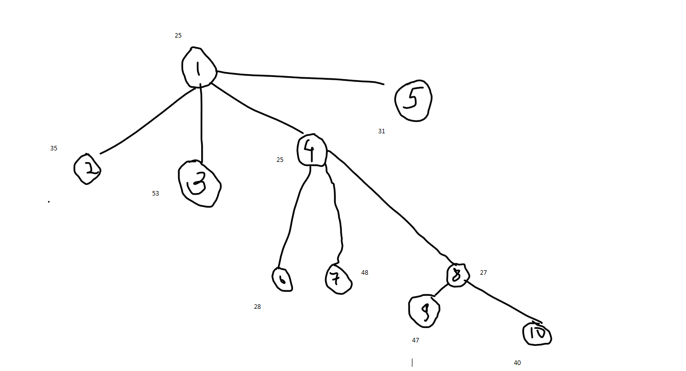

# Unit 2

## KnapSack problem

The knapsack problem is the following problem in combinatorial optimization:

    Given a set of items, each with a weight and a value, determine which items to include in the collection so that the total weight is less than or equal to a given limit and the total value is as large as possible

Lets see it in a boarder view

    Suppose
    n (no of objects) = 
    m (max weight) = 15

| Object | O | 1 | 2  | 3 | 4 | 5 | 6 | 7 |
| -| -| -| -| -| -| -| -| - |
| Profit | P | 10 | 5 | 15 | 7 | 6 | 18 | 3 |
Weight | W | 2 | 3 | 5 | 7 | 1 | 4 | 1
P/W | R | 5 | 1.66 | 3 | 1 | 6 | 4.5 | 3 |

Let's see what object we can put

| Remaining weight | 15 | 14 | 12 | 8 | 3 | 2 | 0 |  
| - | - | - | - | - | - | - | - |
| Weight added |  1 | 2 | 4 | 5 |  1 | 2 | 0 |

Selected elements

| x1 | x2 | x3 | x4 | x5 |  x6 | x7 |
| - | - | - | - | - | - | - |
| 1 | 2/3|  1 | 0 | 1 | 1 | 1 |

SUM(xiwi) = 1 x 2 + 2/3 x 3 + 1 x 5 + 1 x 1 + 1 x 4 + 1 x 1  = 15

SUM(xipi) = 1 x 10 + 2/3 x 5 + 1 x 6 + 1 x 18 + 1 x 3 = 55.3

Q. Let's see the same problem but with steps again

    n = 7
    m = 5

| Object | O | 1 | 2  | 3 | 4 | 5 | 6 | 7 |
| -| -| -| -| -| -| -| -| - |
| Profit | P | 10 | 5 | 15 | 7 | 6 | 18 | 3 |
Weight | W | 2 | 3 | 5 | 7 | 1 | 4 | 1
P/W | R | 5 | 1.66 | 3 | 1 | 6 | 4.5 | 3 |

Selection with max profit

| Obj | profit | weight | remaining weight |
| - | - | - | - |
| 0 | 0 | 0 | 15 |
| 6 | 18 | 4 | 15 - 4 = 11 |
| 3 | 15 | 5 | 11 - 5 = 6 |
| 1 | 10 | 2 | 6 - 2 = 4 |
| Assumed | 4 * 1 = 4 | 4 | 4 - 4 = 0 |

max profit = 47

Selection with min weight

| Obj | profit | weight | remaining weight |
| - | - | - | - |
| 0 | 0 | 0 | 15 |
| 5 | 6 | 1 | 15 - 1 = 14 |
| 7 | 3 | 1 | 14 - 1 = 13 |
| 1 | 10 | 2 | 13 - 2 = 11 |
| 2 | 5 | 3 | 11 - 3 = 8 |
| 6 | 18 | 4 | 8 - 4 = 4 |
|  | 4 * 3 = 12 | 4 | 4 - 4 = 0 |

max profit = 54

Select  object with maximum pi/wi

| Obj | profit | weight | remaining weight |
| - | - | - | - |
| 0 | 0 | 0 | 15 |
| 5 | 6 | 1 | 15 - 1 = 14 |
| 1 | 10 | 2 | 14 - 2 = 12 |
| 6 | 18 | 4 | 12 - 4 = 8 |
| 3 | 15 | 5 | 8 - 5 = 3 |
| 7 | 3 | 1 | 3 - 1 = 2 |
| 2 | 2 * 1.66 | 2 | 2 - 2 = 0 |  

max profit = 55.34

Because of max pi/wi we will get maximum value

## Job Sequencing with deadlines

For the following sequence of a job find out final sequence and max profit

| Job | 1 |  2 | 3 | 4 | 5 | 6 | 7
| - | - | - | - | - | - | - | - |
| Profit | 3 | 5 | 20 | 18 | 0 | 6 | 30 |
| Deadline| 1 | 3 | 4 | 3 | 2 | 1 | 2 |

Solution

Step 1

| Job | 7 |  3 | 4 | 6 | 2 | 1 | 5
| - | - | - | - | - | - | - | - |
| Profit | 30 | 20 | 18 | 6 | 5 | 3 | 0 |
| Deadline| 2 | 4 | 3 | 1 | 3 | 1 | 2 |

Step 2

| 0 | 1 | 2 | 3 | 4 |
| - | - | - | - | - |

as deadline values are from 0 to 4

Step 3

| JOB | 7 | | | | | |
| - | - | - | - | - | - | - |
| Profit | 30 |
| Deadline | 2 |

Step 4

| JOB | 7 | 3 | 4 | 6 | | |
| - | - | - | - | - | - | - |
| Profit | 30 | 20 | 18 | 6 |
| Deadline | 2 | 4 | 3 | 1 |

Step 5

| Job | 6 | 7 | 4 | 3 |
| - | - | - | - | - |
| Profit | 6 | 30 | 18 | 20 |
| Deadline | 1 | 2 | 3 | 4 |  

Max profit is 74

## 0/1 KnapSack  using DP

    k(i,c) = max[(Pi + k(i - 1, c - wi),k(i - 1, c))]

    k(i,c) = 0 [i == 0 || c == 0]

    k(i,c) = k(i,c) [wi > c]

Some *Example*

| | 01 | 02 | 03 |
| - | - | - | - |
| P | 10 | 12 | 28 |
| W | 1 | 2 | 4 |

0 to 6 is capacity below and 0 to 3 are objects

| O/C | 00 | 01 | 02 | 03 | 04 | 05 | 06 |
| - | - | - | - | - | - | - | - |
| 0 | 0 | 0 | 0 | 0 | 0 | 0 | 0 |
| 1 | 0 |
| 2 | 0 |
| 3 | 0 |

    k(1,1) = max[(10 + k(1,1)),k(1,0)]
    k(1,1) = max[10,0]
    k(1,1) = 10

    k(1,2) = max[(10 + k(1,2)),k(1,2-1)]
    k(1,2) = max[10,0]
    k(1,2) = 10

| O/C | 00 | 01 | 02 | 03 | 04 | 05 | 06 |
| - | - | - | - | - | - | - | - |
| 0 | 0 | 0 | 0 | 0 | 0 | 0 | 0 |
| 1 | 0 | 10 |
| 2 | 0 |
| 3 | 0 |

    k(1,3) = max[(10 + k(0,2)),k(0,3)]
    k(1,3) = max[10,0]
    k(1,3) = 10

| O/C | 00 | 01 | 02 | 03 | 04 | 05 | 06 |
| - | - | - | - | - | - | - | - |
| 0 | 0 | 0 | 0 | 0 | 0 | 0 | 0 |
| 1 | 0 | 10 | 10 | 10 |
| 2 | 0 |
| 3 | 0 |

    k(1,3) = max[(10 + k(0,2)),k(0,3)]
    k(1,3) = max[10,0]
    k(1,3) = 10

    K(1,4) = K(1,5) = k(1,6) = max(10,0) = 10

| O/C | 00 | 01 | 02 | 03 | 04 | 05 | 06 |
| - | - | - | - | - | - | - | - |
| 0 | 0 | 0 | 0 | 0 | 0 | 0 | 0 |
| 1 | 0 | 10 | 10 | 10 | 10 | 10 | 10 |
| 2 | 0 |
| 3 | 0 |

    K(2,1) = K(2-1,1) = 10

| O/C | 00 | 01 | 02 | 03 | 04 | 05 | 06 |
| - | - | - | - | - | - | - | - |
| 0 | 0 | 0 | 0 | 0 | 0 | 0 | 0 |
| 1 | 0 | 10 | 10 | 10 | 10 | 10 | 10 |
| 2 | 0 | 10 |
| 3 | 0 |

    K(2,2) = MAX[12 + K(1,0),K(1,2)]
    K(2,2) = MAX[12,10]
    K(2,2) = 12

| O/C | 00 | 01 | 02 | 03 | 04 | 05 | 06 |
| - | - | - | - | - | - | - | - |
| 0 | 0 | 0 | 0 | 0 | 0 | 0 | 0 |
| 1 | 0 | 10 | 10 | 10 | 10 | 10 | 10 |
| 2 | 0 | 10 | 12 |
| 3 | 0 |

    K(2,3) = MAX(12+K(1,1),K(1,3))
    K(2,3) = MAX(12+10,10)
    K(2,3) = 22

| O/C | 00 | 01 | 02 | 03 | 04 | 05 | 06 |
| - | - | - | - | - | - | - | - |
| 0 | 0 | 0 | 0 | 0 | 0 | 0 | 0 |
| 1 | 0 | 10 | 10 | 10 | 10 | 10 | 10 |
| 2 | 0 | 10 | 12 | 22 |
| 3 | 0 |

    K(2,4) = MAX(12+K(1,2),K(1,4))
    K(2,4) = MAX(12+10,10)
    K(2,4) = 22

| O/C | 00 | 01 | 02 | 03 | 04 | 05 | 06 |
| - | - | - | - | - | - | - | - |
| 0 | 0 | 0 | 0 | 0 | 0 | 0 | 0 |
| 1 | 0 | 10 | 10 | 10 | 10 | 10 | 10 |
| 2 | 0 | 10 | 12 | 22 | 22 |
| 3 | 0 |

    K(2,5) = MAX(12+K(1,3),K(1,5))
    K(2,5) = MAX(12+10,10)
    K(2,5) = 22
    K(2,6) = 22

| O/C | 00 | 01 | 02 | 03 | 04 | 05 | 06 |
| - | - | - | - | - | - | - | - |
| 0 | 0 | 0 | 0 | 0 | 0 | 0 | 0 |
| 1 | 0 | 10 | 10 | 10 | 10 | 10 | 10 |
| 2 | 0 | 10 | 12 | 22 | 22 | 22 | 22 |
| 3 | 0 |

    K(3,1) = MAX(10,0)
    K(3,1) = 10

| O/C | 00 | 01 | 02 | 03 | 04 | 05 | 06 |
| - | - | - | - | - | - | - | - |
| 0 | 0 | 0 | 0 | 0 | 0 | 0 | 0 |
| 1 | 0 | 10 | 10 | 10 | 10 | 10 | 10 |
| 2 | 0 | 10 | 12 | 22 | 22 | 22 | 22 |
| 3 | 0 | 10 |

    K(3,2) = 12

| O/C | 00 | 01 | 02 | 03 | 04 | 05 | 06 |
| - | - | - | - | - | - | - | - |
| 0 | 0 | 0 | 0 | 0 | 0 | 0 | 0 |
| 1 | 0 | 10 | 10 | 10 | 10 | 10 | 10 |
| 2 | 0 | 10 | 12 | 22 | 22 | 22 | 22 |
| 3 | 0 | 10 | 12 |

    K(3,3) = 22

| O/C | 00 | 01 | 02 | 03 | 04 | 05 | 06 |
| - | - | - | - | - | - | - | - |
| 0 | 0 | 0 | 0 | 0 | 0 | 0 | 0 |
| 1 | 0 | 10 | 10 | 10 | 10 | 10 | 10 |
| 2 | 0 | 10 | 12 | 22 | 22 | 22 | 22 |
| 3 | 0 | 10 | 12 | 22 |

    K(3,4) = MAX(28 + K(2,0),K(2,4))
    K(3,4) = MAX(38,22)
    K(3,4) = 28

| O/C | 00 | 01 | 02 | 03 | 04 | 05 | 06 |
| - | - | - | - | - | - | - | - |
| 0 | 0 | 0 | 0 | 0 | 0 | 0 | 0 |
| 1 | 0 | 10 | 10 | 10 | 10 | 10 | 10 |
| 2 | 0 | 10 | 12 | 22 | 22 | 22 | 22 |
| 3 | 0 | 10 | 12 | 22 | 28 |

    K(3,5) = MAX(28 + K(2,1),K(2,5))
    K(3,4) = MAX(28 + 10 , 22)
    K(3,4) = 38

| O/C | 00 | 01 | 02 | 03 | 04 | 05 | 06 |
| - | - | - | - | - | - | - | - |
| 0 | 0 | 0 | 0 | 0 | 0 | 0 | 0 |
| 1 | 0 | 10 | 10 | 10 | 10 | 10 | 10 |
| 2 | 0 | 10 | 12 | 22 | 22 | 22 | 22 |
| 3 | 0 | 10 | 12 | 22 | 28 | 38 |

    K(3,6) = MAX(28 + K(2,2),K(2,6))
    K(3,6) = MAX(28 + 12, 22)
    K(3,6) = 40

| O/C | 00 | 01 | 02 | 03 | 04 | 05 | 06 |
| - | - | - | - | - | - | - | - |
| 0 | 0 | 0 | 0 | 0 | 0 | 0 | 0 |
| 1 | 0 | 10 | 10 | 10 | 10 | 10 | 10 |
| 2 | 0 | 10 | 12 | 22 | 22 | 22 | 22 |
| 3 | 0 | 10 | 12 | 22 | 28 | 38 | 40 |

EXAMPLE *2*

NO OF ITEMS = 4

MAX WEIGHT = 5

WEIGHTS --> 2, 1, 3, 2

VALUES --> 12, 10, 20, 15

| C/O | 00 | 01 | 02 | 03 | 04 | 05 |
| - | - | - | - | - | - | - |
| 0 | 0 | 0 | 0 | 0 | 0 | 0 |
| 1 | 0 |
| 2 | 0 |
| 3 | 0 |
| 4 | 0 |

    K(1,1) = 0

| C/O | 00 | 01 | 02 | 03 | 04 | 05 |
| - | - | - | - | - | - | - |
| 0 | 0 | 0 | 0 | 0 | 0 | 0 |
| 1 | 0 | 0 |
| 2 | 0 |
| 3 | 0 |
| 4 | 0 |

    K(1,2) = MAX[12 + K(0,0),K(0,2)]
    K(1,2) = MAX[12,0]
    K(1,2) = 12

| C/O | 00 | 01 | 02 | 03 | 04 | 05 |
| - | - | - | - | - | - | - |
| 0 | 0 | 0 | 0 | 0 | 0 | 0 |
| 1 | 0 | 0 | 12 |
| 2 | 0 |
| 3 | 0 |
| 4 | 0 |

    K(1,3) = MAX[12 + K(0,1),K(0,3)]
    K(1,2) = MAX[12,0]
    K(1,2) = 12

| C/O | 00 | 01 | 02 | 03 | 04 | 05 |
| - | - | - | - | - | - | - |
| 0 | 0 | 0 | 0 | 0 | 0 | 0 |
| 1 | 0 | 0 | 12 | 12 |
| 2 | 0 |
| 3 | 0 |
| 4 | 0 |

    K(1,4) = K(1,5) = 12

| C/O | 00 | 01 | 02 | 03 | 04 | 05 |
| - | - | - | - | - | - | - |
| 0 | 0 | 0 | 0 | 0 | 0 | 0 |
| 1 | 0 | 0 | 12 | 12 | 12 | 12 |
| 2 | 0 |
| 3 | 0 |
| 4 | 0 |

    K(2,1) = MAX[10 + K(1,0),K(1,1)]
    K(2,1) = MAX[10,0]
    K(2,1) = 10

| C/O | 00 | 01 | 02 | 03 | 04 | 05 |
| - | - | - | - | - | - | - |
| 0 | 0 | 0 | 0 | 0 | 0 | 0 |
| 1 | 0 | 0 | 12 | 12 | 12 | 12 |
| 2 | 0 | 10 |
| 3 | 0 |
| 4 | 0 |

    K(2,2) = MAX[10 + K(1,1),K(1,2)]
    K(2,2) = MAX[10,12]
    K(2,2) = 12

| C/O | 00 | 01 | 02 | 03 | 04 | 05 |
| - | - | - | - | - | - | - |
| 0 | 0 | 0 | 0 | 0 | 0 | 0 |
| 1 | 0 | 0 | 12 | 12 | 12 | 12 |
| 2 | 0 | 10 | 12 |
| 3 | 0 |
| 4 | 0 |

    K(2,3) = MAX[10 + K(1,2),K(1,3)]
    K(2,3) = MAX[10 + 12 ,12]
    K(2,3) = 22

| C/O | 00 | 01 | 02 | 03 | 04 | 05 |
| - | - | - | - | - | - | - |
| 0 | 0 | 0 | 0 | 0 | 0 | 0 |
| 1 | 0 | 0 | 12 | 12 | 12 | 12 |
| 2 | 0 | 10 | 12 | 22 |
| 3 | 0 |
| 4 | 0 |

    K(2,4) = MAX[10 + K(1,3),K(1,4)]
    K(2,4) = MAX[10 + 12 ,12]
    K(2,4) = 22

    K(2,4) = K(2,5)

| C/O | 00 | 01 | 02 | 03 | 04 | 05 |
| - | - | - | - | - | - | - |
| 0 | 0 | 0 | 0 | 0 | 0 | 0 |
| 1 | 0 | 0 | 12 | 12 | 12 | 12 |
| 2 | 0 | 10 | 12 | 22 | 22 | 22 |
| 3 | 0 |
| 4 | 0 |

    K(3,1) = K(2,1)
    K(3,1) = 10

| C/O | 00 | 01 | 02 | 03 | 04 | 05 |
| - | - | - | - | - | - | - |
| 0 | 0 | 0 | 0 | 0 | 0 | 0 |
| 1 | 0 | 0 | 12 | 12 | 12 | 12 |
| 2 | 0 | 10 | 12 | 22 | 22 | 22 |
| 3 | 0 | 10 |
| 4 | 0 |

    K(3,2) = K(2,2)
    K(3,2) = 12

| C/O | 00 | 01 | 02 | 03 | 04 | 05 |
| - | - | - | - | - | - | - |
| 0 | 0 | 0 | 0 | 0 | 0 | 0 |
| 1 | 0 | 0 | 12 | 12 | 12 | 12 |
| 2 | 0 | 10 | 12 | 22 | 22 | 22 |
| 3 | 0 | 10 | 12 |
| 4 | 0 |

    K(3,3) = MAX[20 + K(2,0),K(2,3)]
    K(3,2) = MAX[20 + 0,22]
    K(3,2) = 22

| C/O | 00 | 01 | 02 | 03 | 04 | 05 |
| - | - | - | - | - | - | - |
| 0 | 0 | 0 | 0 | 0 | 0 | 0 |
| 1 | 0 | 0 | 12 | 12 | 12 | 12 |
| 2 | 0 | 10 | 12 | 22 | 22 | 22 |
| 3 | 0 | 10 | 12 | 22 |
| 4 | 0 |

    K(3,4) = MAX[20 + K(2,1),K(2,4)]
    K(3,4) = MAX[20 + 10,22]
    K(3,4) = 30

| C/O | 00 | 01 | 02 | 03 | 04 | 05 |
| - | - | - | - | - | - | - |
| 0 | 0 | 0 | 0 | 0 | 0 | 0 |
| 1 | 0 | 0 | 12 | 12 | 12 | 12 |
| 2 | 0 | 10 | 12 | 22 | 22 | 22 |
| 3 | 0 | 10 | 12 | 22 | 30 |
| 4 | 0 |

    K(3,5) = MAX[20 + K(2,2),K(2,5)]
    K(3,5) = MAX[20 + 12,22]
    K(3,5) = 32

| C/O | 00 | 01 | 02 | 03 | 04 | 05 |
| - | - | - | - | - | - | - |
| 0 | 0 | 0 | 0 | 0 | 0 | 0 |
| 1 | 0 | 0 | 12 | 12 | 12 | 12 |
| 2 | 0 | 10 | 12 | 22 | 22 | 22 |
| 3 | 0 | 10 | 12 | 22 | 30 | 32 |
| 4 | 0 |

    K(4,1) = K(3,1)
    K(4,1) = 10

| C/O | 00 | 01 | 02 | 03 | 04 | 05 |
| - | - | - | - | - | - | - |
| 0 | 0 | 0 | 0 | 0 | 0 | 0 |
| 1 | 0 | 0 | 12 | 12 | 12 | 12 |
| 2 | 0 | 10 | 12 | 22 | 22 | 22 |
| 3 | 0 | 10 | 12 | 22 | 30 | 32 |
| 4 | 0 | 10 |

    K(4,2) = MAX[15 + K(3,0),K(3,2)]
    K(4,2) = MAX[15,12]
    K(4,2) = 15

| C/O | 00 | 01 | 02 | 03 | 04 | 05 |
| - | - | - | - | - | - | - |
| 0 | 0 | 0 | 0 | 0 | 0 | 0 |
| 1 | 0 | 0 | 12 | 12 | 12 | 12 |
| 2 | 0 | 10 | 12 | 22 | 22 | 22 |
| 3 | 0 | 10 | 12 | 22 | 30 | 32 |
| 4 | 0 | 10 | 15 |

    K(4,3) = MAX[15 + K(3,1),K(3,3)]
    K(4,3) = MAX[15 + 10,22]
    K(4,3) = 25

| C/O | 00 | 01 | 02 | 03 | 04 | 05 |
| - | - | - | - | - | - | - |
| 0 | 0 | 0 | 0 | 0 | 0 | 0 |
| 1 | 0 | 0 | 12 | 12 | 12 | 12 |
| 2 | 0 | 10 | 12 | 22 | 22 | 22 |
| 3 | 0 | 10 | 12 | 22 | 30 | 32 |
| 4 | 0 | 10 | 15 | 25 |

    K(4,4) = MAX[15 + K(3,2),K(3,4)]
    K(4,4) = MAX[15 + 12,30]
    K(4,4) = 30

| C/O | 00 | 01 | 02 | 03 | 04 | 05 |
| - | - | - | - | - | - | - |
| 0 | 0 | 0 | 0 | 0 | 0 | 0 |
| 1 | 0 | 0 | 12 | 12 | 12 | 12 |
| 2 | 0 | 10 | 12 | 22 | 22 | 22 |
| 3 | 0 | 10 | 12 | 22 | 30 | 32 |
| 4 | 0 | 10 | 15 | 25 | 30 |

    K(4,5) = MAX[15 + K(3,3),K(3,5)]
    K(4,5) = MAX[15 + 22,32]
    K(4,5) = 37

| C/O | 00 | 01 | 02 | 03 | 04 | 05 |
| - | - | - | - | - | - | - |
| 0 | 0 | 0 | 0 | 0 | 0 | 0 |
| 1 | 0 | 0 | 12 | 12 | 12 | 12 |
| 2 | 0 | 10 | 12 | 22 | 22 | 22 |
| 3 | 0 | 10 | 12 | 22 | 30 | 32 |
| 4 | 0 | 10 | 15 | 25 | 30 | 37 |

## Traveling Salesman Problem

    Given a set of cities and distances between every pair of cities, the problem is to find the shortest possible route that visits every city exactly once and returns to the starting point.

### Solve TSP using Branch & Bound

M = {

    [INF,20,30,10,11],
    [15,INF,16,4,2],
    [3,5,INF,2,4],
    [19, 6, 18, INF, 3],
    [18,4,7,16,INF]

}

MIN ROW values = [10,2,2,3,4]

reducing the matrix

M = {

    [INF,10,20,0,1],
    [13,INF,14,2,0],
    [1,3,INF,0,2],
    [16, 3, 15, INF, 0],
    [13,0,3,12,INF]

}

MIN Colum values = [1,0,3,0,0]

M = {

    [INF,10 ,17 ,0  ,  1],
    [12 ,INF,11 ,2  ,  0],
    [0  , 3 ,INF,0  ,  2],
    [15 , 3 ,12 ,INF,  0],
    [11 , 0 , 0 ,12 ,INF]

}

consider path 1-2 make 1st row & 2nd column INF

    that is m[2][1] = INF

M = {

    [INF,INF,INF,INF,INF],
    [INF,INF,11 ,2  ,  0],
    [0  ,INF,INF,0  ,  2],
    [15 ,INF,12 ,INF,  0],
    [11 ,INF, 0 ,12 ,INF]

}

val = 25 + 0 + 10 = 35

consider path 1-3 make 1st row & 2nd column INF

    that is m[3][1] = INF

M = {

    [INF,INF,INF,INF,INF],
    [12 ,INF,INF,2  ,  0],
    [INF, 3 ,INF,0  ,  2],
    [15 , 3 ,INF,INF,  0],
    [11 , 0 ,INF,12 ,INF]

}

val = 25 + 11 + 17 = 53

consider path 1-4 make 1st row & 2nd column INF

    that is m[4][1] = INF

M = {

    [INF,INF,INF,INF,INF],
    [12 ,INF,11 ,INF,  0],
    [0  , 3 ,INF,INF,  2],
    [INF, 3 ,12 ,INF,  0],
    [11 , 0 , 0 ,INF,INF]

}

val = 25

consider path 1-5 make 1st row & 2nd column INF

    that is m[5][1] = INF

M = {

    [INF,INF,INF,INF,INF],
    [12 ,INF,11 ,2  ,INF],
    [0  , 3 ,INF,0  ,INF],
    [15 , 3 ,12 ,INF,INF],
    [INF, 0 , 0 ,12 ,INF]

}

val = 25 + 2 + 3 + 1 = 31

consider path 1-4-2 as infinity

M = {

    [INF,INF,INF,INF,INF],
    [INF,INF,11 ,2  ,  0],
    [0  ,INF,INF,0  ,  2],
    [INF,INF,INF,INF,INF],
    [11 ,INF, 0 ,INF,INF]

}

val = 25 + 0 + 3 = 28

consider path 1-4-3 as infinity

M = {

    [INF,INF,INF,INF,INF],
    [12 ,3  ,11 ,2  ,  0],
    [INF,INF,INF,0  ,  2],
    [INF,0  ,INF,INF,INF],
    [11 ,INF, 0 ,12 ,INF]

}

val = 25 + 11 + 12 = 48

consider path 1-4-5 as infinity

M = {

    [INF,INF,INF,INF,INF],
    [12 ,INF,11 ,2  ,INF],
    [0  , 3 ,INF,0  ,INF],
    [INF,INF,INF,INF,INF],
    [INF, 0 , 0 ,12 ,INF]

}

val = 27

consider path 1-4-5-2

M = {

    [INF,INF,INF,INF,INF],
    [12 ,INF,11 ,INF,INF],
    [0  ,INF,INF,INF,INF],
    [INF,INF,INF,INF,INF],
    [INF,INF,INF,INF,INF]

}

val = 22 + 25 = 47

consider path 1-4-5-3

M = {

    [INF,INF,INF,INF,INF],
    [12 ,INF,INF,INF,INF],
    [INF,3  ,INF,INF,INF],
    [INF,INF,INF,INF,INF],
    [INF,INF,INF,INF,INF]

}

val = 22 + 15 = 40

consider path 1-4-5-3-2

M = {

    [INF,INF,INF,INF,INF],
    [INF,INF,INF,INF,INF],
    [INF,INF,INF,INF,INF],
    [INF,INF,INF,INF,INF],
    [INF,INF,INF,INF,INF]

}

val = 25 + 3 = 28

Final **Tree**

Q2. Solve

M = {

    [INF,11 ,10 ,9  ,  6],
    [8  ,INF,7  ,3  ,  4],
    [8  ,4  ,INF,4  ,  8],
    [11 ,10 ,5  ,INF,  6],
    [6  ,9  ,5  ,5  ,INF],

}

min row val = [6,3,4,5,5]

row reduction

M = {

    [INF,5  ,4  ,3  ,  0],
    [5  ,INF,4  ,0  ,  1],
    [4  ,0  ,INF,0  ,  4],
    [6  ,5  ,0  ,INF,  1],
    [1  ,4  ,0  ,0  ,INF],

}

min col values = [1,0,0,0,0]

col reduction

M = {

    [INF,5  ,4  ,3  ,  0],
    [4  ,INF,4  ,0  ,  1],
    [3  ,0  ,INF,0  ,  4],
    [5  ,5  ,0  ,INF,  1],
    [0  ,4  ,0  ,0  ,INF],

}
