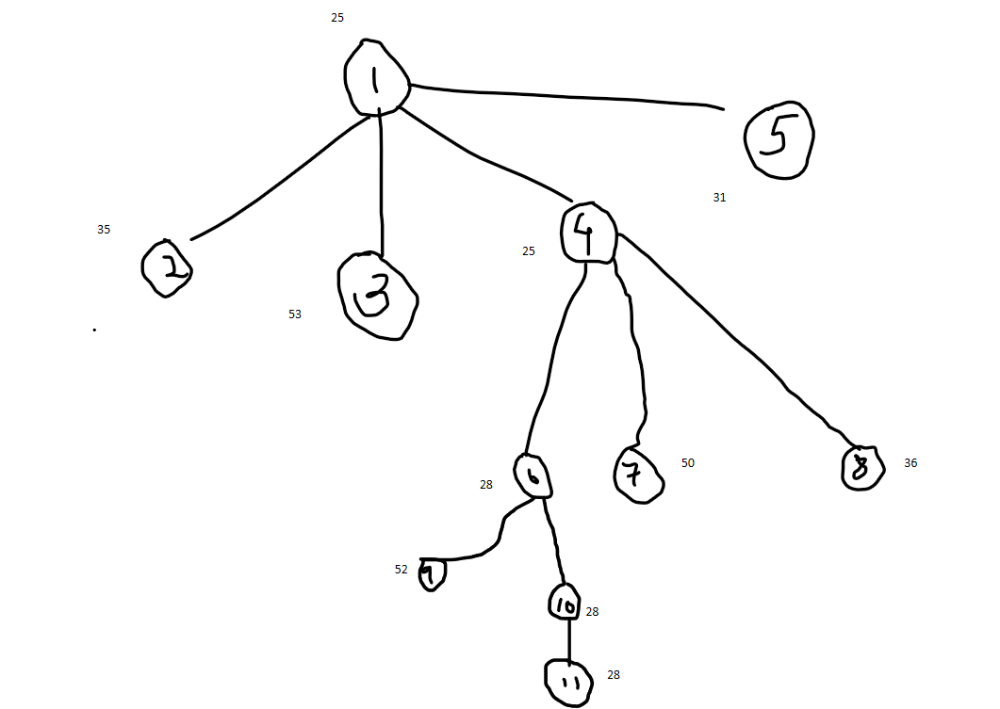
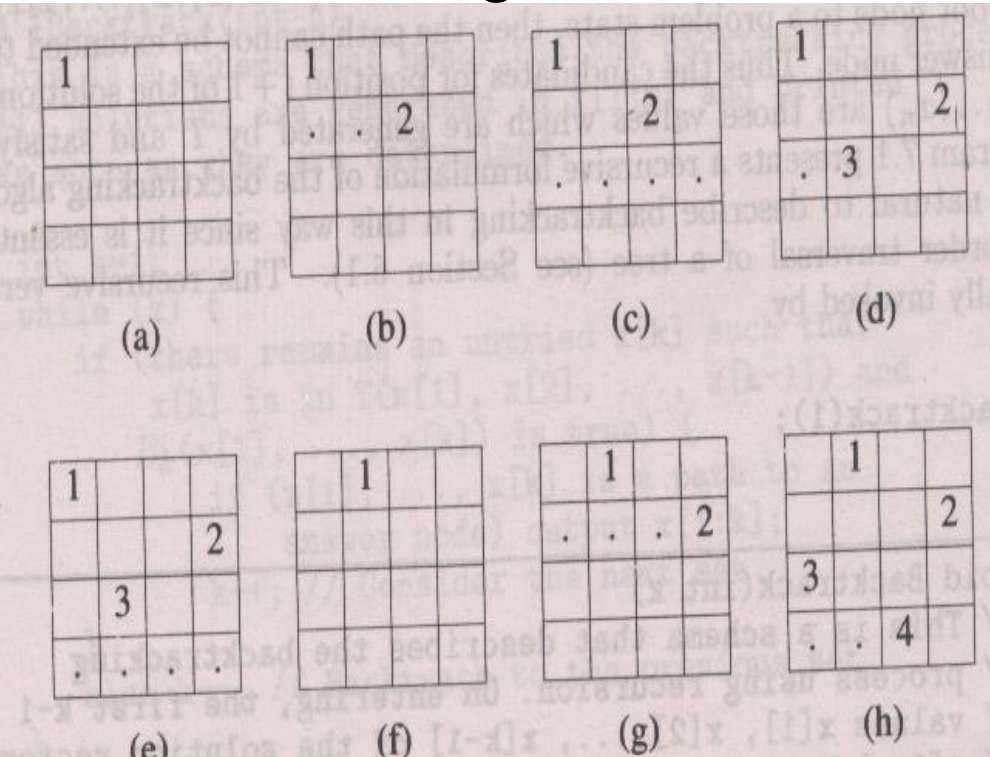
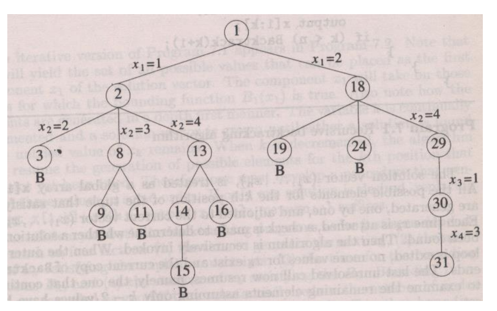

# Unit 3

## Traveling Salesman Problem

    Given a set of cities and distances between every pair of cities, the problem is to find the shortest possible route that visits every city exactly once and returns to the starting point.

### Solve TSP using Branch & Bound

M = {

    [INF,20,30,10,11],
    [15,INF,16,4,2],
    [3,5,INF,2,4],
    [19, 6, 18, INF, 3],
    [18,4,7,16,INF]

}

MIN ROW values = [10,2,2,3,4]

reducing the matrix

M = {

    [INF,10,20,0,1],
    [13,INF,14,2,0],
    [1,3,INF,0,2],
    [16, 3, 15, INF, 0],
    [13,0,3,12,INF]

}

MIN Colum values = [1,0,3,0,0]

M = {

    [INF,10 ,17 ,0  ,  1],
    [12 ,INF,11 ,2  ,  0],
    [0  , 3 ,INF,0  ,  2],
    [15 , 3 ,12 ,INF,  0],
    [11 , 0 , 0 ,12 ,INF]

}

consider path 1-2 make 1st row & 2nd column INF

    that is m[2][1] = INF

M = {

    [INF,INF,INF,INF,INF],
    [INF,INF,11 ,2  ,  0],
    [0  ,INF,INF,0  ,  2],
    [15 ,INF,12 ,INF,  0],
    [11 ,INF, 0 ,12 ,INF]

}

val = 25 + 0 + 10 = 35

consider path 1-3 make 1st row & 2nd column INF

    that is m[3][1] = INF

M = {

    [INF,INF,INF,INF,INF],
    [12 ,INF,INF,2  ,  0],
    [INF, 3 ,INF,0  ,  2],
    [15 , 3 ,INF,INF,  0],
    [11 , 0 ,INF,12 ,INF]

}

val = 25 + 11 + 17 = 53

consider path 1-4 make 1st row & 2nd column INF

    that is m[4][1] = INF

M = {

    [INF,INF,INF,INF,INF],
    [12 ,INF,11 ,INF,  0],
    [0  , 3 ,INF,INF,  2],
    [INF, 3 ,12 ,INF,  0],
    [11 , 0 , 0 ,INF,INF]

}

val = 25

consider path 1-5 make 1st row & 2nd column INF

    that is m[5][1] = INF

M = {

    [INF,INF,INF,INF,INF],
    [12 ,INF,11 ,2  ,INF],
    [0  , 3 ,INF,0  ,INF],
    [15 , 3 ,12 ,INF,INF],
    [INF, 0 , 0 ,12 ,INF]

}

val = 25 + 2 + 3 + 1 = 31

consider path 1-4-2 as infinity

M = {

    [INF,INF,INF,INF,INF],
    [INF,INF,11 ,INF,  0],
    [0  ,INF,INF,INF,  2],
    [INF,INF,INF,INF,INF],
    [11 ,INF, 0 ,INF,INF]

}

val = 25 + 0 + 3 = 28

consider path 1-4-3 as infinity

M = {

    [INF,INF,INF,INF,INF],
    [12 ,INF,INF,INF,  0],
    [INF,3  ,INF,INF,  2],
    [INF,INF,INF,INF,INF],
    [11 ,0  ,INF,INF,INF]

}

val = 25 + 13 + 12 = 50

consider path 1-4-5 as infinity

M = {

    [INF,INF,INF,INF,INF],
    [12 ,INF,11 ,INF,INF],
    [0  , 3 ,INF,INF,INF],
    [INF,INF,INF,INF,INF],
    [INF, 0 , 0 ,INF,INF]

}

val = 25 + 11 + 0 = 36

consider path 1-4-2-3

M = {

    [INF,INF,INF,INF,INF],
    [INF,INF,INF,INF,INF],
    [INF,INF,INF,INF,  2],
    [INF,INF,INF,INF,INF],
    [ 11,INF,INF,INF,INF]

}

val = 28 + 13 + 11 = 52

consider path 1-4-2-5

M = {

    [INF,INF,INF,INF,INF],
    [INF,INF,INF,INF,INF],
    [  0,INF,INF,INF,INF],
    [INF,INF,INF,INF,INF],
    [INF,INF,  0,INF,INF]

}

val = 28 + 0 + 0 = 28

consider path 1-4-2-5-3

M = {

    [INF,INF,INF,INF,INF],
    [INF,INF,INF,INF,INF],
    [INF,INF,INF,INF,INF],
    [INF,INF,INF,INF,INF],
    [INF,INF,INF,INF,INF]

}

val = 28 + 0 + 0 = 28

Final **Tree**

Q2. Find reduced matrix

M = {

    [INF,11 ,10 ,9  ,  6],
    [8  ,INF,7  ,3  ,  4],
    [8  ,4  ,INF,4  ,  8],
    [11 ,10 ,5  ,INF,  6],
    [6  ,9  ,5  ,5  ,INF],

}

min row val = [6,3,4,5,5]

row reduction

M = {

    [INF,5  ,4  ,3  ,  0],
    [5  ,INF,4  ,0  ,  1],
    [4  ,0  ,INF,0  ,  4],
    [6  ,5  ,0  ,INF,  1],
    [1  ,4  ,0  ,0  ,INF],

}

min col values = [1,0,0,0,0]

col reduction

M = {

    [INF,5  ,4  ,3  ,  0],
    [4  ,INF,4  ,0  ,  1],
    [3  ,0  ,INF,0  ,  4],
    [5  ,5  ,0  ,INF,  1],
    [0  ,4  ,0  ,0  ,INF],

}

## Backtracking

* Backtracking is a methodical way of trying out various sequences of decisions, until you find one that “works”

* Build up solution vector, one component at a time

* Use modified criterion functions Pi(x1, .. ,xn), sometimes called bounding functions to test whether the vector being formed has any chance of success

* If partial vector (x1,..xi) cannot lead to success, then mi+1..mn possible test vectors can be ignored entirely

* There are 2 categories of constraints that a backtracking problem should statisfy

        A.Implicit
            i. All tuples that satisfy the explicit constraints define a possible solution space for I
        B.Explicit
            i. Rules that determine which of the tuples in the solution space of I satisfy the criterion function
            ii. They describe the way in which the xi must relate to each other

Important Notes:

    1. Backtracking algorithms try each possibility until they find the right one. 
    2. It is a depth-first search of the set of possible solutions. 
    3. During the search, if an alternative doesn't  work, the search backtracks to the choice  point, the place which presented different alternatives, and tries the next alternative
    4. When the alternatives are exhausted, the search returns to the previous choice point and tries the next alternative there
    5. If there are no more choice points, the search fails

## NQueens

* The N-queens problem is a classic problem in computer science

* The problem is to place n queens on an n x n chessboard such that no two queens attack each other

* A queen can attack another queen if it is in the same row, column, or diagonal. The problem can be solved using backtracking

* The time complexity of the N-queens problem is O(n!)

* The space complexity of the N-queens problem is O(n)

  

  

### Analysis of N Queens problem

* Using brute force approach for an 8x8 chess board there are (64 C 8) possible ways to place 8 queens

* However using NQueens function we allow placement of 8 queens on distinct rows and columns, hence we require to examine of at most 8!

* So time complexity N queens problem is O(N!)
