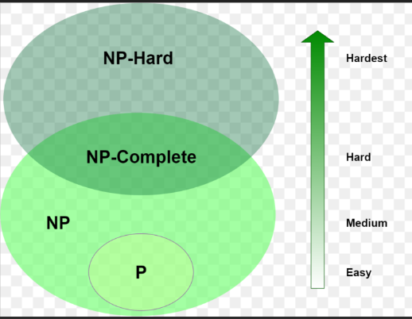

# Unit 4 Intractable Problems and NP-Completeness

Algorithm can be divided into two parts

1. Ploynomial time

   1) Linear Search
   2) Binary Search
   3) Insertion Sort
   4) Merge Sort
2. Exponential time / Non ploynomial time

   1) TSP
   2) GRAPH COLORING
   3) Sudoku
   4) Scheduling

## P Class Problem

A problem which can be solved in ploynomial time is called the P class problem

## NP Class Problem

* A problem which cannot be solved in ploynomial time but it is verified in ploynomial time is called the NP class problem
* Example SUDOKU

  +-------+-------+-------+
  | 6 3 . | . 7 . | . . . |
  | . 9 . | . . 6 | 3 7 . |
  | 8 . . | 9 . . | . 6 2 |
  +-------+-------+-------+
  | . 6 . | 2 8 9 | 1 . . |
  | 3 . 9 | . 6 . | 7 . 8 |
  | . . 1 | 7 3 4 | . 9 . |
  +-------+-------+-------+
  | 7 4 . | . . 8 | . . 6 |
  | . 2 6 | 6 . . | . 8 . |
  | . . . | . 9 . | . 4 7 |
  +-------+-------+-------+

## Deterministic algorithm

    Problems where we know its every steps

## Non Deterministic algorithm

    1. Problems where we don't know its every steps

    2. Example

```Python
        def TYC_SEARCH(A,N,KEY):
            i = choice()

            if(i == key)
                print(i)
  
            print(0)

```

## P & NP CLASS + NP HARD & NP Complete

    +---------------------+
    |                     |
    |                     |    +-----------------+
    |                     |    |                 |
    |                     |    |                 |
    |          NP         |    |                 |
    |                     |    |                 |
    |                     |    |                 |
    |                     |    |                 |
    +---------------------+    |                 |
    |          P          |    |                 |
    +---------------------+    |                 |
                               |                 |
                               |   NPcomplete    |
                               |                 |
    |                 |
                               +-----------------+
                               |   NP-hard       |
                               +-----------------+

Exact Diagram



1. Inside P tractable problems are there
2. Inside NP non tractable problems are there
3. P is the class of problems that can be solved by a deterministic machine in polynomial time
4. NP is the class of problems that can be solved by a non-deterministic machine in polynomial time, or equivalently, verified by a deterministic machine in polynomial time given a certificate or a hint.
5. **NP-complete is the class of problems that are both in NP and as hard as any problem in NP**, meaning that **any problem in NP can be reduced to them in polynomial time**. Example eulers graph
6. **NP-hard is the class of problems that are at least as hard as any problem in NP**, meaning that **any problem in NP can be reduced to them in polynomial time, but they may or may not be in NP themselves.** Example optimization problem

The diagram also shows two possible scenarios for the relationship between P and NP

    1. The left side assumes that P ≠ NP, meaning that there are some problems in NP that cannot be solved by a deterministic machine in polynomial time. This is the most widely believed conjecture, but it has not been proven or disproven yet.
    2. The right side assumes that P = NP, meaning that there are no problems in NP that cannot be solved by a deterministic machine in polynomial time. This would imply that all problems in NP are also in P, and that all problems in NP-complete are also in P. This would have profound implications for cryptography, optimization, and artificial intelligence, but it is considered very unlikely by most experts.

## More on NP HARD & NP Complete

    + - +         + - +
    + A + - - - > + B -
    + - + - - - - + - +

1. A & B are two problem A reduces to problem B
2. There is a way to solve A by deterministic algo that solve B in ploynomial time

## Hamilton Cycle

Example 1


    Hamilton Cycle --> 1 2 3 4 5 6 1
    Hamilton Cycle --> 1 2 6 5 4 3 1

Example 2


    It is not a hamilton cycle

Example 3


    Consider the above graph

    it will have a matrix

    1 2 3 4 5
    1 0 1 1 0 1
    2 1 0 1 1 1
    3 1 1 0 1 0
    4 0 1 1 0 1
    5 1 1 0 1 0


    1. The above is general solution which is obtained by exapanding the node
    2. This is not an optimized solution
    3. To find optimized solution we need to use approximate algorithm

## Vertex Cover Problem

1. Vertex Cover Problem is a known NP Complete problem, i.e., there is no polynomial-time solution for this unless P = NP
2. Consider all the subset of vertices one by one and find out whether it covers all edges of the graph. For eg. in a graph consisting only 3 vertices the set consisting of the combination of vertices are:{0,1,2,{0,1},{0,2},{1,2},{0,1,2}}
3. Approximate Algorithm for Vertex Cover

   1) Initialize the result as {}
   2) Consider a set of all edges in given graph.  Let the set be E.
   3) Do following while E is not empty

      a) Pick an arbitrary edge (u, v) from set E and add 'u' and 'v' to result
      b) Remove all edges from E which are either incident on u or v.
   4) Return result

   

* Terms of approximation algo

  1. C --> Cost of Solution
  2. C* --> Cost of optimal solution
  3. P(n) --> approximation ratio
  4. n --> i/p size
* Problem

  E = { (c,d), (b,c), (a,b) }

  C = fi

  C = fi U {b,c}

  furthur

  (b,c) U (e,f)

  {b,c,e,f} U {d, g }

  {b,c,e,f,d,g}

## SAT-3

* 3-SAT is a decision problem in computational complexity theory, in which the input is a Boolean formula in conjunctive normal form (CNF) in which each clause contains exactly three literals. The problem is to determine whether there is an assignment of truth values to the variables such that the formula is satisfiable
* 3-SAT is one of Karp's 21 **NP-complete problems**
* A simple example of a 3-SAT formula is: **(x1 or x2 or x3) and (x4 or x5 or x6) and (x7 or x8 or x9)**
* This formula is satisfiable if and only if we can assign truth values to x1, x2, x3, x4, x5, x6, x7, x8, and x9 such that each clause contains exactly one true literal. For example, one possible assignment is x1 = true, x2 = false, x3 = false, x4 = true, x5 = false, x6 = true, x7 = false, x8 = true, and x9 = false. This assignment makes the formula satisfiable, because each clause contains exactly one true literal
* 3-SAT is a very important problem in computer science. It is used in the design of many algorithms and data structures, and it is also used in the verification of hardware and software systems
* Applications of 3-SAT
  * In the design of algorithms and data structures, 3-SAT is used to find the minimum vertex cover in a graph
  * In the verification of hardware and software systems, 3-SAT is used to find bugs and errors
  * In artificial intelligence, 3-SAT is used to solve problems such as planning and scheduling
* There is no known polynomial-time algorithm for solving 3-SAT, and the best known algorithms run in exponential time
