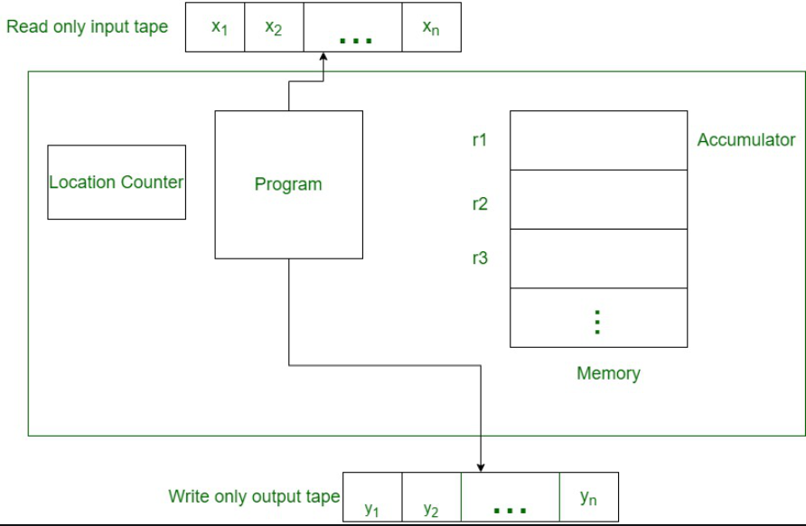
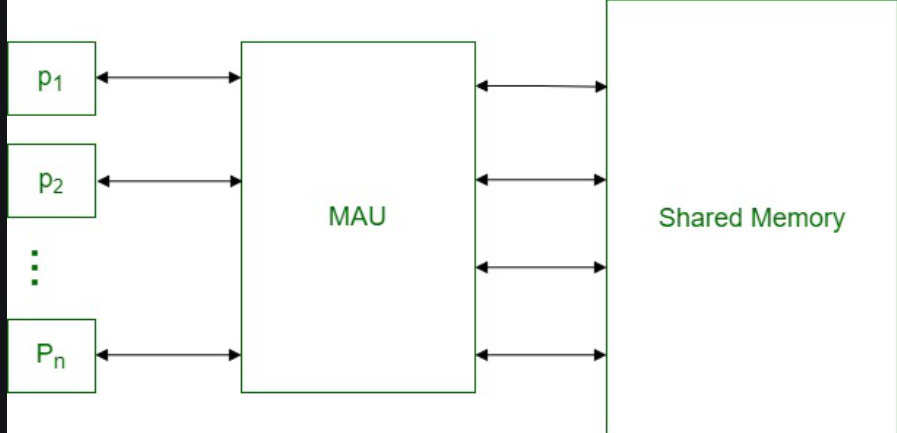
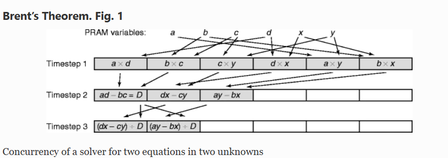
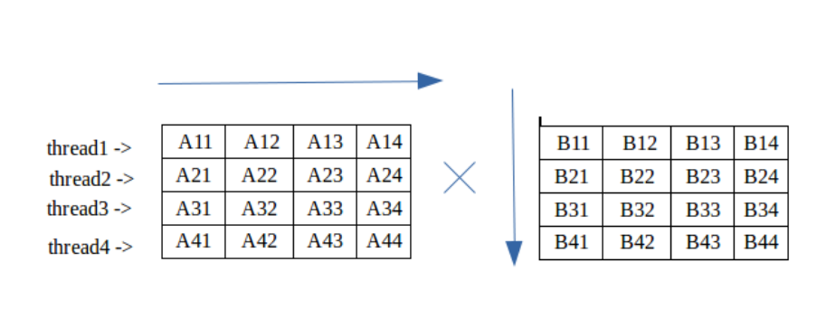

# Unit 6 Parallel and Concurrent Algorithms

## Parallel and Concurrent Algorithms

### Parallel Algorithm

* Parallel algorithms use multiple processing units (such as CPUs or cores) to divide a problem into smaller sub-problems that can be solved simultaneously. Parallel algorithms aim to improve the throughput and computational speed of the system by exploiting parallelism

* Parallel algorithms use multiple processing units (such as CPUs or cores) to divide a problem into smaller sub-problems that can be solved simultaneously. Parallel algorithms aim to improve the throughput and computational speed of the system by exploiting parallelism

* Example

        Parallel quick sort: This algorithm sorts an array of elements by dividing it into smaller sub-arrays that can be sorted independently and in parallel

        Sparse matrix factorization: This algorithm decomposes a sparse matrix (a matrix with many zero elements) into a product of two or more smaller matrices that can be computed in parallel. Sparse matrix factorization can be useful for solving linear systems, finding eigenvalues, or performing dimensionality reduction

        Parallel algorithms derived via divide-and-conquer approach: This is a general technique for designing parallel algorithms that involves breaking a problem into smaller sub-problems that can be solved recursively and in parallel. The solutions to the sub-problems are then combined to obtain the solution to the original problem

### Concurrent algorithms

* Concurrent algorithms use a single processing unit to interleave multiple tasks or computations that can run independently of each other

* Concurrent algorithms aim to maximize the CPU utilization by minimizing its idle time. Concurrent algorithms create the illusion of parallelism by switching between tasks using context switching

* Example

        1. Parallel algorithms use multiple processing units (such as CPUs or cores) to divide a problem into smaller sub-problems that can be solved simultaneously. Parallel algorithms aim to improve the throughput and computational speed of the system by exploiting parallelism. An example of a parallel algorithm is the concurrency::parallel_for algorithm that repeatedly performs the same task in parallel for different iteration values

        2. Concurrency control techniques: These are techniques that ensure the correctness and consistency of data in a database system that allows concurrent access by multiple transactions. Some of the techniques are two-phase locking, timestamp ordering, optimistic concurrency control, and multiversion concurrency control

        3. Parallel expression evaluation: This is a technique that evaluates arithmetic expressions by breaking them into smaller sub-expressions that can be computed concurrently. The technique uses a dependency graph to determine the order of evaluation and a work-stealing scheduler to assign tasks to thread

## RAM



* The algorithm required to solve a problem on a sequential computer is called a sequential algorithm

* Random Access Machine or RAM model is a CPU

* Memory cells are numbered and it takes time to access any cell in memory or say all operations (read/write from memory, standard arithmetic, and Boolean operations) take a unit of time

* Algorithm consists of the following steps

        Read: (Up to) N processors simultaneously (in parallel) read from N memory locations (as in memory) and store the values in their local registers

        Compute: (Up to) N processors perform basic arithmetic or logical operations on values in their registers

        Write: (Up to) N processors simultaneously write from their registers in (up to) N memory locations

* Each step, READ, COMPUTE, WRITE, is assumed to take O(1) time in the case of RAM

## PRAM



* Parallel Random Access Machine, also called PRAM is a model considered for most of the parallel algorithms

* It helps to write a precursor parallel algorithm without any architecture constraints and also allows parallel-algorithm designers to treat processing power as unlimited. It ignores the complexity of inter-process communication

* Models of PRAM

        EREW: also called Exclusive Read Exclusive Write is a constraint that doesn’t allow two processors to read or write from the same memory location at the same instance

        CREW: also called Concurrent Read Exclusive Write is a constraint that allows all the processors to read from the same memory location but are not allowed to write into the same memory location at the same time

        ERCW: also called Exclusive Read Concurrent Write is a constraint that allows all the processors to write to the same memory location but are now allowed to read the same memory location at the same time

        CRCW: also called Concurrent Read Concurrent Write is a constraint that allows all the processors to read from and write to the same memory location parallelly

## Amdahl's law

* It is formula used to find

* Max improvement possible by improving particular part of system

* Helcomputing it is used to predict

* Speed up of programme using multiple processes

* Preparing run in parallel computation it can br **serial**, **Parallel** or **Both**

| F | 1 - F |
| - | ----- |
| Serial | Parallel |

Computation of a programme

    <= 1 / (F + ((1-F)/P))

Single Processor Time ( SCM )

* It equals

         Single processor time /  n processors time

Note:

        Computational time = Serial Exec + parallel exec

| F | 1 - F |
| - | ----- |
| Serial | Parallel |

Parallel = 1 - F / n

S(n) <= 1 / (F + ((1 - F)/n))

## Theorem Based Problem

1. T(n) < n^(log of a to the base b)

    T(n) = Theta ( n ^ (log of a to the base b))

2. F(n) = n ^ (log of a to the base b)

    T(n) = Theta ( n ^ (log of a to the base b) log n)

3. F(n) > n ^ (log of a to the base b)

    T(n) = Theta * F(n)

Example

1. T(n) = 2T(n/2) + n^2

2. T(n) = T(9n/10) + n

3. T(n) = 8T(n/4) + n^2

## Brent's theorem

* Brent's theorem specifies for a sequential algorithm with t time  steps, and a total of m operations, that a run time T is definitely possible on a shared memory machine (PRAM ) with processors

* formula: T = t + (m-t)/p

* Key to understanding Brent's theorem is understanding time steps.

* In a single time step every instruction that has no dependencies is executed, and therefore t is equal to the length of the longest chain of instructions that depend on the results of other instructions (as any shorter chains will be finished executing by (or before) the time the longest chain has)

* Example

        Brent’s Theorem tells us an upper bound on the time a PRAM with four processors would take to perform the algorithm

        {T}_ {4} leq 3 + frac {11 - 3} {4} = 5.

* Assume a parallel computer where each processor can perform an arithmetic operation in unit time. Further, assume that the computer has exactly enough processors to exploit the maximum concurrency in an algorithm with N operations, such that T time steps suffice. Brent’s Theorem says that a similar computer with fewer processors, P, can perform the algorithm in time

        Tp <= T + (N - T) / P 

  

## Parallel Algorithm Analysis

* Parallel algorithm analysis is the process of finding the computational complexity of algorithms executed in parallel – the amount of time, storage, or other resources needed to execute them

* Analysis of an algorithm helps us determine whether the algorithm is useful or not. Generally, an algorithm is analyzed based on its execution time (Time Complexity) and the amount of space (Space Complexity) it requires

* Total number of processors used

        The number of processors used is an important factor in analyzing the efficiency of a parallel algorithm. The cost to buy, maintain, and run the computers are calculated. Larger the number of processors used by an algorithm to solve a problem, more costly becomes the obtained result.

* Total Cost

        1. Total Cost = Time complexity × Number of processors used

        2. Efficiency of a parallel algorithm

            Worst case execution time of sequential algorithm / Worst case execution time of the parallel algorithm

* Speedup of an Algorithm

        The performance of a parallel algorithm is determined by calculating its speedup. Speedup is defined as the ratio of the worst-case execution time of the fastest known sequential algorithm for a particular problem to the worst-case execution time of the parallel algorithm.

* Asymptotic Analysis

        1. Big O notation

            It represents the behavior of a function for large inputs in a simple and accurate method

            f(n) = O(g(n))

        2. Omega notation

            Omega notation is a method of representing the lower bound of an algorithm’s execution time

            f(n) = Ω (g(n))

        3. Theta Notation

            Theta notation is a method of representing both the lower bound and the upper bound of an algorithm’s execution time

            f(n) = θ(g(n))

## Multithreaded Matrix Multiplication

1. Time complexity of matrix multiplication is O(n^3) using normal matrix multiplication. And Strassen algorithm improves it and its time complexity is O(n^(2.8074))

2. Multi-threading can be done to improve it. In multi-threading, instead of utilizing a single core of your processor, we utilizes all or more core to solve the problem

3. Depending upon the number of cores your processor has, you can create the number of threads required

4. Although you can create as many threads as you need, a better way is to create each thread for one core

   

5. Concurrent algorithms are algorithms that can be executed by multiple processes or threads that may run in parallel or interleave

6. They are designed to exploit the parallelism of hardware or to improve the responsiveness of software. Concurrent algorithms often use synchronization mechanisms such as locks, semaphores, monitors, or message passing to coordinate the actions of different threads or processes

### Implimentation

```C

#include<stdio.h>
#include<pthread.h>
#include<unistd.h>
#include<stdlib.h>
#define MAX 4
 
 
//Each thread computes single element in the resultant matrix
void *mult(void* arg)
{
    int *data = (int *)arg;
    int k = 0, i = 0;
     
    int x = data[0];
    for (i = 1; i <= x; i++)
           k += data[i]*data[i+x];
     
    int *p = (int*)malloc(sizeof(int));
         *p = k;
     
//Used to terminate a thread and the return value is passed as a pointer
    pthread_exit(p);
}
 
//Driver code
int main()
{
 
    int matA[MAX][MAX];
    int matB[MAX][MAX];
     
     
    int r1=MAX,c1=MAX,r2=MAX,c2=MAX,i,j,k;
 
 
    // Generating random values in matA
    for (i = 0; i < r1; i++)
            for (j = 0; j < c1; j++)
                   matA[i][j] = rand() % 10;
           
        // Generating random values in matB
    for (i = 0; i < r1; i++)
            for (j = 0; j < c1; j++)
                   matB[i][j] = rand() % 10;
    
    // Displaying matA        
    for (i = 0; i < r1; i++){
        for(j = 0; j < c1; j++)
            printf("%d ",matA[i][j]);
        printf("\n");
    }
             
    // Displaying matB               
    for (i = 0; i < r2; i++){
        for(j = 0; j < c2; j++)
            printf("%d ",matB[i][j]);
        printf("\n");   
    }
     
     
    int max = r1*c2;
     
     
    //declaring array of threads of size r1*c2       
    pthread_t *threads;
    threads = (pthread_t*)malloc(max*sizeof(pthread_t));
     
    int count = 0;
    int* data = NULL;
    for (i = 0; i < r1; i++)
        for (j = 0; j < c2; j++)
               {
                
               //storing row and column elements in data
            data = (int *)malloc((20)*sizeof(int));
            data[0] = c1;
     
            for (k = 0; k < c1; k++)
                data[k+1] = matA[i][k];
     
            for (k = 0; k < r2; k++)
                data[k+c1+1] = matB[k][j];
              
             //creating threads
                pthread_create(&threads[count++], NULL,
                               mult, (void*)(data));
                 
                    }
     
    printf("RESULTANT MATRIX IS :- \n");
    for (i = 0; i < max; i++)
    {
      void *k;
       
      //Joining all threads and collecting return value
      pthread_join(threads[i], &k);
            
           
          int *p = (int *)k;
      printf("%d ",*p);
      if ((i + 1) % c2 == 0)
          printf("\n");
    }
 
     
 
  return 0;
}
```

Input & Output

    Matrix A
    3 7 3 6 
    9 2 0 3 
    0 2 1 7 
    2 2 7 9

    Matrix B
    6 5 5 2 
    1 7 9 6 
    6 6 8 9 
    0 3 5 2 

    Multiplication of A and B
    43 100 132 87 
    56 68 78 36 
    8 41 61 35 
    56 93 129 97 

### Important note

    Time Complexity: O(MAX*MAX)
    Auxiliary Space: O(MAX*MAX)

## Dinning Philosopher

* The dining philosopher problem is a classic synchronization problem in computer science that involves multiple processes (philosophers) sharing a limited set of resources (forks) in order to perform a task (eating)

* The problem is that each philosopher needs two forks to eat, but there is only one fork between each pair of philosophers

* Therefore, a philosopher may have to wait for another philosopher to finish eating and release a fork before he or she can eat

### Constraints and Condition for the problem

1. Constraints and Condition for the problem

2. Every Philosopher may pick up the forks on the left or right but only one fork at once

3. Every Philosopher may pick up the forks on the left or right but only one fork at once

4. Every Philosopher may pick up the forks on the left or right but only one fork at once

### solution

1. This problem was structured to tackle the issue of deadlocks which occurs during multiple resource sharing on an operating system

2. A deadlock is a situation in which two computer programs sharing the same resource are effectively preventing each other from accessing the resource, resulting in both programs ceasing to function

3. Let us consider the philosophers to be processed in an OS and the chopsticks to be shared resources. Now if we observe clearly, each process needs two resources, out of which, one of the resources it has already acquired, but another resource is in use for another process

4. Due to this, till the time the other process does not release its resource, the current process cannot proceed further

5. Therefore, every process is waiting for some other process, hence they are in a circular wait. This leads the system to a deadlock

### Illustration

1. Let us consider the philosophers as P0, P1, P2, P3, P4, and chopsticks as C0, C1, C2, C3, C4

2. Now, process P1 enters the system. Since P0 is already acquiring the resource C0 and C1, P1 cannot acquire the process C1. Therefore, P1 keeps waiting until C1 gets freed, and after that, it can acquire the resources C1 and C2.

3. Now, process P2 enters the system. Since resources C2 and C3 are both free, P2 acquires both

4. Now, process P3 enters the system. Since resource C3 has been acquired, it keeps waiting.

5. Now, process P4 enters the system. Since resource C0 has been acquired, it keeps waiting

6. Now, let’s consider a situation, that process P0 completed eating. Hence, resource C0 and C1 gets freed. Therefore, process P4 starts acquires resources C0 and C4, since both are free.

   Note: Process P1 cannot start executing, since C2 isn’t available.

7. Now, if P2 completes executing, resource C2 and C3 becomes free, hence process P1 starts executing

8. Now, if P4 completes executing, resource C0 and C4 becomes free, hence process P3 starts executing.

### Implimentation of Algorithm Dinning Philosopher

```Cpp

#define N5
#define Thinking 0
#define Hungry 1
#define eating 2
#define Left (i+N-1)%N
#define Right (i+1)%N

Semaphore mutex=1;
Semaphore S[N]={0};

int state[N]=0;
void Philosopher(int i)
{
    while(True){
        Thinking();
        Take Forks(1);
        Eat();
    }
    PutForks(1);
}
void TakeForks(int i){
    down mutex;
    state[i]=Hungry;
    Test(i);
    up mutex;
}down(S[i]);

void Test(int i){
    if(state(i)==Hungry && state[Left!=Eating] && state[Right!=Eating]){
        state[i]=Eating;
    }up(S[i]);
}

void PutForks(int i){
    down mutex;
    state[i]=Thinking;
    Test[Left];
    Test[Right];
    up mutex;
}

```
