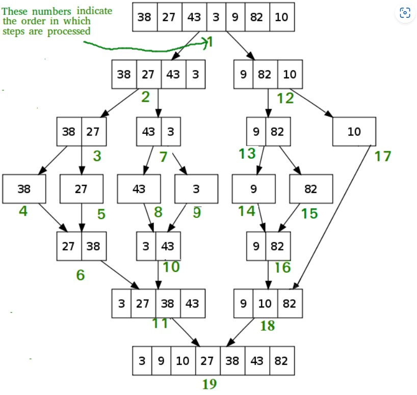

# DAA Lecture Notes

## Lecture 5

## Analysis of merge sort

A merge sort consists of several passes over the input. The first pass merges segments of size 1, the second merges segments of size 2, and the i th pass merges segments of size 2i-1. Thus, the total number of passes is [log2n]. As merge showed, we can merge two sorted segments in linear time, which means that each pass takes O(n) time. Since there are [log2n] passes, the total computing time is O(nlogn).

### Merge Sort Working Process

        Think of it as a recursive algorithm continuously splits the array in half until it cannot be further divided. This means that if the array becomes empty or has only one element left, the dividing will stop, i.e. it is the base case to stop the recursion. If the array has multiple elements, split the array into halves and recursively invoke the merge sort on each of the halves. Finally, when both halves are sorted, the merge operation is applied. Merge operation is the process of taking two smaller sorted arrays and combining them to eventually make a larger one

