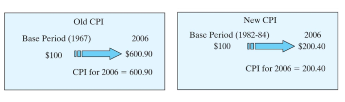

# Unit II : Banking and Trades

## Indian Economic

* India is a developing nation and economy, including a blended economy on the planet.
The significant attributes of a developing economy are overpopulation, the most extreme populace underneath the destitute or poverty line, a poor infrastructure, an agro-based economy, a slower pace of capital development, and low per capita income.

* Characteristics of the Indian Economy

        1. Low Per Capita Real Income
            i.The actual revenue or income of a nation alludes to the buying force or the purchasing power of the nation overall in a given monetary year,

        2. High Rate of Population Growth
            i. Where there is a high populace, There additionally must be a framework set up to help that populace

        3. The Endless Loop of Poverty. 
            i.The endless loop of neediness and poverty deals with both the supply side just as the demand side

## National Income

* It is also used in macroeconomic models to determine things like the level of employment and inflation.

* There are several ways to measure national income. The most common method is the GDP approach, which simply adds up all of the final services and goods produced in an economy. Another common method is the income approach, which adds up all of the incomes of the factors of production

* National Income Formula

        Y = C + I + G + (X-M)

        where

        Y = national income

        C = consumption

        I = investment

        G = government spending

        X = exports

        M = imports.

* National Income Includes

        GDP & GDP with cost factor

        GNP & GNP with cost factor

        NNP (Net National Product)

What affects National Income

        Consumption

        Investment

        Gross Expenditure

        Ex-Impact

        Indirect Taxes

        Subsideries

        Deprication of goods

## Microeconomics

    A. largely describes the behavior of individual economic agents in the markets for different goods and services and tries to figure out how prices and quantities of goods and services are determined through the interaction of different individuals in the markets
    B. Macroeconomics describes the economy as a whole by focusing on aggregate measures, such as total output, employment, and aggregate price level.

## Indian Banking

1. The Stated policy policy of bank is to amnage volatility but without any fixed exchange rates

2. Loan recovery for housing, vehicle and personal loans

3. The features of the Indian banking system

        A. Deals with Money

            i.You can put your money in a bank account, for example, to store it safely, and you will be interested in the money you save in the account.
        
        B. Provides Loan

            i.The bank earns the additional funds by lending money to the qualifying person at predetermined rates.
        
        C.Withdrawal and payment facilities

            i.Modern banks now provide internet services, which is another element of a bank
        
        D.Internet services

            i.The growth of the internet and its integration into the banking industry has made it even easier for customers to do numerous transactions
        
        E.Business

            i.Banking’s sole purpose is not to supply consumers with banking services. 
            ii.To make additional money, all banks are involved in subsidiary enterprises

## Role of Reserve bank

        A. Responsible for the printing of currency notes and managing the supply of money in the Indian economy.
        B. The second important function of the Reserve Bank is to act as the Banker, Agent and Adviser to the Government of India and states
        C. The Reserve Bank performs the same functions for the other commercial banks as the other banks ordinarily perform for their customers
        D. The RBI undertakes the responsibility of controlling credit created by commercial banks. RBI uses two methods to control the extra flow of money in the economy
        E. For the purpose of keeping the foreign exchange rates stable, the Reserve Bank buys and sells foreign currencies and also protects the country's foreign exchange funds
        F. The Reserve Bank performs a number of other developmental works. These works include the function of clearinghouse arranging credit for agriculture (which has been transferred to NABARD) collecting and publishing the economic data, buying and selling of Government securities

## International Economy

    A. It includes topics such as international trade, international finance, international monetary economics and international political economy
    B. International economy is an important and relevant topic in today’s world, as it affects the lives of billions of people around the globe
    C. It also poses many challenges and opportunities for policymakers, businesses and consumers.

### Banking & Trades

1. Financial Management

2. It involves deployment of finances

### Fianacial Analysis

1. There are 5 main areas

        a.Liquididty

        b.investments

        c.Gearing

        d.Profitability

        e. financial

## GDP is affected by

1. Investment
2. Government spending
3. Net exports
4. Consumption

## The Nature of the effects

### When prices lower

* The *Wealth* effect --> Due to more money in hand people consume more thus GDP increases

* The *Interest* effect --> It decreases

* Export effect  -->  Export increases

As a result GDP increases

### When prices increases

* The *Wealth* effect --> less wealth in hand

* The *Interest* effect --> It increases

* Export effect  -->  Export decreases

## GDP Types

### Real GDP

    1. Does not considers the time value of money
    2. More Accurate than nominal GDP

### Nominal GDP

    1. Does not considers the time value of money
    2. Less Accurate than real GDP

## Year on Year development

* The development of companies are in yearly quaters

## Inflation & Financial Ratios

A. Inflation

    a. Lets see the concepts of 
        i. Time value of money e.g compound interest
        ii. Annuity e.g transport vehicles has to pay taxes annually.
    b. Increase in prices to lead the same life style is inflation
    c. Inflation of 8% is good for nationa may lead to overall growth of nation's economy
    d. cheap loans -> money -> D > S -> price rises
    e. Continuous rise in inflation leads to decrease in purcasing power
    f. Limits 2% to 6% (Creeping change)
    g. Inflation categorized
        i. Creeping (2% - 6%)
        ii. Walling (< 10%)
        iii. Running (10% - 20%)
        iv. Galloping (20% - 100%)
        v. Hyper ( < 100%)
    Note: From point h to k belongs to types of inflation
    h. Cost pushed infilation (When resources to produce becomes costly)
    i. Monetary push (Increase in money leads to inflation in society)
    j. Skewflation (Rise in only certain product/ Timily rise in prices of certain products)
    k. Stagflation (Demand decreases + Unemployment + price increases)

NOTE: **Base year for calculation of taxes is 2011-2012**

How *Measuring Inflation* works?

    a. PPI (Product Price Index)
        i. Only about cost of product
    b. WPI (Wholesale Price Index)
        i. Price of wholesale market
        ii. Weighted indice 
        iii. Includes: Food (64%), Fuel (22%), Goods (13%)
    c. CPI (Consumer Price Index)
        i. Cost of consumer products
        ii. Includes: Food (45%), Fuel

* CPI Example

  

* Inflation rate

        A. Inflation rate = ( Change in price index / Initial price index ) x 100

        B. example, CPI in 2001 = 177.1, CPI in 2000 = 172.2,

        C. IR = ( ( 177.1 - 177.2 ) / 177.2 ) x 100 = 2.8 % 

* Compounding effect

        A. Each year’s inflation rate is based on the previous year’s rate

        B. Example (Averge inflation is used here which will be explained further)

    

* Average inflation rate

    

        By observation we can construct simple formula like F = P (1 + f)^N

        where, 
        P is Principle amount
        F is compound value 
        f is avg inflation
        N is period

B. Deflation

    a. Decrease in prices to lead to same life

### GDP (Gross Domestic Product)

    a. Domestic means location dependent and whatever income/assets are in the region are counted in GDP
    b. GDP = C + I + G + (X-M) + Income by foreign national - Income by national aboard

### GNP (Gross National Product)

    a. National means the nations assets regardless of location
    b. GNP = C + I + G + (X-M) - Income by foreign national + Income by national aboard

### Cost Factor

    a. MRP
        i. if tax are added prices of things goes up
        ii. if subsidiaries are given then prices goes down
    b. GDP cost factor = GDP - Indirect Taxes + subsidiary
    c. Same can be applied for GNP

### NNP

    a. NNP = GNP - Depreciation
    b. NDP = GDP - Depreciation
    c. NDP with cost = GDP Cost Factor - Depreciation
    d. NNP with cost = GNP Cost Factor - Depreciation

### Percapita Income

    a. PCI = GDP / Population

### Personal Income (PI)

* This is NI minus corporate income taxes plus transfer payments. Transfer payments are payments made by the government to individuals that do not require the recipient to provide any good or service in return.

* The formula for PI: PI = GDP – NIT (where NIT=net indirect taxes).

### Disposable Income (DI)

* This is PI minus personal income taxes

## Financial commission

    A. A financial commission is a constitutional or statutory body that is responsible for evaluating and recommending the distribution of financial resources between different levels of government

## Financial institutions

    A. A financial institution is a business entity that provides financial services such as banking, lending, investing, or insurance to customers.

    B. They can be of various types example banks 
