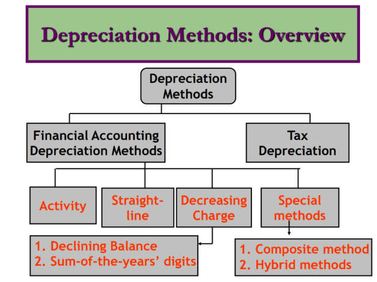
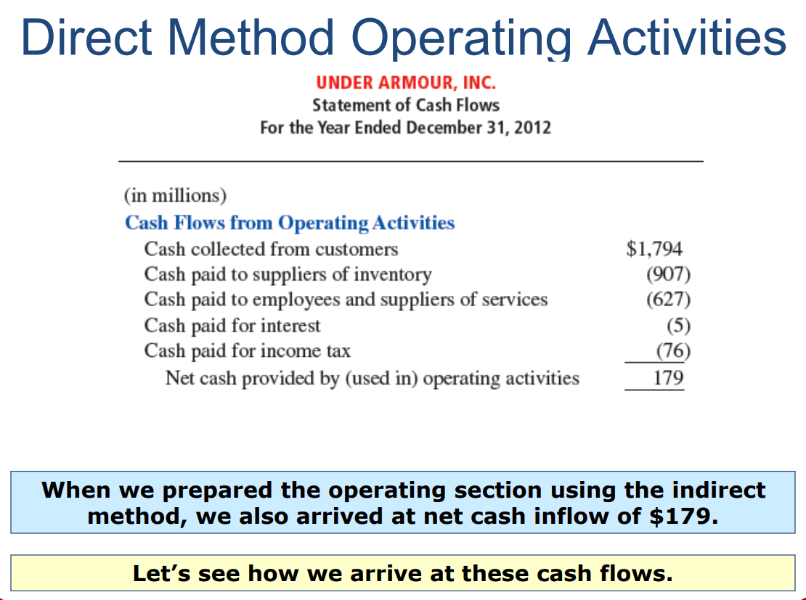
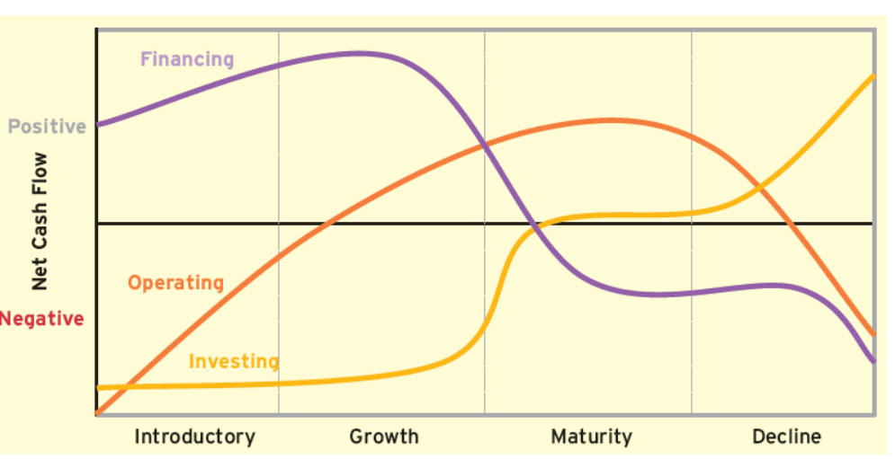

# Unit 3 *Cash Flow*

Note :

1. Hard cash is not handeled in bussiness

2. Turn Over means either the company earns or spends such amount

## Budget analysis

A strategy for evaluating a business' financial well-being

How to do budget analysis?

    1. Choose your budgeting strategy
        a.Before you can analyze a company's budget, it's important to first develop the budget itself. 
        b.Different businesses often use different budgeting strategies
        c.Consider researching various methods of budgeting and choose one that works best for the company's situation
    2. Decide on a time frame
        a.After you've chosen a budget type, think about the time frame you want to use for your budget analysis. 
        b.Many budget analysis cycles happen on a monthly basis, but you might choose another period, such as the business quarter or fiscal year
    3. Track the company's budget
        a.When you've determined a budgeting strategy and time frame, you can begin tracking the company's budget information.
        b.Many businesses use computer programs and other technology to simplify this process. Keep track of expenditures and income across the whole business
        c.Many budgeting methods require the itemization of income and expenses, so be aware of the details necessary in your budget strategy.
    4. Analyze your results
        a.Based on the time frame you've chosen, evaluate the company's budget information. Consider whether the company's expenditures or income are greater and why.
        b.If you notice that more money leaves the business than comes in, think about ways to limit spending or increase revenue
    5. Set up for your next budget cycle
        i.You can use the information from one budget cycle to set up for the next. 
        ii.This means that your end total for your selected time period becomes the beginning dollar amount for the next cycle

## Break even analysis

* The break-even point is calculated by dividing the total fixed costs of production by the price per individual unit less the variable costs of production.

* Fixed costs are costs that remain the same regardless of how many units are sold

* Break-even analysis is useful in studying the relation between the variable cost, fixed cost and revenue

* Example: Break-even analysis is useful in studying the relation between the variable cost, fixed cost and revenue. Generally, a company with low fixed costs will have a low break-even point of sale. For example, say Happy Ltd has fixed costs of Rs. 10,000 vs Sad Ltd has fixed costs of Rs. 1,00,000 selling similar products, Happy Ltd will be able to break-even with the sale of lesser products as compared to Sad Ltd

* Components of Break-Even Analysis

        a. Fixed costs
            i.Fixed costs are also called overhead costs. These overhead costs occur after the decision to start an economic activity is taken and these costs are directly related to the level of production, but not the quantity of production. 
            ii.Fixed costs include (but are not limited to) interest, taxes, salaries, rent, depreciation costs, labor costs, energy costs etc
        b. Variable costs
            i.Variable costs are costs that will increase or decrease in direct relation to the production volume

## Elementary economic Analysis

    1. Elementary economic analysis is a term that refers to the application of simple economic principles and tools to evaluate different alternatives and make optimal decisions
    2. It can be used in various situations, such as business, personal, or social contexts. For example, an elementary economic analysis can help you decide whether to buy or rent a house, whether to invest in a project or not, whether to source raw materials from a nearby or far-off place
    3. The main steps involved in an elementary economic analysis are:
        a. Identify the problem and define the objectives
        b. List the possible alternatives and their consequences
        c. Compare the costs and benefits of each alternative
        d. Choose the best alternative based on some criteria
        e. Implement and monitor the chosen alternative
    4. Let’s say you want to buy a new car and you have two options: a sedan or an SUV. You can use elementary economic analysis to compare the costs and benefits of each option and choose the best one for you. Some of the factors that you may consider are:
        a. The initial price of each car
        b. The fuel efficiency and maintenance cost of each car
        c. The resale value and depreciation rate of each car
        d. The comfort, safety, and performance of each car
        e. The environmental impact of each car
    5. You can assign monetary values to each factor and calculate the total cost and benefit of each option over a certain period of time. Then you can compare the net benefits (benefits minus costs) of each option and choose the one that has the highest net benefit. This is an example of elementary economic analysis using a simple cost-benefit analysis tool

## Material Selection

* The materials selection process already described is more closely associated with the activities of technical (or engineering) design

* There are many systematic methods, most numerically based, with some implemented as computer software tools, for matching material properties with technical design requirements.

* There is also relatively easy access to a lot of detailed and verifiable technical information (materials and design) available from many different sources (organizations and publications).

* These facilities are particularly useful for novice product designers involved in materials selection.

## Depreciation

* Accounting for Depreciation

* Depreciation is a means of cost allocation.

* Depreciation involves: allocating the cost of tangible assets to expense in a systematic and rational manner to periods expected to benefit from use of its depreciable assets.

* An asset’s service life and physical life are not the same.

* Economic factors include:

        1. Inadequacy (asset can not meet current demand)
        2. Supercession (by a better asset)
        3. Obsolescence (other factors)

    

### Depreciation method

A. Straight Line

    a. Results in an equal amount of depreciation expense for a given period
    b. Depreciation Expense is computed as:

        Formula (Cost - Salvage Value)/Estimated Life

B. Depreciation Methods: Activity

    a. Is a function of usage rather than time.
    b. Estimated life is in terms of total input/output of asset
    c. Depreciation expense is computed as

   

C. Depreciation Methods: Decreasing Charge (Accelerated)

    These methods result in higher depreciation expense in the earlier years and lower charges in the later years.
    Two decreasing charge methods are:
        1. Declining balance
        2. Sum-of-the-years’-digits

D. Depreciation Methods: Declining Balance

    1. Salvage value is not deducted when computing depreciable base.
    2. Utilizes a depreciation rate (%) that is some multiple of the SL rate.
    3. The depreciation rate is multiplied by the asset’s book value at the beginning of the period to get the depreciation expense for the period.

E. Depreciation Methods: Sum-of-
the-Years’ Digits

    a. Fraction is multiplied by the depreciable base to 
    b. Arrive at the depreciation expense per period.
    c. The fraction is:
            1. Numerator: number of years remaining in the asset’s life as of the beginning of the period.
            2. Denominator: sum of the years in the life
            3. For example, a 5 year life property would have depreciation expense for the first year as

## Project Cash-Flow Analysis

    A. Project cash flow analysis is a process of evaluating how cash flows in and out of a project

    B. It helps you to determine the profitability and feasibility of a project, as well as to monitor its performance and adjust the plan accordingly

    C. Project cash flow analysis involves calculating the cash inflows and outflows that are directly related to a project, excluding any fixed or irrelevant costs

    D. You can use a simple formula to calculate project cash flow: cash inflow - cash outflow

    E. Project cash flow analysis involves identifying and separating the variable expenses related to a project, such as materials, labor, and overheads

    F. It also involves understanding the five stages of project cost: initiation, planning, execution, monitoring and control, and closing

    G. You can calculate your project cash flow by subtracting your project expenses from your project revenue

    H. Benefits of Project Cash Flow Analysis

    It helps your company avoid overextending itself, particularly regarding large projects

    An analysis can help you avoid using other company revenues to pay for a project’s expenses

    A project cash flow analysis can also help you with project contracts that include large upfront payments

## Operating activities

1. Inflow: (Incoming cash)

    a. Collection from customers

    b. Receiving divdent

2. Outflow: (Outgoing cash)

    a. Purchasing services

    b. Paying salaries

    c. Paying interest

## Investment activity

1. Inflows

    a. Cash by sale or disposal of goods

    b. Sale of investment securities

2. Outflows

    a. Purchase of equipment

    b. Purchase of intangible

## Relationship between balance sheet & statement of cashflows

| Categories | Balance sheet categories |
| - | - |
| Operating | current liabilities & assets |

## Statement of cashflow

* Balance sheet comparision

* Additional info of selective accounts

* Investment details

* Additional info of transactions

Note : cash flow reporting can be direct or indirect

* A cash statement, also known as a cash flow statement, is a financial statement that summarizes the amount of cash and cash equivalents entering and leaving a company. It shows how well a company manages its cash position, meaning how well the company generates cash to pay its debt obligations and fund its operating expenses

* It also complements the balance sheet and the income statement

* The main components of the cash statement are

        A. Cash flow from operating activities: This reflects how much cash is generated from a company’s products or services. It includes receipts from sales, interest payments, income tax payments, payments to suppliers and employees, rent payments, and any other type of operating expenses

        B. Cash flow from investing activities: This shows how much cash is used for investing in assets for the future, such as property, plant, and equipment (PP&E), as well as how much cash is received from the sale of these assets. It also includes cash flows from acquisitions and disposals of subsidiaries or other businesses

        C. Cash flow from financing activities: This indicates how much cash is generated or spent on raising and repaying share capital and debt together with the payments of interest and dividends. It also includes cash flows from issuing or repurchasing shares, borrowing or repaying loans, and paying dividends to shareholders

        D. Disclosure of non-cash activities: This is sometimes included when prepared under generally accepted accounting principles (GAAP). It shows significant non-cash transactions that affect assets and liabilities but do not affect cash flows, such as depreciation, amortization, deferred taxes, stock-based compensation, etc

* There are two methods of calculating cash flow:

        A. The direct method 

            i. The direct method lists all the major operating cash receipts and payments for the period by source

        B. The indirect method

            i.  The indirect method adjusts net income for items that affected reported net income but did not affect cash

* Direct Methods

  

  

* Indirect Method

### Overall Patterns of Cash Flows

