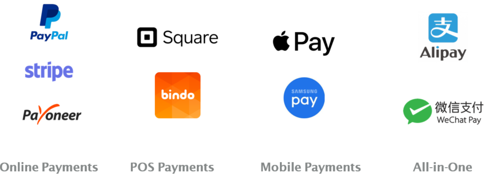
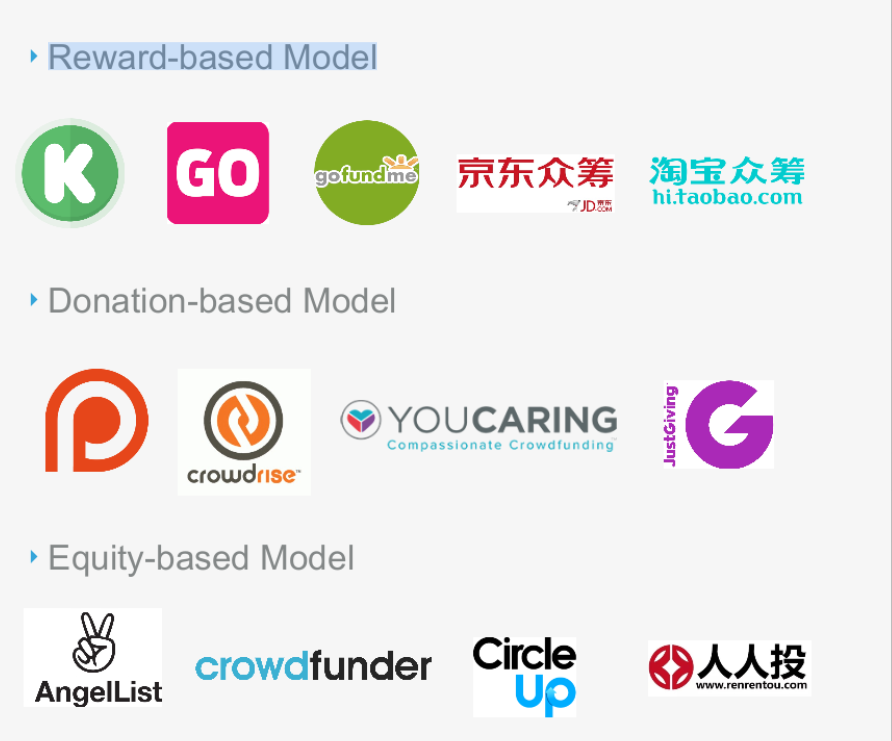

# Unit 4 Introduction to FinTech

* FinTech = Finance + Technology
* It is new finance Industry that works for the betterment of finance activities
* Wealth is not in physical form now a day
* Example banking apps nowadays
* Financial Technology apps include lending, borrowing & paying

## What are financial services?

* Financial services refer to services provided by the banks and financial institutions in a financial system.
* In general, all types of activities which are of financial nature may be regarded as financial services.
* In a broad sense, the term financial services mean mobilisation and allocation of savings. Thus, it includes all activities involved in the transformation of savings into investment.

## What FinTech is used for?

1. They provide a low cost, sophisticated alternative to traditional wealth managers
2. Allows investors to observe trends in banking

## Changing Environment & Customer Centricity

The environment is constantly changing, and businesses need to be able to adapt to those changes in order to stay competitive

One way to do this is to focus on customer centricity. Customer centricity means putting the customer first and making decisions that are in their best interests. This can be done by understanding the customer's needs and expectations, and then developing products and services that meet those needs. It also means providing excellent customer service and making it easy for customers to do business with you.

How to be customer centric?

* **Understand your customers:** The first step to becoming more customer centric is to understand your customers. What are their needs and expectations? What are their pain points? Once you understand your customers, you can start to develop products and services that meet their needs.
* **Listen to your customers:** It's important to listen to your customers and get feedback from them. This can be done through surveys, focus groups, and social media. Listening to your customers will help you identify areas where you can improve your products and services.
* **Provide excellent customer service:** Excellent customer service is essential for any customer-centric business. This means being responsive to customer inquiries, resolving problems quickly, and going the extra mile to make sure customers are happy.
* **Make it easy for customers to do business with you:** Customers should be able to do business with you easily and conveniently. This means having a clear and easy-to-use website, offering multiple ways to contact customer service, and making it easy for customers to pay their bills

## Digital transformation

* Business's problem + consumer's problem are solved by digital transformations

  * Digital transformation is the process of using digital technologies to fundamentally change the way an organization operates. In the financial services industry, digital transformation is driving innovation in a number of areas, including:

    1. Payments: Digital payments are becoming increasingly popular, as consumers and businesses look for more convenient and secure ways to transact. Fintech companies are developing new payment technologies, such as mobile wallets and peer-to-peer payments, that are disrupting traditional payment methods. `
    2. Lending: Fintech companies are using technology to make lending more accessible and affordable. For example, online lenders use big data and analytics to assess borrowers' creditworthiness, and they can often provide loans more quickly and easily than traditional banks.
    3. Investing: Fintech companies are making investing more accessible to a wider range of investors. For example, robo-advisors use algorithms to create and manage investment portfolios, and they can often charge lower fees than traditional investment advisors. 4.
    4. Insurance: Fintech companies are using technology to make insurance more efficient and affordable. For example, insurtech companies are using telematics to track drivers' behavior and offer discounts to safe drivers.

### 3P's of digital transformation

1. Product: The definition of digital services
2. Processes: Considers changes in process
3. People: Consumers

### 4 V's

1. Values
2. Variety
3. Veriability
4. Velocity

## History of Fintech

* The history of fintech can be traced back to the early days of the telegraph, when banks began using the technology to transmit financial data. In the 1960s, the development of computers and electronic funds transfer (EFT) systems led to further innovation in the financial services industry.
* The 1970s saw the introduction of the first ATMs and credit cards, which made it easier for people to access and manage their money. In the 1980s, the rise of personal computers and the internet led to the development of online banking and investing services.
* The 1990s saw the emergence of new fintech companies that were using technology to disrupt traditional financial services. These companies offered a variety of new products and services, such as online lending, peer-to-peer payments, and mobile banking.
* The 2008 financial crisis led to a renewed interest in fintech, as people looked for alternative ways to access financial services. In the years since the crisis, fintech has continued to grow and evolve, and it is now a major force in the financial services industry.
* Important events

  1866: The first transatlantic telegraph cable is laid, which allows banks to transmit financial data across the Atlantic Ocean.
  1969: The first ATM is installed in London.
  1971: The first credit card is issued.
  1983: The first online bank is founded.
  1996: The first peer-to-peer payment system is launched.
  2008: The financial crisis leads to a renewed interest in fintech.
  2010: The first mobile banking app is launched.
  2015: The first robo-advisor is launched.
  2020: The COVID-19 pandemic accelerates the adoption of fintech.

## Fintech Initiatives

* United States: The United States is a major hub for fintech innovation. In 2021, the US fintech industry raised $122 billion in funding, more than any other country. Some of the most well-known fintech companies in the US include Square, PayPal, and Stripe.
* United Kingdom: The UK is another major hub for fintech innovation. In 2021, the UK fintech industry raised $9.4 billion in funding. Some of the most well-known fintech companies in the UK include Revolut, Monzo, and Starling Bank.
* China: China is a rapidly growing market for fintech. In 2021, the Chinese fintech industry raised $130 billion in funding. Some of the most well-known fintech companies in China include Ant Group, Tencent, and Alibaba.
* India: India is another rapidly growing market for fintech. In 2021, the Indian fintech industry raised $38 billion in funding. Some of the most well-known fintech companies in India include Paytm, MobiKwik, and PhonePe.
* Africa: Africa is a region with a lot of potential for fintech growth. In 2021, the African fintech industry raised $4.6 billion in funding. Some of the most well-known fintech companies in Africa include Flutterwave, JumiaPay, and Wave.

## Fintech Ecosystems

* Regulatory ecosystems: These ecosystems are made up of regulators, fintech companies, and other stakeholders who work together to develop and enforce regulations that support innovation in the financial services industry.
* Investor ecosystems: These ecosystems are made up of investors, fintech companies, and other stakeholders who work together to provide funding for fintech startups.
* Collaboratory ecosystems: These ecosystems are made up of fintech companies, traditional financial institutions, and other stakeholders who work together to develop and deliver financial services.
* Example ANT GROUP ECOSYSTEM
  

## Ranking fintech ecosystems world wide

* Ranking of the top 10 fintech ecosystems in the world, according to the 2022 Global Fintech Ecosystem Report by Startup Genome

  1. Silicon Valley, United States
  2. New York City, United States
  3. London, United Kingdom
  4. Singapore
  5. Beijing, China
  6. Shanghai, China
  7. Boston, United States
  8. Hong Kong
  9. Paris, France
  10. Chicago, United States
* This ranking is based on a number of factors, including the number of fintech companies, the amount of funding raised by fintech companies, the level of government support for fintech, and the overall vibrancy of the fintech ecosystem.

## Downsides of Disruptive Fintech Initiatives

1. As the technologies advance, so too do hackers’ abilities and resources.
2. The nature of attackers has grown. They are highly organized. In some
   cases, they might even be nation-states.There are substantial risks for the
   industry. Fintech initiatives might suffer from the risks involved with them.
3. Fintech initiatives have deep risks connected with regulations
4. In the case of fintech initiatives, national borders are less relevant
   from a technology point of view, but regulatory agencies on all sides are keeping a close watch.
5. This is true especially for international sovereignty aspects, legal
   jurisdiction, customer data protection, and taxation.
6. While regulators with risk management on their agenda currently are
   a perceived barrier to fintech initiatives, the expectation is to see a
   higher level of coordination among the financial services, fintech
   companies, and regulatory officials.
7. It might even be a disaster to stifle such a
   promising industry change at this stage of development.
8. For example, the South Korean government realizes that fintech
   initiatives are changing the nature of financial services.30 The
   industry there is highly regulated, and the government worries about
   the viability of its existing banking infrastructure going forward

## Some Concepts mentioned in ppt

### Payments

Above are the payment companys

Case study of apple pay

No credit card information is
ever stored on iPhone or
Apple servers (even in
encrypted form).

EMV Payment Tokenization

How it works?

### Digital Banking

What does digital marketing include?

1. Money Deposits
2. Withdrawals, and Transfers
3. Checking/Saving
4. Account Management
5. Applying for Financial Products
6. Loan Management
7. Bill Pay
8. Account Services
9. Example

### Investment

1. Online portfolio management solution that aims to invest client assets by automating client advisory.
2. Digital Wealth Management
   

### Crowd Funding Model

Crowd funding based model

Basic info regarding crowd funding model

There are three main types of crowdfunding:

* **Rewards-based crowdfunding** is the most common type of crowdfunding. In rewards-based crowdfunding, backers pledge money to a project in exchange for rewards, such as early access to a product, merchandise, or a personalized thank-you note.
* **Debt-based crowdfunding** is a type of crowdfunding where backers lend money to a project creator. The project creator then repays the loan, with interest, over a set period of time.
* **Equity crowdfunding** is a type of crowdfunding where backers invest in a company in exchange for a share of ownership. The company then uses the investment to grow its business.

### Block chain Explained

* Decentralized
* Digitalized
* Cryptographically Sealed
* Consensus-based
* Chronological & Timestamped
* Distributed, public ledger
* For more info refer [How blockchain works
  ](https://www.investopedia.com/terms/b/blockchain.asp)

### Insurance Tech

* **The rise of digitalization** . The increasing use of technology by consumers and businesses is driving the demand for digital insurance products and services.
* **The growth of big data** . The increasing availability of data is enabling insurers to better understand their customers and risks, which is leading to more personalized and targeted products and services.
* **The development of new technologies** . The development of new technologies, such as artificial intelligence, blockchain, and the Internet of Things (IoT), is opening up new possibilities for innovation in the insurance industry.

The Insurtech ecosystem is having a positive impact on the insurance industry. It is leading to new products and services that are more tailored to the needs of customers, it is improving customer experience, and it is helping to reduce costs. The Insurtech ecosystem is also creating new jobs and opportunities for growth in the insurance industry.

* **Startups** . Startups are at the forefront of innovation in the insurance industry. They are using technology to develop new products and services that are more efficient, effective, and affordable.
* **Established insurers** . Established insurers are investing in Insurtech to stay ahead of the competition. They are partnering with startups, acquiring Insurtech companies, and developing their own Insurtech capabilities.
* **Technology companies** . Technology companies are providing the tools and platforms that are enabling Insurtech innovation. They are developing software, hardware, and data analytics solutions that are helping insurers to improve their operations and deliver better customer service.
* **Other stakeholders** . Other stakeholders in the Insurtech ecosystem include regulators, investors, and academics. These stakeholders are playing a key role in shaping the future of the Insurtech industry.

### Regulation Tech

