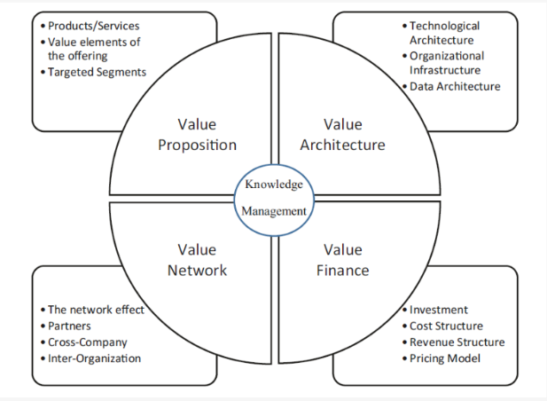

# Unit 5 Model and Classifications

Fintech initiatives are concerned about?

* Why a fintech initiative was born?
* For whom was it born?
* Which are the services it aims to provide?
* Where does it aim to perform its business?
* When does it aim to operate, within the framework of the financial
  cycle?
* How is fintech working?

## Model groups

These groups include  Customer service, financial services, compliance,and business process

* Customer service: Processes and services that deal with the
  customer at the user interface level as well as at the backend database
  level. Some examples are
  * Customer relationship management (CRM)
  * Call center software
  * Electronic billing, payment, trading & banking
* Financial services: Applications and processes for **portfolio management** and risk management
* Compliance: These are the methods for a company to comply with external and
  internal regulations. Example
  * Financial statement reporting and analysis

## Fintech Comparsion

## 5Ws & 1H of FinTech

The five Ws and one H of FinTech are:

**What is FinTech?**

Fintech is a portmanteau of "financial" and "technology." It refers to the use of technology to improve and automate financial services. Fintech companies use technology to provide new and innovative financial products and services to consumers and businesses.

**Who are the players in FinTech?**

There are a variety of players in the FinTech industry, including

* Fintech startups: These are small, innovative companies that are using technology to disrupt traditional financial services.
* Large financial institutions: These are traditional banks, insurance companies, and other financial institutions that are adopting new technologies to improve their products and services.
* Technology companies: These are companies that are not primarily focused on financial services, but that are developing technologies that can be used in FinTech.
* Investors: These are individuals and institutions that are investing in FinTech companies.

**Where is Fintech happening?**

Fintech is happening all over the world. However, some of the leading FinTech hubs include

* Silicon Valley, California
* New York City
* London
* Singapore
* Tel Aviv

**When did FinTech start?**

Fintech is a relatively new industry. The term "Fintech" was first used in the early 2000s, but the industry really took off in the late 2000s and early 2010s

**How is FinTech changing the financial industry?**

* Making financial services more accessible and affordable
* Improving the efficiency of financial services
* Providing new and innovative financial products and services
* Increasing competition in the financial industry

## Nature of subjects using Fintech Services

The relations are

1. P2P—person-to-person services
2. B2P—business-to-person services
3. P2B—person-to-business services
4. B2B—business-to-business services

### P2P

P2P business model works, with reference to Lending Club and other credit
companies, it is possible to consider the following simplified process

Example

* Borrower applies for a loan to the lending platform.
* The lending platform commits to the borrower.
* The lending platform informs the partner bank that the borrower is verified and
  investors have committed.
* The partner bank issues the actual loan to the borrower.
* The borrower sends a loan note to the partner bank.
* The lender/investor gives cash to the lending platform.
* The lending platform purchases the loan note using the lender’s/ investor’s
  cash from the partner bank.
* The partner bank sends the loan note to the lending platform.
* The lending platform sends the loan note to the lender/investor.
* When the due time is reached, the borrower pays back the lending platform, which then pays back the lender/investor

### B2P

* The ATM is the typical example of B2P: the customer can easily
  access an ATM, withdraw money, and make a variety of financial
  transactions while consistently saving time and resources.
* Cash apps like PayPal, Venmo and Apple Pay all allow clients or
  customers to transfer money via the internet or mobile technology,
  and budgeting apps like Mint allow customers to manage their
  finances and expenses.

### P2B

The second type of financial services are P2B ones.

* Trading
* Crowdfunding
* Deposit
* Virtual currencies
* Insurance

### B2B

B2B services refer to the existing economic transactions between two

or more companies. Companies that are willing to establish business

* Relationships with other companies with the aim of maximizing
  opportunities for both partners follow a B2B model.
* Relationships between companies are complex and difficult to
  manage, but they are one of the best catalysts for innovation.

Fintech initiatives follow a B2B model operates in the following areas:

* Money transfer
* Credit for SMEs
* Provision of advanced services and packages to financial institutions
* Support for the internationalization of the businesses
* Other professional services to the businesses

Before fintech was developed, businesses would go to banks to
obtain loans and financing. But with the advent of fintech, businesses
can easily get loans, financing, and other financial services through
mobile technology.

## What FinTech is doing differently?

## Threats of FinTech

Some of the top threats facing fintech companies today

* **Cybersecurity** . Fintech companies are often targeted by cyberattacks because they handle sensitive financial data. In 2020, there were over 500 million cyberattacks on fintech companies, resulting in losses of over $10 billion.
* **Regulatory compliance** . Fintech companies are subject to a variety of regulations, which can be complex and time-consuming to comply with. In some cases, the regulations may be outdated or not well-suited to the new technologies that fintech companies use.
* **Competition** . The fintech industry is very competitive, and new companies are entering the market all the time. This can make it difficult for existing companies to maintain their market share.
* **Lack of trust** . Some consumers may be hesitant to trust fintech companies with their financial data. This is especially true for older consumers who are more familiar with traditional financial institutions.
* **Lack of talent** . The fintech industry is growing rapidly, and there is a shortage of skilled workers to meet the demand. This can make it difficult for fintech companies to find the talent they need to grow their businesses.

## FinTech: Growing Industry or Technological Bubble

* **The rise of mobile banking and payments:**
  * Mobile banking and payments are becoming increasingly popular, and this is driving demand for fintech solutions
  * The global mobile payment market is on track to surpass $1 trillion in 2019
* **The growth of e-commerce:** E-commerce is growing rapidly, and this is creating new opportunities for fintech companies to provide financial services to online retailers and consumers.
* **The increasing demand for financial literacy:** Consumers are increasingly demanding financial literacy, and this is creating new opportunities for fintech companies to provide financial education and advice.
* **The growing need for financial inclusion:** Financial inclusion is a growing global issue, and fintech companies are playing a role in providing financial services to the unbanked and underbanked.
* **Insurance:** Insurtech startups are increasingly attracting funding, with insurance startup Oscar Health securing some $165 million in funding , in March of 2019 - at a $3.2 billion valuation, according to CNBC
* **Fintech Stocks:** Fintech stocks have been on a record-breaking run in recent years. The S&P 500 Fintech Index has more than doubled in the past five years, and it is now at an all-time high. There are a number of factors driving the growth of fintech stocks, including

## How fintech initiatives are innovating & delivering?

* Through software or other technology and includes anything from
  mobile payment apps to cryptocurrency.
* Mobility (for instance, mobile banking)
* Big data analytics
* Social Networks
* IoT & Robotics
* Artificial intelligence (AI) & Cloud Computing

## Classification of FinTech Services

* Insurance
* Wealth management
* Payments
* Credit
* Crowdfunding
* Retail banking
* Security
* Currency and forex (foreign exchanges and remittances)

## International landscape of FinTech startups

### WHERE

The relationship between the business idea and its development,

fintech initiatives fall into one of the following classes

* Startups
* Traditional financial institutions, such as banks or insurance
  companies
* Technological or retail companies moving into financial services
* Advanced startups with a mixed ownership

### WHEN

Fintech may be classified into two categories according to “when”
companies provide their services

* Traditional fintech
* Emergent fintech

## Organization Model

### V4 business model framework

### P3

* Peer relationships
  * Balance sheet lenders
  * Marketplace lenders
  * Hybrid model
* Financial products
  * Revolving lines of credit
  * Merchant cash advances
  * Unsecured term loans (3–8 months)
* Processes
  * Direct flow
  * Mediated flow

### The Business Model Approach

Every startup should address its focus toward nine important elements

1. Market—focus on targets
2. Products and services—focus on value added
3. Channels—focus on social and omnichannel
4. Customer experience—focus on customer-centric approach
5. Revenue—focus on customer lifetime value
6. Processes and activities—focus on marketing
7. Resources and systems—focus on technology
8. Partnership and collaboration—focus on financial institutions
9. Costs and investments—focus on risks

Why Invest in FinTech?

* Easier Payment Process
* Evaluating Risks Effectively
* Faster Investment
* Lower cost

What are important trends in fintech?

* Blockchain will Become a Prominent Part of Fintech Strategy
* AI will Enhance Financial Consumer Strategy
* Blockchain Paving the Way for Smarter and Safer Operation
* Chatbots Increases Customer-Interaction
* Robotic Process Automation (RPA) Saves Time from Repetitive Tasks
* New Payment Solutions will be Introduced
* CyberSecurity will Get More Attention
* Digital-Only Banks World
* Higher Investment Will be Made in Fintech

### 9 Most Important Elements of a Business

* Value Proposition: the product/service, its features and benefits or
  uniqueness vs. competition; size of the market opportunity;
  customer feedback early.
* Customer Segments: who your customer is and what problems the
  product solves.
* Channels: how you'll distribute and sell your product.
* Customer Relationships: how you'll create demand.
* Cost Structure: the fixed and variable costs required to operate
  your business.
* Key Activities: the tasks the company must perform to succeed.
* Key Resources: suppliers, commodities, or other essential
  elements of the business.
* Key Partners: other enterprises essential to success of the
  business.
* Revenue Streams: revenue and profit sources and size.

### The Bussiness Model Canvas

Example: PayPals bussiness canvas

Example Crowdfunding bussiness model

### Components of an effective marketing plan

* Big Data Analytics: New software products and tools have entered the market, making Big Data (both structured and unstructured) far more accessible, even for little startups.
* Open data: Data publicly available with no restrictions from ownership,
  patents and copyrights
* The other 3 Cs: Customized Customer Content. This is about putting in
  action marketing promotions leveraging on social media channels.
* Relational marketing: The primary objective of a company should be the
  construction of loyal and long-term relationships with its customers. This task can also be accomplished by leveraging on social media channels, Big Data Analytics, and technology.
