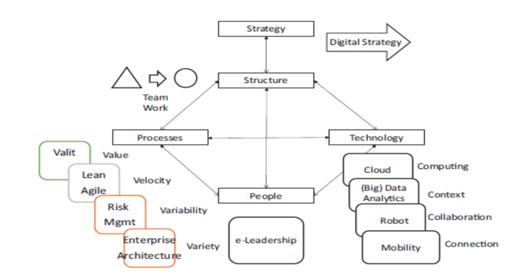
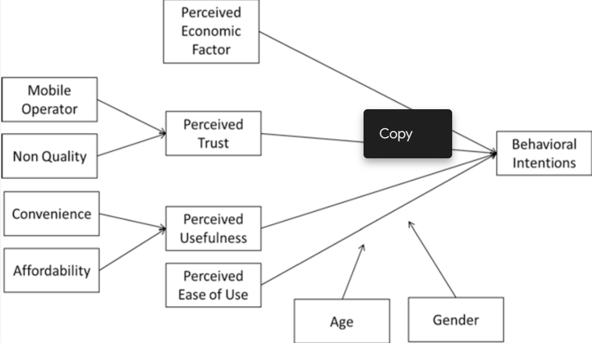

# Unit 6 FinTech Innovation

## Innovation and Fintech

* Fintech innovation is having a major impact on the financial services industry
* New technologies are being used to improve the way that financial services are delivered, making them more efficient, convenient, and accessible
* This is leading to increased competition and innovation, which is ultimately benefiting consumers
* Some of the most notable fintech innovations include
  * **Blockchain technology:** Blockchain is a distributed ledger technology that can be used to record transactions securely and efficiently. This is being used to create new financial products and services, such as cryptocurrencies and decentralized finance (DeFi)
  * **Artificial intelligence (AI):** AI is being used to automate tasks, such as fraud detection and customer service. This is freeing up human resources to focus on more complex tasks, and it is also leading to more personalized and efficient services
  * **Open banking:** Open banking is a regulatory framework that allows third-party companies to access customer financial data. This is enabling new financial products and services to be developed, such as personal financial management (PFM) tools and robo-advisors

## Digital Transformation and Fintech

Simply a matter of using digital technologies to sell and service clients
more effectively, more efficiently, and in a more customized way.

We need to answer below questions in order get the concept of digital transformation

* Why digital transforms the organization?
* For whom to do the transformation?
* What is the product it should aim to provide?
* Where can it take place?
* When can it take place?
* How to implement a digital transformation?

## A model for an integrated innovation strategy

Organizations should approach digital innovation in a holistic way.

To approach this challenge it is necessary to consider the four
connected variables:

* Structure (organization)
* Processes
* Technology
* Persons

## Understanding Types of Innovation

* **Product (or services) innovation:** This is the development of new products or services that offer new features, benefits, or value to customers. For example, fintech companies have developed new products such as mobile banking apps, peer-to-peer lending platforms, and robo-advisors.
* **Process innovation:** This is the improvement of existing processes to make them more efficient, effective, or customer-friendly. For example, fintech companies have developed new processes such as online account opening, real-time payments, and fraud detection.
* **Organizational innovation:** This is the change in the way that an organization operates to improve its efficiency, effectiveness, or customer service. For example, fintech companies have developed new organizational structures such as agile teams and data-driven decision making.
* **Business model innovation:** This is the development of new ways to create, deliver, and capture value. For example, fintech companies have developed new business models such as subscription-based services and marketplace lending.

## Example of Innovations

* **Product (or services) innovation:**
  * Mobile banking apps: These apps allow customers to access their bank accounts and conduct transactions from anywhere with an internet connection.
  * Peer-to-peer lending platforms: These platforms allow individuals to lend money to each other without the need for a bank.
  * Robo-advisors: These automated investment services use algorithms to create and manage investment portfolios for customers.
* **Process innovation:**
  * Online account opening: This process allows customers to open a bank account online, without having to visit a branch.
  * Real-time payments: These payments are processed and delivered instantly, 24/7.
  * Fraud detection: This technology uses algorithms to identify and prevent fraudulent transactions.
* **Organizational innovation:**
  * Agile teams: These teams are cross-functional and self-organizing, which allows them to quickly adapt to change.
  * Data-driven decision making: This approach to decision making uses data to identify trends and make informed choices.
* **Business model innovation:**
  * Subscription-based services: These services charge customers a monthly or annual fee for access to a product or service.
  * Marketplace lending: This model connects borrowers with lenders through an online platform.

## Process Innovation Examples in depth

### Big Data Analytics

* Big Data Analytics is the use of a large collection of data gathered and
  collected from inside and outside the company.
* Making use of suchdatasets is generally a very complex thing to do and using traditional processing applications may not be enough.
* This gap in the traditional processing applications is capitalizing on Big Data
  Analytics.
* 3V's
  * Volume
  * Velocity
  * Variety
* Big Data Analytics means
  * Storing a large amount of data
  * Examining (or mining) them
  * Getting appropriate information
* It is important to follow a correct process in storing Big Data
  Analytics:
  * Selecting data sources for analysis
  * Defining data models: key value, graphics, document
  * Analyzing the characteristics of the data
  * Improving the data quality, for instance, eliminating redundant or
    duplicated data

What are important steps in storing large sets of data?

* Choosing the correct data stores based on the characteristics of the data
* Moving code to data
* Implementing polyglot data store solutions
* Aligning business goals to the appropriate data store
* Integrating disparate data stores
* Mapping data to the programming framework
* Connecting and extracting data from storage
* Transforming data for processing
* Monitoring the progress of job flows
* Using advanced tools, such as D3.js

What are questions that are used to deal with Big Data?

* Which types of solutions to be used in Big Data Analytics?
* Where data are stored: centralized or distributed or cloud storage?
* Where processing is done: mainframe, distributed servers/cloud?
* How data are stored and indexed: high-performance schema-free databases?
* What operations are performed on data: sequential, analytic, or semantic processing?
* What are the risks?
* Are the right talents available capable of choosing the right data to solve the right problem?

### Internet of Things

* One impressive development in technology is the IoT. Cisco calls it
  also the IoE #Internet of (Everything)Things
* Typically, IoT offers advanced connectivity of devices, systems, and
  services.
* It covers a variety of protocols, domains, and applications.
* The interconnection of these embedded devices (including smart
  objects) allows automation in nearly all fields.
* In insurance, IoT can refer to a wide variety of devices, such as health
  monitoring implants, biochip transponders on farm animals, vehicles
  with built-in sensors, or field operation devices that assist in remote
  monitoring plenty of apparatus and situations.

What are the relations between Internet of Things & Fintech?

* It is interesting to analyze the general use of IoT in fintech.
* IoT finds its best applications in the insurance industry.
* IoT is a potential game-changing factor and a highly disruptive
  element in the financial services industry, similar to what have been
  smartphones and tablets
* While, still today, most of the financial information needed by people
  for their decisions need to be accessed in some steps, in the era of
  IoT, they will most likely be retrieved in real time.
* In insurance, by using IoT, it could be possible for insurance
  companies to use such sensors to record and possibly anticipate and
  prevent damage.
* This might save costs in the end not just for reinsurers and investors,
  but also for individuals and communities.

### Blockchain Technology

* Blockchain was born in connection with Bitcoin, a virtual currency.
* It is essentially a database for recording transactions in a secure way.
* Blockchain technology has interesting potential in several fields and
  especially in the financial services industry.
* Blockchain offers trust and provenance.
* Blockchain is a decentralized solution.
* For instance, all participants of a P2P network have a copy of the full
  set of records.

Potential of Bloackchain

* Blockchain has much greater potential than digital currency alone,
  even if the concept was born in connection with Bitcoin
* It enables point-to-point transactions without a clearing
  intermediary.

Distributed Ledger

* In a distributed ledger, there are two types of records
  * Transactions (Transactions are at the core of the entire process)
  * Blocks (contain the correct amount and order of valid transactions indelibly added to the database)

Different Types of Blockchain

* Concerning access protocols, distributed ledgers can either be
  * Public: Any user who wishes to do so can access the ledger and submit
    transactions for inclusion.
  * Private: Only a select few participants can view as well as submit
    transactions.
* In addition to public and private ledgers, blockchain falls under two similar but independent categories

Note

Permissionless means : permissionless ledger, anyone can choose to
participate in this verification network and obtain potential rewards
of participation.

Permissioned blockchain:Permissioned blockchains are gaining
traction within financial institutions and digital ledger-based startups.
A financial institution must verify non-cash payments between
individuals for the transaction to be complete.

### Organizational Innovation: Social Networks

* It defines social technologies as digital technologies used by people to
  interact socially and together to create, enhance, and exchange content
* Social technologies distinguish themselves with the following
* Three characteristics are:
  * They are enabled by information technology.
  * They provide distributed rights to create, add, and/or modify content and communications.
  * They enable distributed access to consume content and communications.

### Kreditech's self-learning algorithm

* Kreditech's self-learning algorithm is a machine learning algorithm that is used to assess the creditworthiness of borrowers. The algorithm is trained on a large dataset of historical data, and it is able to learn to identify patterns that are associated with good and bad credit risks.
* The self-learning algorithm is able to make decisions about whether or not to lend money to borrowers more quickly and accurately than traditional methods of credit assessment. This is because the algorithm is able to learn from the data as it is collected, which allows it to improve its accuracy over time.
* The self-learning algorithm has been shown to be effective in reducing the risk of lending to borrowers who are likely to default on their loans. This has made it possible for Kreditech to offer loans to borrowers who would not otherwise be able to obtain credit, which has helped to improve financial inclusion.
* The self-learning algorithm is a powerful tool that can be used to improve the efficiency and accuracy of credit assessment. It is a valuable asset for Kreditech and other lenders who are looking to expand access to credit and reduce the risk of lending.
* Overall, Kreditech's self-learning algorithm is a valuable asset that has helped the company to improve the efficiency, accuracy, and risk-management of its lending operations

## PPTS EXTRAS

### Business Model Innovation

* The economic literature has identified the primary dimensions of a
  business model in the V4 business model framework
  * The value proposition
  * The value architecture
  * The value finance
  * The value network

### Robots in Fintech

* A robot is a technology or technology-enabled process that can perform
* More and more, robots are finding ways to provide support also for financial services.

Robo advisors

* These Robo-advisors are used in Fintech Companies such as
  * Wealthfront
  * Betterment
* Robo-advisors are reshaping the financial services industry, especially
  in the wealth management and portfolio management areas.
* The reason why this is happening is simple: fintech companies have
  been leading the way of new business patterns, anticipating trends
  and putting their customers at the center of their strategies.

### Robotic Process Automation

* RPA is the application of technology that allows a company to configure
  computer software or a robot to capture and interpret existing applications
  for processing a transaction, manipulating data, triggering responses, and
  communicating with other digital systems
* In simple words, RPA aims to implement solutions which “sense-think-act”
* RPA provides substantial improvements in accuracy, cycle time, and
  increased productivity in transaction processing while elevating the nature
  of work by removing people from simple, repetitive tasks.
* The technology of RPA can provide a solution to a wide range of
  activities:

  * Process automation
  * ICT support and management
  * Automated assistance
* It can get excellent results especially in activities where there is a
  need of:

  * analysis/judgment
  * complex data entry/rule-based decision:

### Virtual Currencies

* A virtual currency or virtual money has been defined in 2012 by the ECB as “a type of unregulated, digital money, which is issued and usually controlled by its developers, and used and accepted among the members of a specific virtual community”
* At the same time, it can minimize both time and fees to transfer money.
* In some cases, there might be transactional fees to get a speedier
  process.
* Examples of virtual currency provider & currency
  * Coinify (Coinify is a blockchain currency service provider)
  * Colu (Colu is a Fintech company that delivers a powerful solution for
    businesses and developers aiming to build blockchain-based
    applications)

### Technology Acceptance Model

* It is interesting in the case of Fintech initiatives to analyze a model
  developed in the past for evaluating the acceptance of new solutions
  (technology acceptance model; TAM
* The base of the evaluation of TAM is on the premise that the fundamental
  determinants of the adoption and use of new technologies are
  * The perceived usefulness (PU), which is the degree to which people think
    that using a particular system will enhance their performance.
  * The measures of PU include performance increase, productivity increase,
    effectiveness, overall usefulness, timesaving, and increased job performance.
  * The perceived ease of use (PEOU), which is the degree to which a person
    believes that using a particular system requires little effort.
  * The measures for PEOU include ease of control, ease of use, simplicity,
    clarity, and flexibility of use. PEOU has a significant and direct effect on the
    intention of uninsured people to adopt digital insurance services.

* Behavioral intentions (BI), which is the propensity to adopt a new solution
* Perceived economic factor (PEF), which has a significant and direct effect
  on the intention of uninsured persons to adopt digital insurance services
* PU, which has a significant and direct effect on the intention of the
  customer to adopt digital insurance services. It is determined by the level of
  convenience (CON) and affordability (AFF) derived from digital insurance
  services
* Perceived trust (PT), which has a significant and direct effect on the
  intention of un/insured persons to adopt digital insurance services
* Age and gender of un/insured persons, which affects their perceived ease
  of use of digital insurance services
* Mobile Network Operator (MNO) characteristics and the non-quality (NQ) of the service provided.
