# Unit 1

## Good Software is determined on the basis of

    1. Quality of product
        a. Correctness
        b. Reliability
        c. Usablity
        d. Testability
        e. Maintainability
    2. Quality of process
        a. Code reviews
        b. Requirements understanding
        c. Testing 
    3. Quality in the context of business environment
        a. Return on investment
        b. Express in effort
            i. Schedule
            ii. Productivity
            iii. Customer

## System Approach

    System is collection of entities and activites plus description of relationships between entities and activites

## System boundary

    eg. Banking system has pay checks which are mailed to customers.

## Design Methods

    1. Procedural and structural design methods are two different approaches to software engineering and civil engineering respectively.
    2. Both methods aim to achieve efficiency, reliability, and safety in their respective domains

1. Procedural

     Procedural design is a technique that transforms structural components into a procedural description of the software

2. Structural Design methods

    Structural design is a process that determines the shape, size, and arrangement of structural members that can withstand external loads

## Object Oriented design method

1. Object-oriented design method is an approach to software engineering that views the system as a collection of interacting objects

2. Here are some diagrams that illustrate some of the concepts and principles of object-oriented design:

        1. Encapsulation: This diagram shows how an object can hide its data and methods from the outside world by using access modifiers such as public, private, protected, etc. The object can also provide a public interface that defines how other objects can interact with it.
        2. Inheritance: This diagram shows how a class can inherit attributes and methods from another class (called superclass or parent class) and also add its own attributes and methods (called subclass or child class). The subclass can also override some of the methods inherited from the superclass to provide different behavior.
        3. Polymorphism: This diagram shows how different subclasses can share a common interface (defined by an abstract class or an interface) and provide different implementations of the same method. This allows objects of different types to be treated uniformly by using a reference of the common interface.
        4. Adapter: This diagram shows how an adapter class can act as a bridge between two incompatible interfaces. The adapter class implements one interface and uses an instance of another interface to perform the required operations. This allows objects that use different interfaces to work together.
        5. Composite: This diagram shows how a composite class can represent a hierarchy of objects that share a common interface. The composite class can contain other objects (called components) that implement the same interface. The composite class can also implement methods that delegate operations to its components. This allows objects that have part-whole relationships to be treated uniformly

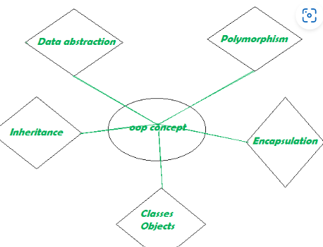

## Unified Modeling Language

1. UML is generalized modeling language distinct from other languages like c,c++

    * There are a total of 9 UML Diagrams

            • Use case diagram
            • Class diagram
            • Object diagram
            • State diagram
            • Activity diagram
            • Sequence diagram
            • Collaboration diagram
            • Component diagram
            • Deployment diagram

    * They can classified as

            A. Static: the structural aspect of the system, define what parts the system is made up of. 
            B. Dynamic: The behavioral features of a system; for example, the ways a system behaves in response to certain events or actions are the dynamic characteristics of a system. 
            C. Implementation: The implementation characteristic of a system is an entirely new feature that describes the different elements required for deploying a system.

2. UML has two things

        i. Diagram
        ii. Notation

3. UML Building block

* Things: They can be classified as

  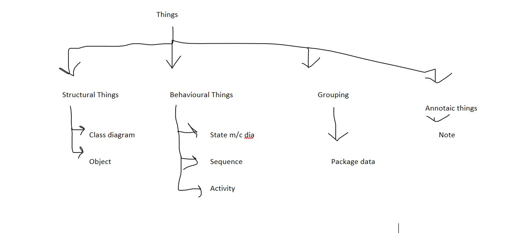

  A. Structural things

  * It includes class diagram, object diagram

    a. Classes

        i. In object-oriented programming, a class is a template or blueprint that defines the attributes and methods of a type of object. A class can be used to create multiple instances of objects that share the same characteristics and behavior.In a class diagram classes are represented
        ii. In UML, a class is a graphical representation of an object-oriented concept that shows its name, attributes, and operations in a rectangular box.
        iii. It looks like when represented

        +------------+
        | Name       |
        +------------+
        | Functions  |
        +------------+
        | Variables  |
        +------------+

        iv. Default definition: A Class is a set of identical things that outlines the functionality and Attributes of an object. It also represents the abstract class whose functionalities are not defined

    b. Object

        i.  An individual that describes the behavior and the functions of a system
        ii In UML, an object is a graphical representation of an instance of a class that shows its name (optional), class name (underlined), and attribute values (if any) in a rectangular box. 
        iii.An object can also show its relationships with other objects through different types of lines and symbols
        iv. The notation of the object is similar to that of the class

  B. Behaviour things
  * They are the verbs that encompass the dynamic parts of a model.

  * It contains state machine & activity diagram

    a. State machine diagram

        i. It defines a sequence of states that an entity goes through in the software development lifecycle
        ii. A state machine is a specification of the dynamic behavior of individual class objects, use cases, and entire systems.
        iii. Basic components are mentioned in the state diagram given below

    

    b. Activity Diagram

        i. It portrays all the activities accomplished by different entities of a system. It is represented the same as that of a state machine diagram
        ii. Used to show the message flow from one activity to another activity
        iii. It consists of an initial state, final state, a decision box, and an action notation
        iv. Shows flow control within a system 
        v. Has two types { Action state: It cannot be decomposed furthur & Activity state: Can be decomposed further }

C. Grouping Things:

    i.  A method that together binds the elements of the UML model. 
    
    ii. In UML, the package is the only thing, which is used for grouping

    iii. Package: Package is the only thing that is available for grouping behavioral and structural things

D. Annotating Things

    i. It is a mechanism that capturs the remarks, descriptions, and comments of UML model elements. In UML, a note is the only Annotational thing

    ii. It is used to attach the constraints, comments, and rules to the elements of the model. It is a kind of yellow sticky note.

E. Relational things

* Dependency

  1. Dependency is a kind of relationship in which a change in target element affects the source element, or simply we can say the source element is dependent on the target element
  2. It depicts the dependency from one entity to another
  3. It is denoted by a dotted line followed by an arrow at one side as shown below

         --->

* Association

  1. It tells how many elements are actually taking part in forming that relationship
  2. Association is a structural relationship that represents how two entities are linked or connected to each other within a system
  3. It can form several types of associations, such as one-to-one, one-to-many, many-to-one, and many-to-many
  4. It has been categorized into four types of associations (Bi-directional, unidirectional, aggregation (composition aggregation), and reflexive)

Note:

    An aggregation is a special form of association and Composition is a special form of aggregation

* Aggregation

  1. An aggregation is a special form of association
  2. It portrays a part-of relationship. It forms a binary relationship, which means it cannot include more than two classes. It is also known as Has-a relationship
  3. It forms a weak association
  4. Consider the following example

            Example - A doctor has patients when the doctor gets transfer to another hospital, the patients do not go to a new workplace

* Composition

  1. In a composition relationship, the child depends on the parent. It forms a two-way relationship. It is a special case of aggregation.
  2. It is known as Part-of relationship
  3. It forms a strong association
  4. Consider the example below

            Example - A hospital and its wards. If the hospital is destroyed, the wards also get destroyed

* Generalization

  1. It portrays the relationship between a general thing (a parent class or superclass) and a specific kind of that thing (a child class or subclass).

* Realization

  1. It is a semantic kind of relationship between two things, where one defines the behavior to be carried out, and the other one implements the mentioned behavior

Note: Refer this for all kind of relationships

  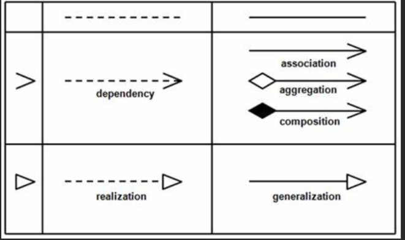

* Diagram

1. Simple Class Diagram

   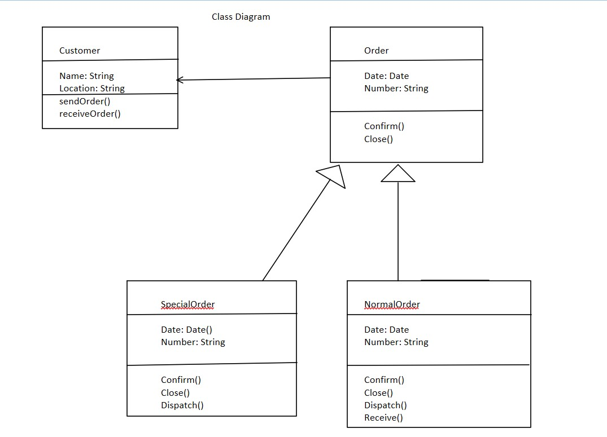

   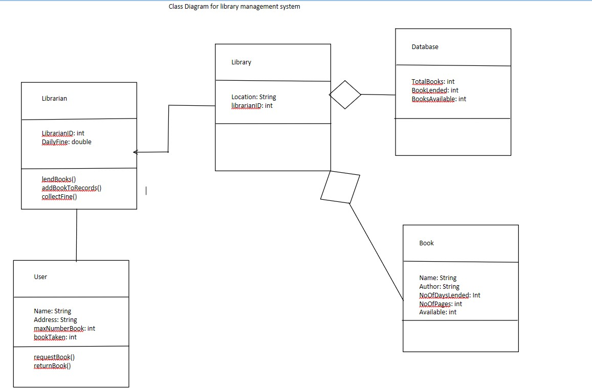

   * Class diagram is basically a graphical representation of the static view of the system and represents different aspects of the application

   * A collection of class diagrams represent the whole system

2. Object Diagram

   * Object diagrams are dependent on the class diagram as they are derived from the class diagram

   

3. Use Case Diagram

   * Actors represent roles, that is, a type of user of the system
•Use cases represent a sequence of interaction for a type of functionality
   * The use case model is the set of all use cases. It is a complete
description of the functionality of the system and its environment

   * Note

            The <<extend>> Relationship

            • <<extend>> relationships represent exceptional cases.
            • The exceptional event flows are factored out of the main event flow for clarity.
            • Use cases representing exceptional flows can extend more than one use case.
            • The direction of a <<extend>> relationship is to the extended use case

        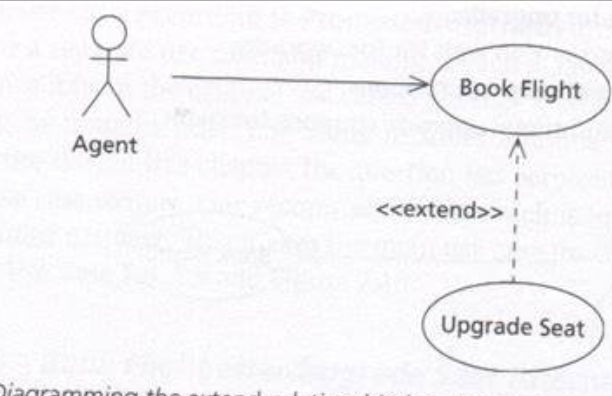

            The <<include>> Relationship

            • An <<include>> represents behavior that is factored out for reuse, not because it is an exception.
            • The direction of a <<include>>relationship is to the using use case (unlike <<extend>> relationships).

        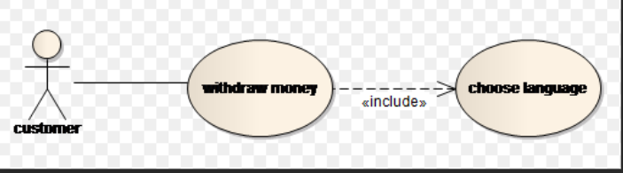

4. State Diagram

        • To model dynamic aspect of the System.
        • Define different state of an object during its lifetime.
        • Described flow of control from one state to another state.
        • These states are controlled by internal or external events.

   

5. Sequence Diagram

    * A sequence diagram is a type of interaction diagram that shows how objects or parts of a system work together to perform a function or a use case

    * It also shows the order or sequence of the interactions over time

    * Sequence diagrams can help you understand the logic of complex processes, functions, or methods

      

Note:

* Control nodes

    1. Merge Nodes

            1. Bring together multiple alternate flows
            2. All controls and data arriving at a merge node are immediately passed to the outgoing edge
            3. There is no synchronization of flows or joining of tokens

       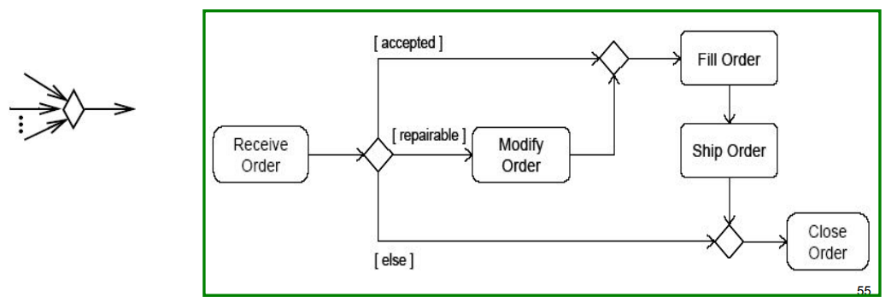

    2. fork nodes

            1. Fork nodes split flows into multiple concurrent flows (tokens are duplicated)

       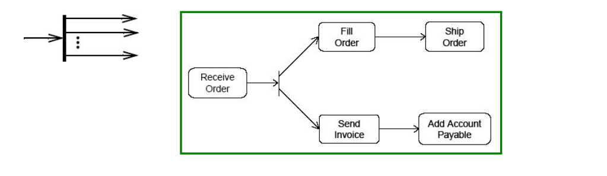

    3. join nodes

            1. Join nodes synchronize multiple flows

        

## More Design Methods

    • Design is a trial-and-error process
    • The process is not the same as the outcome of that process
    • There is an interaction between requirements engineering, 
    architecting, and design

They are categorized into 4 Design methods

1. Functional decomposition

       1. Functional decomposition is a method of breaking down a complex system or process into smaller, simpler components based on their specific functions
        2.  It helps to simplify the design, analysis, and implementation of complex systems by identifying the functions and relationships between them

    

2. Data Flow Design (SA/SD)

   From data flow diagrams to structure charts

        • result of SA: logical model, consisting of a set of DFD’s, augmented by 
        minispecs, data dictionary, etc.
        • Structured Design = transition from DFD’s to structure charts
        • heuristics for this transition are based on notions of coupling and 
        cohesion
        • major heuristic concerns choice for top-level structure chart, most 
        often: transform-centered

3. Design based on Data Structures (JSD/JSP)

    * JSD (Jackson Structured Design) { used on large scale}

        1. JSD has three stages

                a. Modeling stage: description of real world problem in terms of entities and actions
                b. Network stage: model system as a network of communicating processes
                c. Implementation stage: transform network into a sequential design

        2. JSD tries to fill in the gap of JSP which we will discuss further

        3. This life cycle is depicted as a Process Structure Diagram (PSD); these resemble JSP’s structure diagrams

    * JSP (Jackson Structured Programming)

        1. Basic idea: good program reflects structure of its input and output
        2. Program can be derived almost mechanically from a description of the input and output

        3. Input and output are depicted in a structure diagram and/or in structured text/schematic logic (a kind of pseudocode)

        4. Three basic compound forms: sequence, iteration, and selection)

           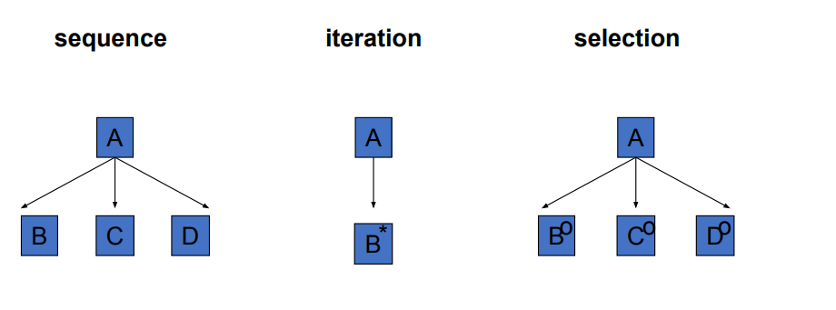

        5. The problem: how to obtain a mapping from the problem structure to the data structure?

4. OO design method

        • Booch: early, new and rich set of notations
        • Fusion: more emphasis on process
        • RUP: full life cycle model associated with UML

## Classification of design methods

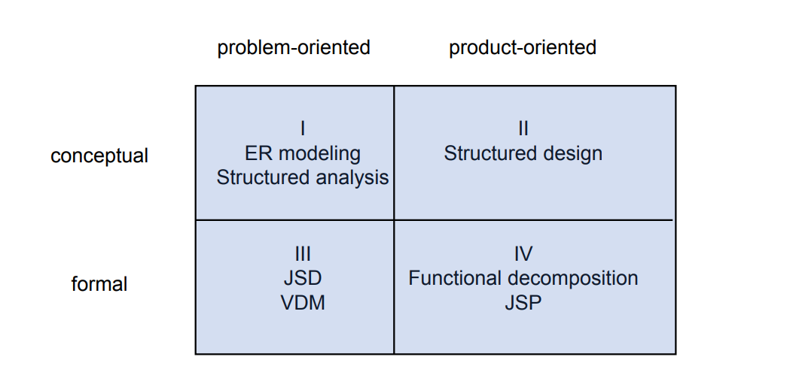
