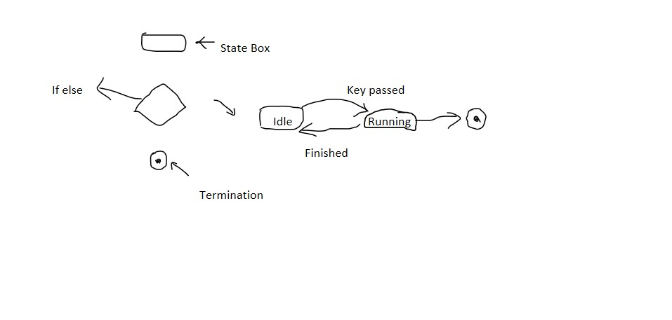
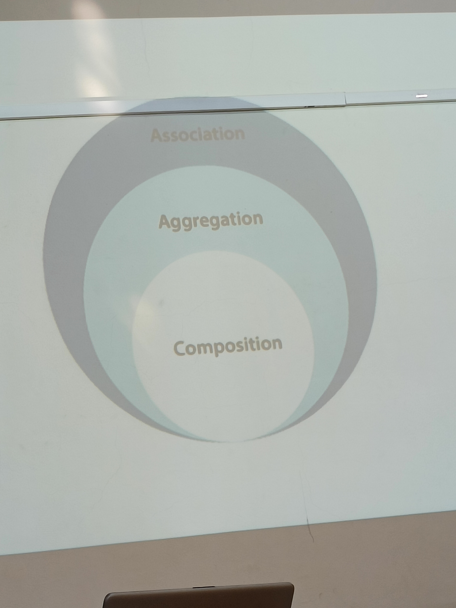
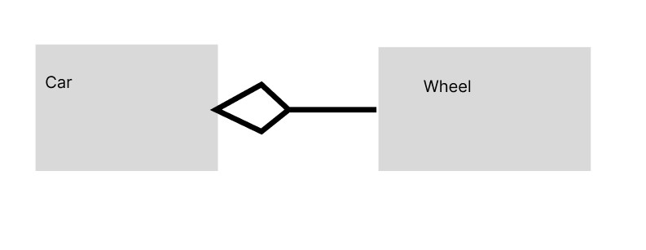

# Unit 1

## Good Software is determined on the basis of

    1. Quality of product
        a. Correctness
        b. Reliability
        c. Usablity
        d. Testability
        e. Maintainability
    2. Quality of process
        a. Code reviews
        b. Requirements understanding
        c. Testing 
    3. Quality in the context of business environment
        a. Return on investment
        b. Express in effort
            i. Schedule
            ii. Productivity
            iii. Customer

## System Approach

    System is collection of entities and activites plus description of relationships between entities and activites

## System boundary

    eg. Banking system has pay checks which are mailed to customers.

## Design Methods

1. Procedural

2. Structural Design methods

## Unified Modeling Language

1. UML is generalized modeling language distinct from other languages like c,c++

2. UML has two things

        i. Diagram
        ii. Notation

3. UML Building block

        i. Things: They can be classified as

            a. Class diagram: i. It is structured like this

|Classname|
|-|
|Attributes|
|Functions|
                ii. (+) -> public
                    (-) -> private
                    there are protected access as well
                iii. It also has the data type of the attributes mentioned in the attribute column
            b. Object Diagram: i. Object diagram is similar to class diagram it can be structured like this

|Object Name|
|-|
|Attributes|

                ii. Example of Object diagram

|Mango: Fruit|
|-|
|Color: yellow|
|Weight: 2 kg|

            c. State m/c diagram: i. It is represented as

            d. Sequence Diagram: i. See the figure below

                ii. Dotted line with arrow head is dependency (Relationship where the arrowhead pointed things can change the non arrowhead thing)
                iii. Association is structured relationship where one is dependent on another. (Denoted by single headed arrow or bidirection arrow)
                iv. see the following figure for in short explanation

                v. Aggregation is structured relationship where one class can't exits without the other. It is denoted by hollow diamond.(Ex wheels can exit without the car but a car cannot exit without wheels)

            Note: UML First pass is State Diagram

            e. Activity Diagram: i. Swimlanes (Useful notation for understanding where activity takes place)
                ii. Control nodes (Bring together alternative flows. It is denoted as diamond)
                iii. Forking node (Splited flow)

Example

1. Simple Class Diagram

2. Class Diagram for Library Management

