# Unit 3 Design Pattern

    1. General repeatable pattern
    2. Not mandatory to always implement design pattern
    3. They are generic, simple,  well tested, resuable and object oriented in nature
    4. We need to pick the right pattern for our project as there are 23 design patterns
    5. It requires communicating object that includes name, abstract and key aspects and focuses on OOC Problems (Object Oriented Concepts)

The *Gang of four* (GOF)

* Four authors Erich Gamma, Richard Helm,  Ralph Johnson and John V publish a book Design Pattern - Elements of reusable Object Oriented Software
* There design pattern are categorised. These are known as *gang of four*.

The *Design pattern* can be **Categorised** as follows:

    1. Creational Design Patterns
        a. provides a way to create objects while hiding the creational logic rather than instantiating objects yourself directly
        b. It gives more flexibility
        c. It can be furthur categorized as singleton, builder, prototype, factory
    2. Structual Design Patterns
        a. These design patterns concern class and object composition
        b. Those design patterns are about organizing classes and objects to a larger structure
        c. It uses Inheritance between classes
        d. Furthur divided as Bridge, Adapter
    3. Behavioral Design Pattern
        a. Concerned with communication between objects
        b. Example chain of responsibilty, Command, Interpreter, Iterator, Mediator, Memento etc

The **Creational Design Pattern* Type

1. Prototype Design pattern

        a. Here we are cloning the existing object instead of creating a new instance
        b. We can customized it 
        c. We can add or remove objects at runtime

        Example:

    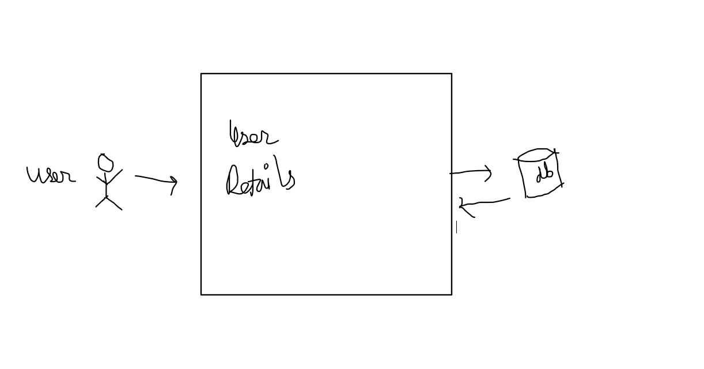

    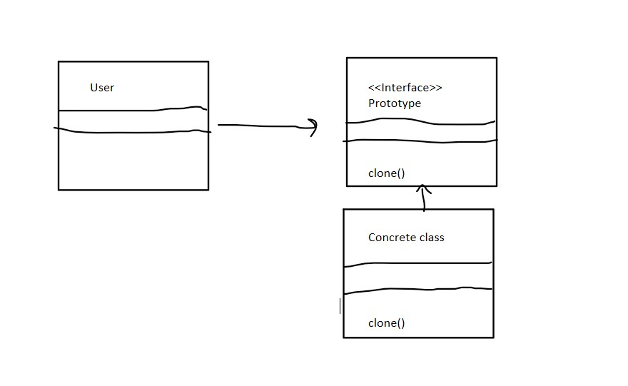

    The **Advantage**:

        a. We can add or delete object at runtime

2. Builder Design

        a. It helps us build complex java object in an easy and readable manner
        b. It is used when we want to hide internal complex structure from external entities which use interface to create object
        c. It separates object construction from its representation
        d. It has 3 major parts
            i. Product (This is the actual object that we are trying to construct)
            ii. Builder (Builds complex part)
            iii. Executor (Executes complex part)
    Example

    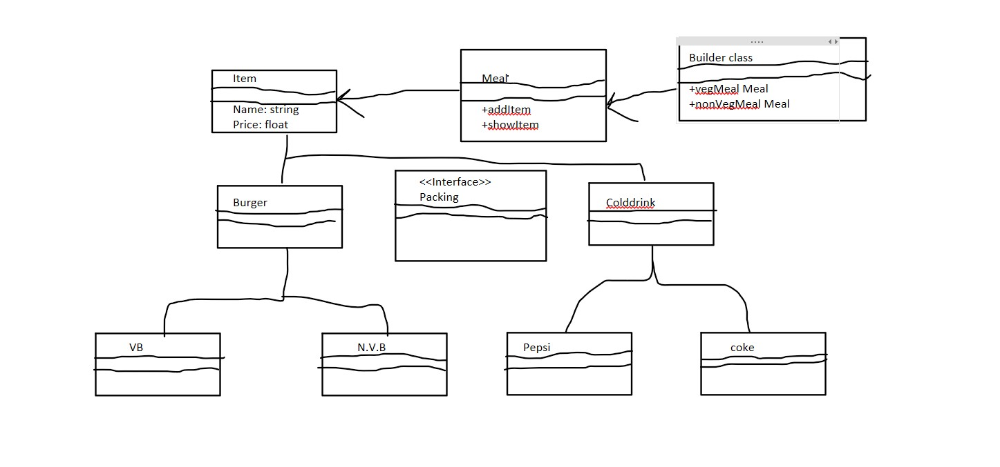

3. Factory Design Pattern

        a. Define an interface or abs class for creating an object but let the subclasses decide which class to instantiate
        b. The main purpose is to return objects at runtime
        c. Helps us to separate the object creation code from the one which is using it.
        d. Reuses the same memory

    Example

    

4. Abstract Factory Design Pattern

        a. Similar to Factory Design Pattern
        b. Add another level of abstraction layer to factory design pattern
        c. It creates factory of factory i.e super factory

    Example

    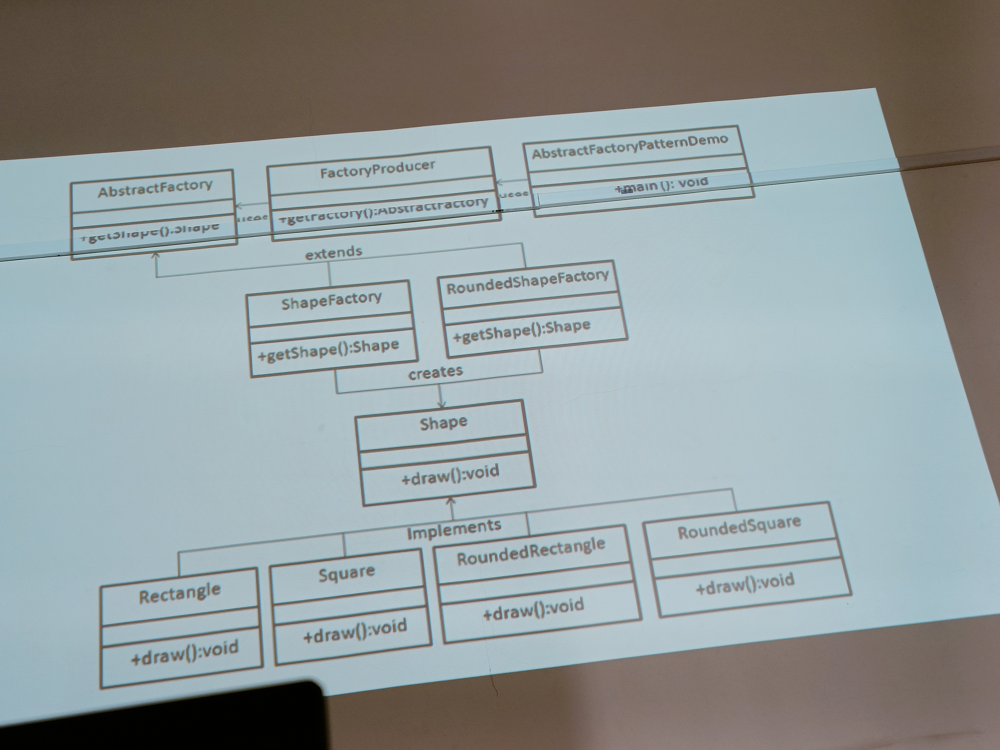

5. Singleton Design Pattern

        a. private constructor
        b. Instance private
        c. Global Method

    Example

        Public static Singleton getInstance(){
            if(instance == null){
                instance = new Singleton();
                return instance;
                }
            }

    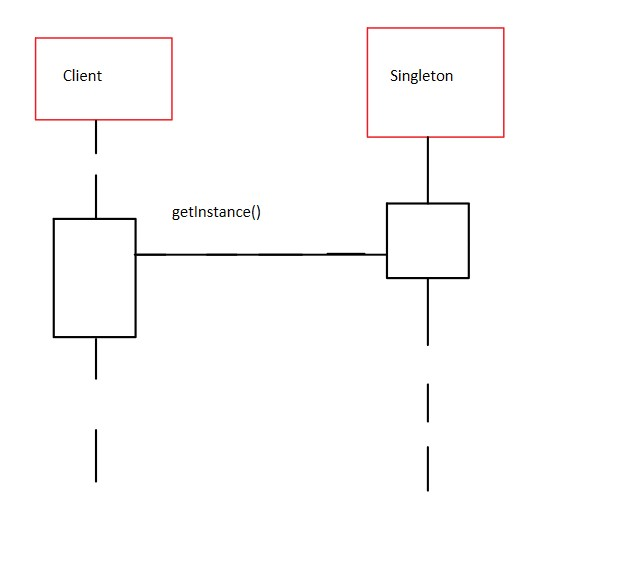

6. Object pool (Collection of objects)

    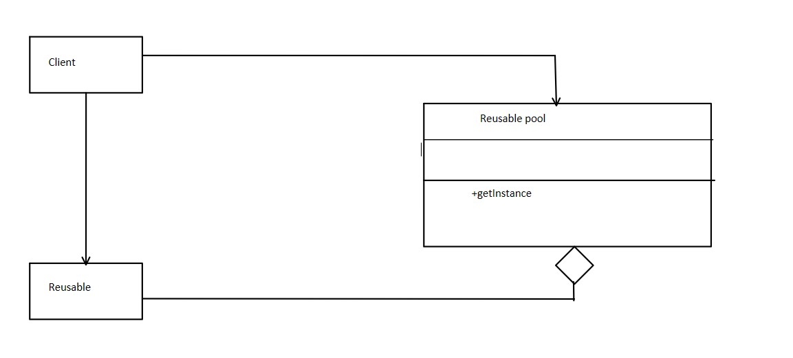

The *Structural Design* Patterns

1. Adapter

        a. Adapter is between two objects
        b. Alternate from of class creation is possible
        c. The pattern converts the incompatible interface of a class into another interface that client requires

    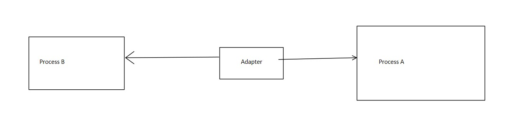

2. Decorator

        a. Used to extend the functionality of the base class
        b. It offers wrapper to existing class
        c. Example In pizza class toppings can be added
        d. It does not affects the behaviour of  other objects in the class

3. Bridge Design Pattern

        a. It is used to split large class into two separate inheritance hierarchies
        b. One is for implimentations and one for abstraction
        c. This pattern is known as bridge design pattern

    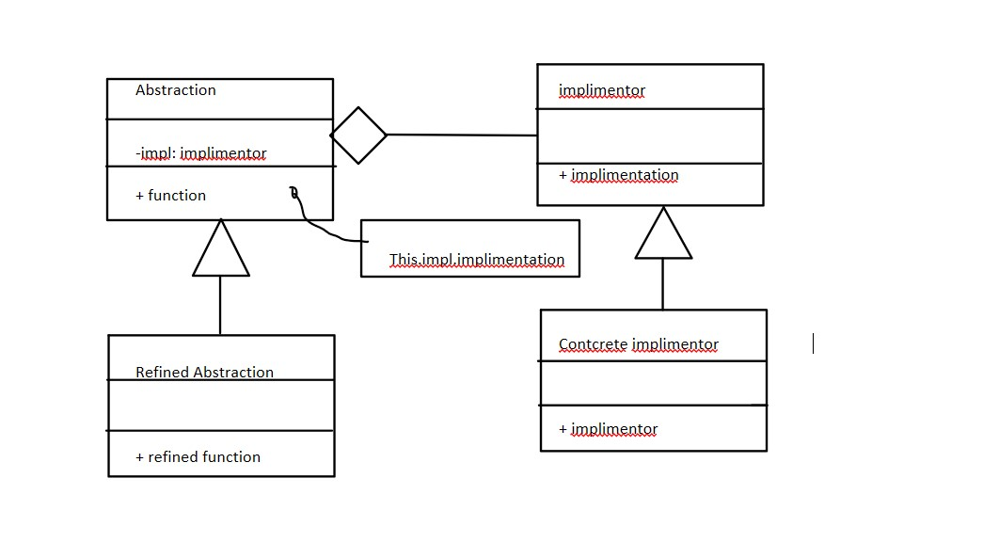

4. Poxy Design Pattern

        a. In proxy pattern a class functionality of another class.
        b. Here we create object having original object to interface its outer world functionality
        c. According to GOF (Gang oF Four) it provide interface to access information of original object
        d. Types 
            i. Virtual proxy (Avoids duplication of memory)
            ii. Remote proxy (Provides local representaion of object)
            iii. Protective proxy (Checks whether proper content is served)
            iv. Smart proxy (Provides additional layer of security)

    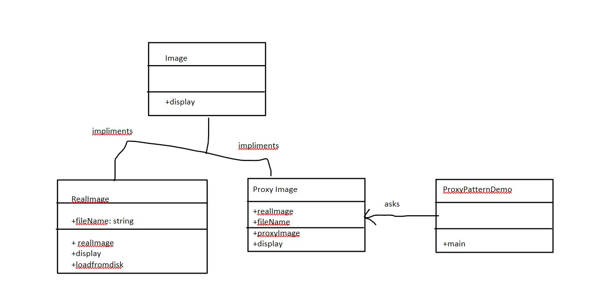

5. Flyweight design pattern

        a. It is used to reduce the number of objects created and improves performance
        b. It reuses similar existing kind of objects
        c. Provides good solution to reducing memory load by sharing objects
        d. Has two states
            i. Intrinsic states (It is constant for over all state)
            ii. Extrinsic states (Changing part)
        e. Example Car object
            i. Intrinsic (Color,Image)
            ii. Extrinsic (x,y,z co-ordinates)

    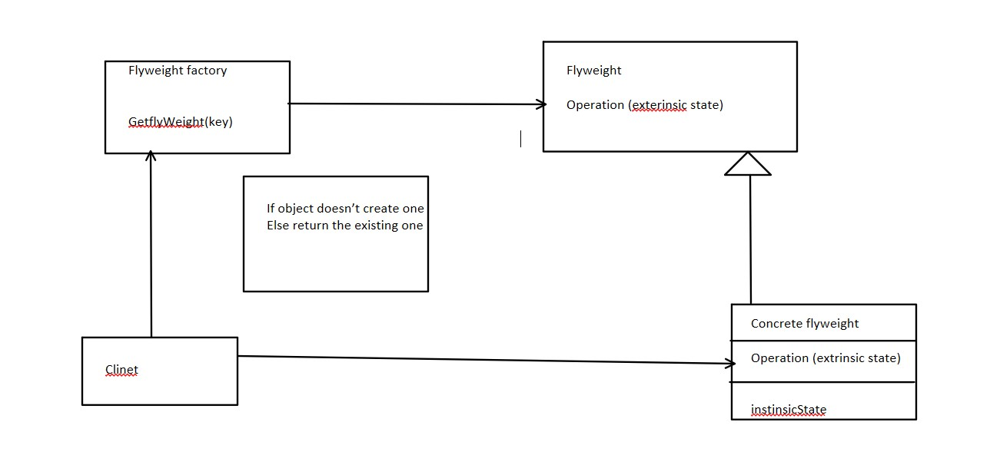

The *Behavioural design pattern*

1. Chain of responsibility pattern

        a. There is a handler that handels the respnsibility of the objects which are in process

    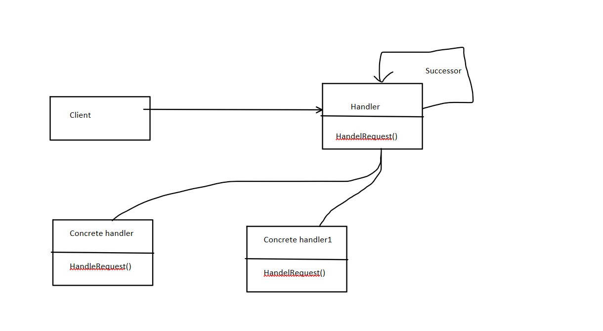

        b. Request can be handeled with one handler or many handlers
        c. Example
            i. One full note of 200 rs can paid the sum of 200 rs (One handler)
            ii. Multiple notes of 10,20,50 can pay the sum of 200 rs (Multiple handlers)
        d. This design pattern is to be used when sender doesn't have enough idea about it.

2. Mediator

        a. It says that "to define an object that encapsulates how a set of object interacts"
        b. Used to reduce communication complexity between multiple objects
        c. It is more generic

    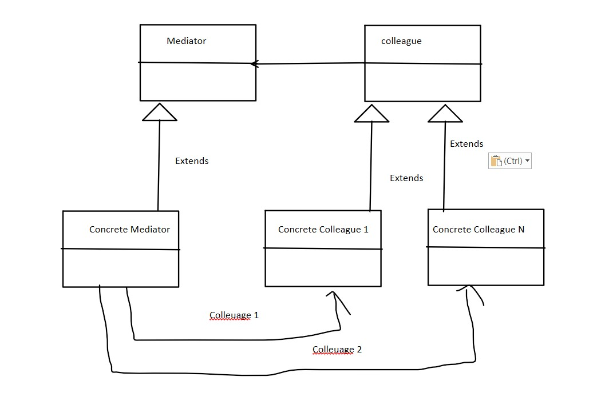

3. Observer

        a. Observer is a behavioral design pattern. It specifies communication between objects: observables and observers. An observable is an object which notifies observers about the changes in its state
        b. We can implement the code using two classes in java. One is Observer/Observable, Other is PCL (PropertyChangeListener)
        c.Observer Pattern *looks* like this
    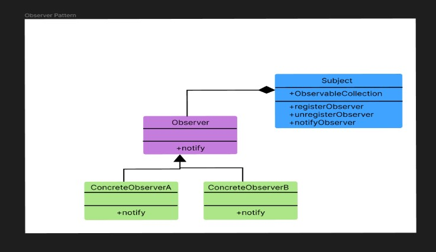

4. Obsence
