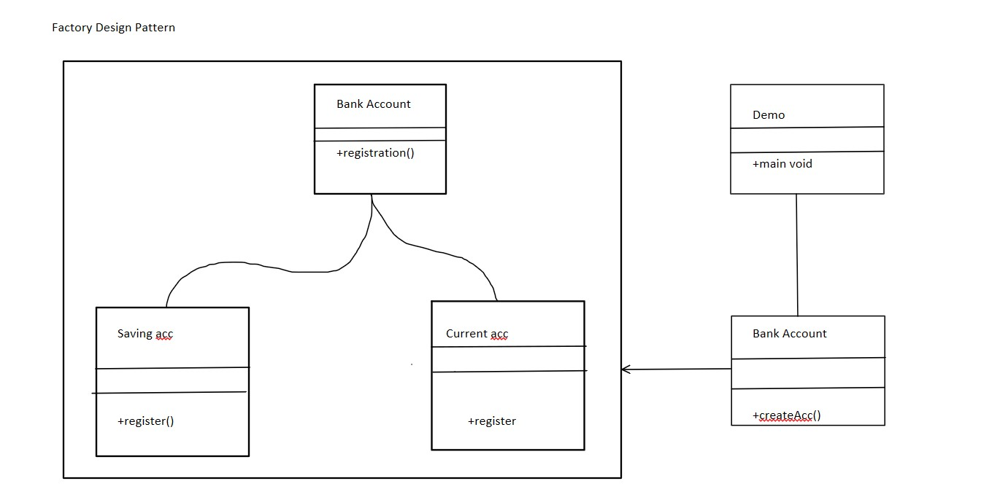
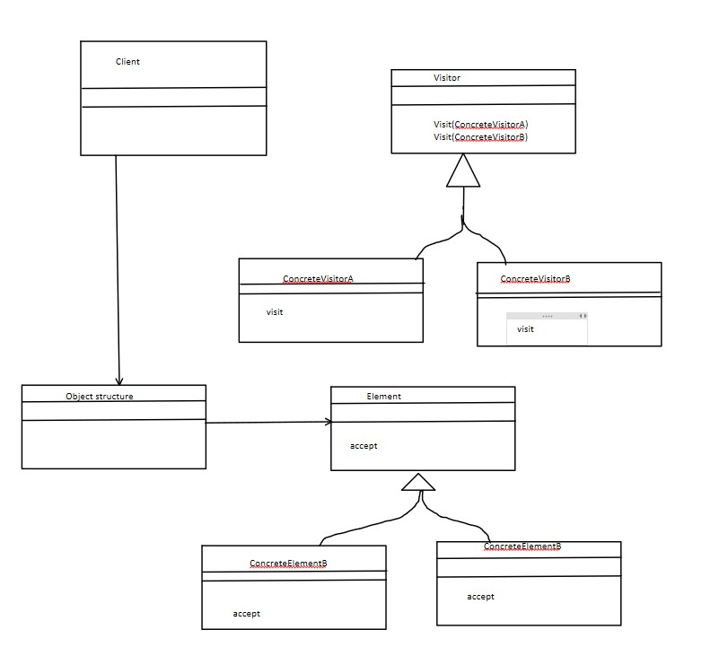
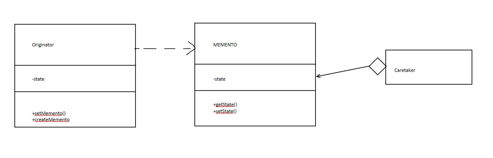

# Unit 3 Design Pattern

    1. General repeatable pattern
    2. Not mandatory to always implement design pattern
    3. They are generic, simple,  well tested, resuable and object oriented in nature
    4. We need to pick the right pattern for our project as there are 23 design patterns
    5. It requires communicating object that includes name, abstract and key aspects and focuses on OOC Problems (Object Oriented Concepts)

The *Gang of four* (GOF)

* Four authors Erich Gamma, Richard Helm,  Ralph Johnson and John V publish a book Design Pattern - Elements of reusable Object Oriented Software
* There design pattern are categorised. These are known as *gang of four*.

The *Design pattern* can be **Categorised** as follows:


    1. Creational Design Patterns
        a. provides a way to create objects while hiding the creational logic rather than instantiating objects yourself directly
        b. It gives more flexibility
        c. It can be furthur categorized as singleton, builder, prototype, factory
    2. Structual Design Patterns
        a. These design patterns concern class and object composition
        b. Those design patterns are about organizing classes and objects to a larger structure
        c. It uses Inheritance between classes
        d. Furthur divided as Bridge, Adapter
    3. Behavioral Design Pattern
        a. Concerned with communication between objects
        b. Example chain of responsibilty, Command, Interpreter, Iterator, Mediator, Memento etc

The **Creational Design Pattern** Type

1. Prototype Design pattern

        a. Here we are cloning the existing object instead of creating a new instance
        b. We can customized it 
        c. We can add or remove objects at runtime

        Example:

    

    

    The **Advantage**:

        a. We can add or delete object at runtime

2. Builder Design

        a. It helps us build complex java object in an easy and readable manner
        b. It is used when we want to hide internal complex structure from external entities which use interface to create object
        c. It separates object construction from its representation
        d. It has 3 major parts
            i. Product (This is the actual object that we are trying to construct)
            ii. Builder (Builds complex part)
            iii. Executor (Executes complex part)
    Example

    

3. Factory Design Pattern

        a. Define an interface or abs class for creating an object but let the subclasses decide which class to instantiate
        b. The main purpose is to return objects at runtime
        c. Helps us to separate the object creation code from the one which is using it.
        d. Reuses the same memory

    Example

    

4. Abstract Factory Design Pattern

        a. Similar to Factory Design Pattern
        b. Add another level of abstraction layer to factory design pattern
        c. It creates factory of factory i.e super factory

    Example

    

5. Singleton Design Pattern

        a. private constructor
        b. Instance private
        c. Global Method

    Example

        Public static Singleton getInstance(){
            if(instance == null){
                instance = new Singleton();
                return instance;
                }
            }

    

6. Object pool (Collection of objects)

    

The *Structural Design* Patterns

1. Adapter

        a. Adapter is between two objects
        b. Alternate from of class creation is possible
        c. The pattern converts the incompatible interface of a class into another interface that client requires

    

2. Decorator

        a. Used to extend the functionality of the base class
        b. It offers wrapper to existing class
        c. Example In pizza class toppings can be added
        d. It does not affects the behaviour of  other objects in the class

3. Bridge Design Pattern

        a. It is used to split large class into two separate inheritance hierarchies
        b. One is for implimentations and one for abstraction
        c. This pattern is known as bridge design pattern

    

4. Poxy Design Pattern

        a. In proxy pattern a class functionality of another class.
        b. Here we create object having original object to interface its outer world functionality
        c. According to GOF (Gang oF Four) it provide interface to access information of original object
        d. Types 
            i. Virtual proxy (Avoids duplication of memory)
            ii. Remote proxy (Provides local representaion of object)
            iii. Protective proxy (Checks whether proper content is served)
            iv. Smart proxy (Provides additional layer of security)

    

5. Flyweight design pattern

        a. It is used to reduce the number of objects created and improves performance
        b. It reuses similar existing kind of objects
        c. Provides good solution to reducing memory load by sharing objects
        d. Has two states
            i. Intrinsic states (It is constant for over all state)
            ii. Extrinsic states (Changing part)
        e. Example Car object
            i. Intrinsic (Color,Image)
            ii. Extrinsic (x,y,z co-ordinates)

    

The *Behavioural design pattern*

1. Chain of responsibility pattern

        a. There is a handler that handels the respnsibility of the objects which are in process

    

        b. Request can be handeled with one handler or many handlers
        c. Example
            i. One full note of 200 rs can paid the sum of 200 rs (One handler)
            ii. Multiple notes of 10,20,50 can pay the sum of 200 rs (Multiple handlers)
        d. This design pattern is to be used when sender doesn't have enough idea about it.

2. Mediator

        a. It says that "to define an object that encapsulates how a set of object interacts"
        b. Used to reduce communication complexity between multiple objects
        c. It is more generic

    

3. Observer

        a. Observer is a behavioral design pattern. It specifies communication between objects: observables and observers. An observable is an object which notifies observers about the changes in its state
        b. We can implement the code using two classes in java. One is Observer/Observable, Other is PCL (PropertyChangeListener)
        c.Observer Pattern *looks* like this
    

## Strategy Design Pattern

    a. Class Behaviour or pattern can be changed at run time
    b. Example while in sorting we can change the sorting algorithm according to the given array

## Visitor Design Pattern

    a. Represent an operation to be performed on the elements of object
    b. Visitor let's you define a new operation without changing the class elements on which it operates
    c. We use a visitor which changes the executing algorithm of an element object




## State Design Pattern

    a. It is behavioural design pattern that lets an object alter its behaviour when its internal state changes. It appears as if the object changed its class
    b. Here class Behaviour changes based on its state. This type of design pattern comes under behviour pattern
    c. State pattern is know as object pattern

## Iterator design pattern

    a. It is used ti access the elements of an aggregate object sequentially wwithout exposing its underlying implimentation
    b. In OOP this pattern is used to traverse a container and access the containers elements
    c. Used when there are multiple traversal of objects


## Memento Design Pattern

    a. It is used to restore the state of object to previous state. Memento pattern falls under behavioural pattern
    b. It uses three actors
        a. State of an object that has to be restored
        b. Originator creates and stores in memento objects and caretaker restores object state
    c. It is used in undo/redo operations


## Case Study

Note: This is case study of singleton pattern using java

The singleton design pattern restricts the instantiation of a class to a single instance. This is done in order to provide coordinated access to a certain resource, throughout an entire software system. Through this design pattern, the singleton class ensures that it’s only instantiated once, and can provide easy access to the single instance.

In such a case, we create the instance of the class at the time of declaring the static data member, so an instance of the class is created at the time of classloading.

Common use-cases for the singleton design pattern include factories, builders, and objects that hold program state.

Singletons are sometimes considered to be an alternative to global variables or static classes.

Compared to global variables, singletons have the following benefits:

Singleton instance fields don’t take up space in the global namespace
Singletons may be lazily initialized (to be discussed further)

basic code with lazy initialization

```java
class A {
    // It gets memory only once because of static
    // public static A obj; // returns null
    public static A obj = new A(); // returns obj
    public static A getInstance() {
        // if object is null then return new object else it will return previous instance
        if(obj == null){
            System.out.println("Object doesn't exist so created a new instance");
            return new A();
        }
        System.out.println("Object does exist so created return the object");
        return obj;
    }
}
```

Final code

```java
import java.util.ArrayList;
import java.util.List;
import java.util.Scanner;


class ListOperations{


    private static ListOperations LO;
    private static List<Integer> storage = new ArrayList<Integer>(); // if object is null then return new object else it will return previous instance
   
    // prevents the object to be initialized by other class
    // private ListOperations(){};
   
    ListOperations(){


    }


   
    ListOperations(String decision){
        if(decision.equals("Y") || decision.equals("y")){
            LO = new ListOperations(); // returns object
        }
        ListOperations.getInstance();
    }


    public static ListOperations getInstance() {
        if(LO == null){
            System.out.println("Object doesn't exist so created a new instance");
            return new ListOperations();
        }
        System.out.println("Object does exist so return the object");        
        return LO;
    }


    public static void addToList(int num){
        storage.add(num);
    }


    public static void removeFromList(int num){
        if(storage.contains(num)){
            storage.remove(num);
        }
        else{
            System.out.println("Number does not exist");
        }
    }


    public static void printList(){
        for(int i: storage){
            System.out.print(i+" ");
        }
        System.out.println();
    }


    public static int size(){
        return storage.size();
    }


    public static boolean isEmpty(){
        return storage.isEmpty();
    }
}


public class Assignment2 {
    public static void main(String[] args) {
        Scanner sc = new Scanner(System.in);


        // ListOperations L = new ListOperations();


        boolean loop = false;
        while (loop == false) {
            System.out.println("Do you want the instance of object?");
            String decision = sc.next();
            new ListOperations(decision);
            System.out.println("Enter you choices");
            System.out.println("What do you wanna do?");
            System.out.println("Press 1 to add to the list");
            System.out.println("Press 2 to remove from the list");
            System.out.println("Press 3 to print the list");
            System.out.println("Press 4 to get the size of list");
            System.out.println("Press 5 to get check whether the list is empty");
            int ch = sc.nextInt();
            switch(ch){
                case 1:
                    ListOperations.addToList(sc.nextInt());
                    break;
                case 2:
                    ListOperations.removeFromList(sc.nextInt());
                    break;
                case 3:
                    ListOperations.printList();
                    break;
                case 4:
                    System.out.println("Size of list : "+ ListOperations.size());
                    break;
                case 5:
                    System.out.println("Is list empty : "+ ListOperations.isEmpty());
                    break;
                default:
                    System.out.println("Wrong choice");
            }


            System.out.println("Do you want to continue?");
            String choice = sc.next();
            if(choice.toLowerCase().equals("y")){
                loop = false;
            }
            else{
                loop = true;
            }


        }


        sc.close();
    }
}
```

Final UML class Diagram


Final Execution


