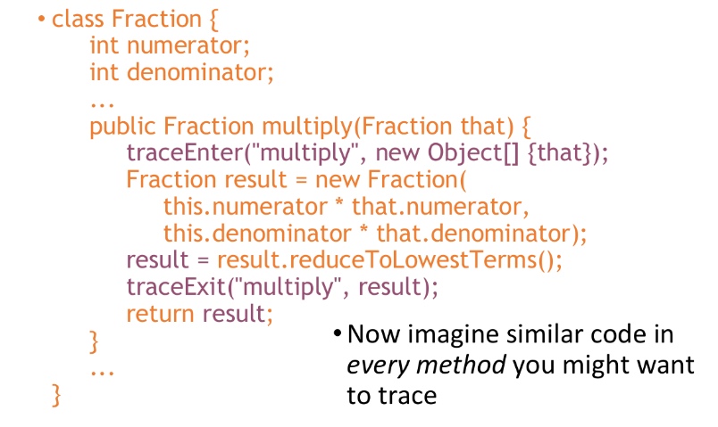
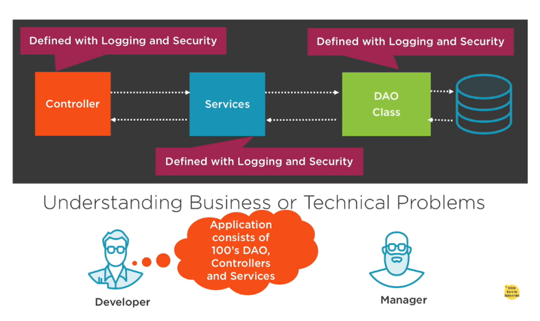
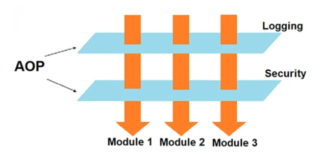
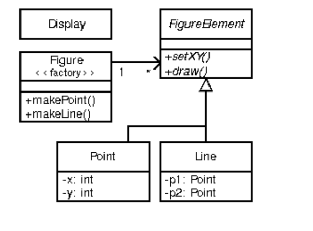

# Unit 4 Aspect-Oriented Architecture

## MDA (Model Driven Architecture)

1. MDA model driven architecture is an approach to software design, development and implementation that uses models to express the specifications of a system at different levels of abstraction. MDA separates the business and application logic from the underlying platform technology, allowing the system to be realized on various platforms using different technologies
2. MDA is an initiative of the Object Management Group (OMG), which provides standards and guidelines for structuring software specifications using models. Some of these standards are UML, MOF, XMI, and CWM
3. MDA aims to improve the productivity, portability, interoperability, and maintainability of software systems by using models as the primary artifacts of software development
4. MDA also supports model-driven engineering, which is a broader discipline that applies modeling techniques to various domains and engineering processes

### Benefits

Some of the benefits of using MDA are:

* It can improve the productivity of software development by allowing developers to focus on the business logic and functionality rather than the technical details and platform dependencies
* It can enhance the portability and interoperability of software systems by enabling them to be realized on different platforms using different technologies, such as Web Services, .NET, CORBA, J2EE, etc.
* It can increase the maintainability and evolvability of software systems by allowing the business and technical aspects to change independently and at their own pace, without affecting each other.
* It can support model-driven engineering, which is a broader discipline that applies modeling techniques to various domains and engineering processes, such as analysis, design, testing, verification, validation, etc

  

  

### Types of viewpoints MDA

1. Computational Independant Viewpoint

   It focuses on environment of system
2. Platform Independent Viewpoint

   It focuses on Operations of system
3. Platform Specific Viewpoint

   It is linked to specific technology of platform

### Types of MDA

1. Computational Independant Model (CIM)

   1. A Computational Independent Model (CIM) is a model of a software or business system that defines its functionality and requirements from a business perspective, without considering any specific implementation details or technologies
   2. A CIM may contain information about the system’s organization, roles, functions, processes, activities, documentation, constraints, etc
   3. A CIM is one of the primary models defined within the Model-Driven Architecture (MDA) approach proposed by the Object Management Group (OMG)
2. Platform Independent Model (PIM)

   1. A PIM is a model that describes the system’s functionality and behavior in a platform-independent way, using concepts that are independent of any specific technology or implementation
3. Platform Specific Model (PSM)

   1. A PSM is a model that describes the system’s functionality and behavior in a platform-specific way, using concepts that are linked to a specific technology or implementation
   2. This way, the system can be developed in a more abstract and platform-independent way, and then refined and implemented for different platforms in a more automated and consistent way

Note: They get converted to other MDAs with the help of automation

CORBA converts to c++

EJB converts to java

### Conversion

### Basic concepts of MDA

1. Model: Combination of drawing & text
2. Viewpoint: here 'abstraction' is used to mean the process of suppressing selected detail
3. Platform: Set of subsystems
4. Prevasive services: services available in a wide range of platforms

Consider the diagram

## Aspect Oriented Programming

* In computing, aspect-oriented programming (AOP) is a programming paradigm that aims to increase modularity by allowing the separation of cross-cutting concerns.
* It does so by adding behavior to existing code (an advice) without modifying the code itself, instead separately specifying which code is modified via a "pointcut" specification, such as "log all function calls when the function's name begins with 'set'.
* Procedural programming

  Executing a set of commands in a given sequence

  Fortran, C, Cobol
* Functional programming

  Evaluating a function defined in terms of other functions

  Lisp, ML, OCaml
* Logic programming

  Proving a theorem by finding values for the free variables

  Prolog
* Object-oriented programming (OOP)

  Organizing a set of objects, each with its own set of responsibilities

  Smalltalk, Java, C++ (to some extent)
* Aspect-oriented programming (AOP)

  Executing code whenever a program shows certain behaviors

  AspectJ (a Java extension)

### The Problem

Some programming tasks cannot be neatly encapsulated in objects,
but must be scattered throughout the code such as

* Logging (tracking program behavior to a file)
* Profiling (determining where a program spends its time)
* Tracing (determining what methods are called when)
* Session tracking, session expiration
* Special security management

The result is crosscuting code--the necessary code “cuts across” many
different classes and methods

### Consequences of crosscutting code

* Difficult to reason about
* Redundant code
* Difficult to change
* Inefficient when crosscuting code is not needed

### Why AOP

### What is AOP?

* Aspect oriented programming(AOP) can be defined as the breaking of code into different modules, also known as modularization, where the aspect is the key unit of modularity.
* AOP is the methodology to apply middleware services on application.
* AOP allows us to write application code and middleware services separately and allow to link middleware services code with application through xml files or annotation.
* AOP breaks the program logic into distinct parts called as concerns.

### Example

logging

How to solve this?

* There are several advantages to using the AOP approach to logging rather than manually adding logging function: The code for logging is easy to add and remove: all you need to do is add or remove a couple of configurations of some aspect.
* All the source code for logging is kept in one place, so you don't need to manually hunt down all the places where it is used.
* Logging code can be added anywhere, whether in methods and classes
  that have already been written or in new functionality. This reduces the
  number of coding errors.
* Also, when removing an aspect from a design configuration, you can be
  sure that all the tracing code is gone and that nothing was missed.
* Aspects are separate code that can be improved and used again and
  again.

AOP is also used for exception handling, caching, and extracting certain functionality to make it reusable.

### OOP VS AOP

| OOP                                                                                                   | AOP                                                                     |
| ----------------------------------------------------------------------------------------------------- | ----------------------------------------------------------------------- |
| Focus of OOP is to break down the programming task in to objects,which encapsulate data and methods, | Focus of AOP is to break down the program in to crosscutting concerns. |
| Reusability of code is at a great extent                                                              | Reusability of code is at a lessextent                                  |

### Advantages of AOP

* Increased Modularity.
* Increased Maintainability.

* Increased Reusability
* Reduction in the size of the code.

### AspectJ

* AspectJ is a small, well-integrated extension to Java
* AspectJ modularizes crosscutting concerns
* The AspectJ compiler is free and open source
* AspectJ works with JBuilder, Forté, Eclipse, probably others
* Example

#### Terminology

* A join point is a well-defined point in the program flow. Such as method execution, exception handling etc. In Spring AOP, a join point always represents a method execution.
* A pointcut is a group of join points. The concept of join points as matched by pointcut expressions is central to AOP, and Spring uses the AspectJ pointcut expression language by default.
* Advice is code that is executed at a pointcut
* Introduction modifies the members of a class and the relationships
  between classes
* An aspect is a module for handling crosscutting concerns
* Each of these terms will be discussed in greater detail
* Advice: Action taken by an aspect at a particular join point. Different types of advice include "around," "before" and "after" advice.

#### Types of advice

* Before advice: Advice that executes before a join point, but which does not have the ability to prevent execution flow proceeding to the join point (unless it throws an exception).
* After returning advice: Advice to be executed after a join point completes normally: for example, if a method returns without throwing an exception.
* After throwing advice: Advice to be executed if a method exits by throwing an exception.
* After (finally) advice: Advice to be executed regardless of the means by which a join point exits (normal or exceptional return).
* Around advice: Advice that surrounds a join point such as a method invocation. This is the most powerful kind of advice. Around advice can perform custom behavior before and after the method invocation.

#### Pointcut designator wildcards

* execution(*(..))
  * Chooses the execution of any method regardless of return or parameter types
* call(* set(..))
  * Chooses the call to any method named set regardless of return or parameter type
* Pointcut designators based on types
  * execution(int *()): Chooses the execution of any method with no parameters that returns an int
  * call(* setY(long)): Chooses the call to any setY method that takes a long as an argument, regardless of return type or declaring type
  * call(* Point.setY(int)): Chooses the call to any of Point’s setY methods that take an int as an argument, regardless of return type
  * call(*.new(int, int)):Chooses the call to any classes constructor, so long as it takes exactly two ints as arguments
* Pointcut designator composition
  * Pointcuts compose through the operations or (“||”), and (“&&”) and not (“!”)

QUESTIONS

What are the types of programming paradigm?

Terminology in ASPECTJ

Consequences of cross cutting code

Point cut & simple program for it

Program for traceExit & traceEnter
