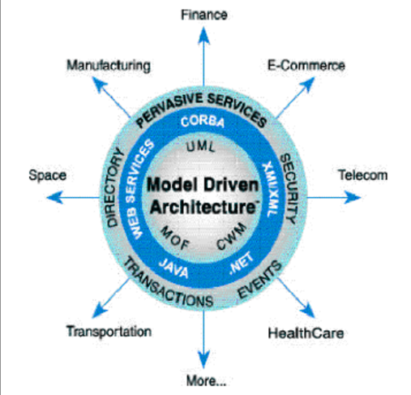

# Unit 4 Aspect-Oriented Architecture

## MDA (Model Driven Architecture)

1. MDA model driven architecture is an approach to software design, development and implementation that uses models to express the specifications of a system at different levels of abstraction. MDA separates the business and application logic from the underlying platform technology, allowing the system to be realized on various platforms using different technologies

2. MDA is an initiative of the Object Management Group (OMG), which provides standards and guidelines for structuring software specifications using models. Some of these standards are UML, MOF, XMI, and CWM

3. MDA aims to improve the productivity, portability, interoperability, and maintainability of software systems by using models as the primary artifacts of software development

4. MDA also supports model-driven engineering, which is a broader discipline that applies modeling techniques to various domains and engineering processes

### Benefits

Some of the benefits of using MDA are:

* It can improve the productivity of software development by allowing developers to focus on the business logic and functionality rather than the technical details and platform dependencies

* It can enhance the portability and interoperability of software systems by enabling them to be realized on different platforms using different technologies, such as Web Services, .NET, CORBA, J2EE, etc.

* It can increase the maintainability and evolvability of software systems by allowing the business and technical aspects to change independently and at their own pace, without affecting each other.

* It can support model-driven engineering, which is a broader discipline that applies modeling techniques to various domains and engineering processes, such as analysis, design, testing, verification, validation, etc

  

  

### Types of viewpoints MDA

1. Computational Independant Viewpoint

        It focuses on environment of system

2. Platform Independent Viewpoint

        It focuses on Operations of system

3. Platform Specific Viewpoint

        It is linked to specific technology of platform

### Types of MDA

1. Computational Independant Model (CIM)

        1. A Computational Independent Model (CIM) is a model of a software or business system that defines its functionality and requirements from a business perspective, without considering any specific implementation details or technologies
        2. A CIM may contain information about the system’s organization, roles, functions, processes, activities, documentation, constraints, etc
        3. A CIM is one of the primary models defined within the Model-Driven Architecture (MDA) approach proposed by the Object Management Group (OMG)

2. Platform Independent Model (PIM)

        1. A PIM is a model that describes the system’s functionality and behavior in a platform-independent way, using concepts that are independent of any specific technology or implementation

3. Platform Specific Model (PSM)

        1.  A PSM is a model that describes the system’s functionality and behavior in a platform-specific way, using concepts that are linked to a specific technology or implementation
        2.  This way, the system can be developed in a more abstract and platform-independent way, and then refined and implemented for different platforms in a more automated and consistent way

Note: They get converted to other MDAs with the help of automation

CORBA converts to c++

EJB converts to java

### Conversion

### Basic concepts of MDA

1. Model: Combination of drawing & text

2. Viewpoint: here 'abstraction' is used to mean the process of suppressing selected detail

3. Platform: Set of subsystems

4. Prevasive services: services available in a wide range of platforms

Consider the diagram

## Aspect Oriented Programming

* In computing, aspect-oriented programming (AOP) is a programming paradigm that aims to increase modularity by allowing the separation of cross-cutting concerns.

* It does so by adding behavior to existing code (an advice) without modifying the code itself, instead separately specifying which code is modified via a "pointcut" specification, such as "log all function calls when the function's name begins with 'set'.

1. Fundamental Programming

QUESTIONS

What are the types of programming paradigm?

Terminology in ASPECTJ

Consequences of cross cutting code

Point cut & simple program for it

Program for traceExit & traceEnter
