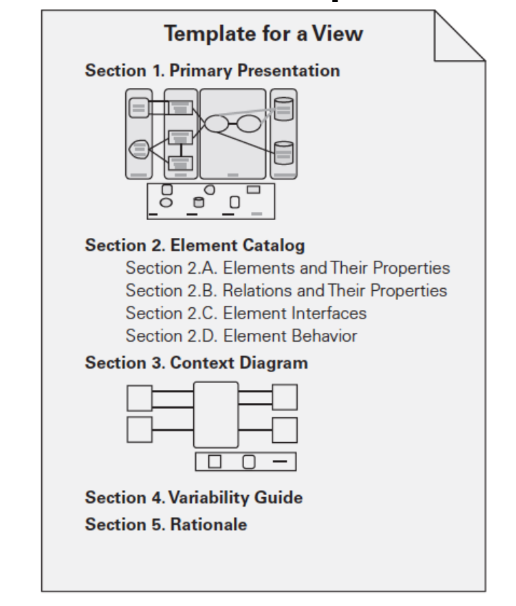

# Unit 5 Documenting architecture

## Architecture Documentation

* Architecture documentation must

        1. be sufficiently transparent and accessible to be quickly understood by new employees

        2. be sufficiently concrete to serve as a blueprint for construction

* Architecture documentation is both prescriptive and descriptive.

* Understanding stakeholder uses of architecture documentation is
essential

### Uses for Architecture Documentation

* Education

* Primary vehicle for communication among stakeholders

* Basis for system analysis and construction

## Notations

1. Informal notations

        Views are depicted (often graphically) using general-purpose diagramming and editing tools

        The semantics of the description are characterized in natural language

        They cannot be formally analyzed

2. Semiformal notations

        Standardized notation that prescribes graphical elements and rules of construction

        Lacks a complete semantic treatment of the meaning of those elements

        Rudimentary analysis can be applied

        UML is a semiformal notation in this sense.

3. Formal notations

        Views are described in a notation that has a precise (usually mathematically based)semantics.

        Formal analysis of both syntax and semantics is possible.

        Architecture description languages (ADLs)

        Support automation through associated tools.

### How will you choose a notation?

        1. Typically, more formal notations take more time and effort to create and understand, but offer reduced ambiguity and more opportunities for analysis.

        2. Conversely, more informal notations are easier to create, but they provide fewer guarantees.

        3. UML class diagram will not help you reason about schedulability, nor will a sequence chart tell you very much about the system’s likelihood of being delivered on time.

        4. Choose your notations and representation languages knowing the important issues you need to capture and reason about.

Note:

Principle of architecture documentation:

**Documenting an architecture is a matter of documenting the relevant views and then adding documentation that applies to more than one view.**

## View

* Views let us divide a software architecture into a number of (we hope) interesting and manageable representations of the system.

* The types of views are as follows:

### Module View

* Elements

        Modules, which are implementation units of software that provide a coherent set of responsibilities.

* Relations

        Is part of, which defines a part/whole relationship between the submodule—the

        Depends on, which defines a dependency relationship between two modules.

        Is a, which defines a generalization/specialization relationship between a more specific module & the child and a more general module & the parent.

* Constraints

        Different module views may impose specific topological constraints, such as limitations on the visibility between modules.

* Usage

        Blueprint for construction of the code

        Change-impact analysis

        Planning incremental development

        Requirements traceability analysis

### C & C view

* Shared data, Client & server & process

* Elements

        1. Principal processing units and data stores.

        2. Connectors (Pathways of interaction between components)

* Relations

        1. Attachments (Component ports are associated with connector roles to yield a graph of components and connectors)

        2. Interface delegation (The case is similar for the roles of a connector)

* Constraints

        1. Components can only be attached to connectors, not directly to other components.

        2. Connectors can only be attached to components, not directly to other connectors.

        3. Attachments can only be made between compatible ports and roles.

        4. a connector must be attached to a component.

* Uses

        1. Show how the system works.

        2. Guide development by specifying structure and behavior of runtime elements.

### Notations for C&C Views

1. UML connectors are not rich enough to represent many C&C connectors.

2. Represent a “simple” C&C connector using a UML connector—a line.

3. Connector roles cannot be explicitly represented with a UML connector.

4. Represent a “rich” C&C connector using a UML component, or by annotating a line UML connector with a tag that explains the meaning of the complex connector.

## Allocation Views

* Elements

        1. Software element and environmental element.

        2. A software element has properties that are required of the environment

        3. An environmental element has properties that are provided to the software.

* Relations

        1. A software element is mapped (allocated to) an environmental element.

        2. Properties are dependent on the particular view.

* Constraints

        1. Varies by view

* Usage

        1. Reasoning about performance, availability, security, and safety.

        2. Reasoning about distributed development and allocation of work to teams.

        3. Reasoning about concurrent access to software versions.

        4. Reasoning about the form and mechanisms of system installation. 

## Quality Views

* A quality view can be tailored for specific stakeholders or to address specific concerns.

* A quality views is formed by extracting the relevant pieces of structural views and packaging them together.

        1. Security view (Show the components that have some security role or responsibility)

        2. Communications view (Especially helpful for systems that are globally dispersed and heterogeneous)

        3. Exception or error-handling view (Could help illuminate and draw attention to error reporting and resolution mechanisms.)

        5. Reliability view (Models mechanisms such as replication and switchover)

        6. Performance view (Shows those aspects of the architecture useful for inferring the system’s performance.)

## Choosing the Views

You can choose a view firstly you need answers for this

    1. What people, and with what skills, are available

    2. Which standards you have to comply with

    3. What budget is on hand

    4. What the schedule is

    5. What the information needs of the important stakeholders are

    6. What the driving quality attribute requirements are

    7. What the approximate size of the system is

### Method for Choosing the Views

1. Build a stakeholder/view table.

2. Combine views to reduce their number

3. Prioritize and stage.

## Documenting a View

* Section 1: The Primary Presentation.

        1. The primary presentation shows the elements and relations of the view.

        2. The primary presentation should contain the information you wish to convey
        about the system—in the vocabulary of that view.

        3. The primary presentation is most often graphical.

* Section 2: The Element Catalog.

        1. The element catalog details at least those elements depicted in the primary presentation.

        2. Parts of the catalog: (Elements and their properties, Relations and their properties, Element interfaces, Element behavior)

* Section 3: Context Diagram.

        1. context diagram shows how the system or portion of the system depicted in this view relates to its environment.

* Section 4: Variability Guide.

        1. A variability guide shows how to exercise any variation points that are a part of the architecture shown in this view.

* Section 5: Rationale.

        1. Rationale explains why the design reflected in the view came to be.

### Example

## Documenting beyond views

Section 1: Documentation Roadmap.

        The documentation map tells the
reader what information is in the documentation and where to find it.

Section 2: How a View Is Documented.

        Explain the standard organization you’re using to document views—either the one described in this chapter or one of your own.

Section 3: System Overview.

        Short prose description of the system’s function, its users, and any important background or constraints.

Section 4: Mapping Between Views.

        Helping a reader understand the associations between views will help that reader gain a powerful insight

Section 5: Rationale.

        Documents the architectural decisions that apply to more than one view.

Section 6: Directory.

        Set of reference material that helps readers find more information quickly.

## Documenting Behavior

* Behavior documentation complements each views by
describing how architecture elements in that view
interact with each other.

* Behavior documentation enables reasoning about

        a system’s potential to deadlock

        a system’s ability to complete a task in the desired amount
        of time

        maximum memory consumption

### Notations for Documenting Behavior

* Trace-oriented languages

A trace describes a particular sequence of activities or
interactions between structural elements of the system.

        1. use cases

        2. sequence diagrams

        3. communication diagrams

        4. activity diagrams

        5. message sequence charts

        6. timing diagrams

        7. Business Process Execution Language

* Comprehensive languages

Comprehensive models show the complete behavior of structural elements.

The state machine formalism represents the behavior of
architecture elements because each state is an abstraction
of all possible histories that could lead to that state.

### Documenting Quality Attributes

1. Rationale that explains the choice of design approach should include a
discussion about the quality attribute requirements and tradeoffs.

2. Architectural elements providing a service often have quality attribute
bounds assigned to them, defined in the interface documentation for
the elements, or recorded as properties that the elements exhibit.

3. Quality attributes often impart a “language” of things that you would
look for. Someone fluent in the “language” of a quality attribute can
search for the kinds of architectural elements put in place to satisfy
that quality attribute requirement.

4. Architecture documentation often contains a mapping to requirements
that shows how requirements (including quality attribute requirements)
are satisfied.

5. Every quality attribute requirement will have a constituency of
stakeholders who want to know that it is going to be satisfied. For these
stakeholders, the roadmap tells the stakeholder where in the document
to find it.

## Documenting Architectures That change Faster

Document what is true about all versions of your system. Record those
invariants as you would for any architecture. This may make your
documented architecture more a description of constraints or
guidelines that any compliant version of the system must follow.

Document the ways the architecture is allowed to change. This will
usually mean adding new components and replacing components with
new implementations. The place to do this is called the variability guide.

## Documenting Architecture in an Agile Development Project

1. Adopt a template or standard organization to capture your design
decisions.

2. Plan to document a view if (but only if) it has a strongly identified
stakeholder constituency.

3. Fill in the sections of the template for a view, and for information beyond
views, when (and in whatever order) the information becomes available.
But only do this if writing down this information will make it easier (or
cheaper or make success more likely) for someone downstream doing
their job.

4. Don’t worry about creating an architectural design document and then a
finer-grained design document. Produce just enough design information
to allow you to move on to code.

5. Don’t feel obliged to fill up all sections of the template, and certainly not
all at once. Write “N/A” for the sections for which you don’t need to
record the information (perhaps because you will convey it orally).

6. Agile teams sometimes make models in brief discussions by the
whiteboard. Take a picture and use it as the primary presentation.

## Question Unit 5

Need of documentation

Uses of documentation

Ellaborate Use case diagram, sequence diagram,  state diagram for documentation

Module view allocation view

Various notation

templates for view documentation
