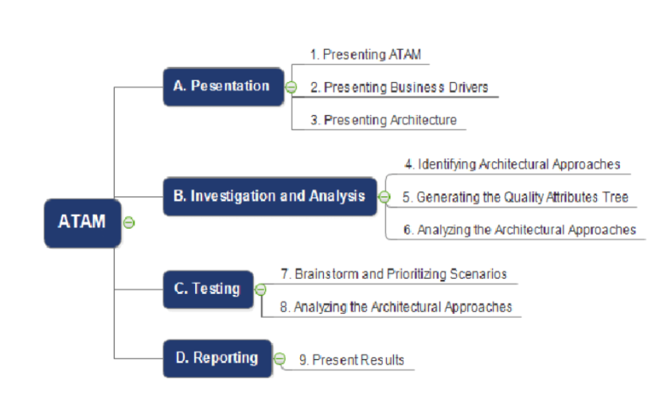
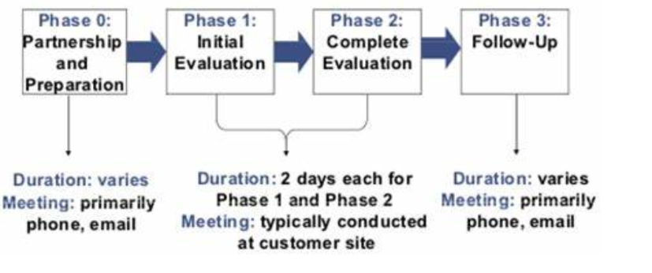
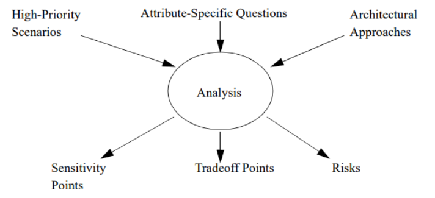

# Unit 6

## What is architecture evaluation?

Architecture evaluation is the activity of evaluating the architectural design decisions of an (envisioned) system to build confidence that the system can fulfill the stakeholder concerns

Typically, evaluation techniques actually evaluate what is documented in an architecture description

## Benefits & limits

Some of the benefits of architecture evaluation are:

* It can validate that architectures address the concerns of stakeholders.
* It can assess the quality of architectures with respect to their intended purpose and quality attributes such as modifiability, performance, security, etc.
* It can assess the value of architectures to their stakeholders and support decision making where architectures are involved.
* It can provide knowledge and information about architecture entities and their relationships.
* It can assess progress towards achieving architecture objectives and clarify understanding of problem space and stakeholder needs.

Some of the limits of architecture evaluation are

* It can be challenging to integrate architecture evaluation with continuous development methods that require frequent feedback and adaptation.
* It can be difficult to automate evaluation techniques that focus on semantics rather than structure of architectures.
* It can be costly and time-consuming to perform architecture evaluation for large-scale and complex systems with multiple stakeholders and viewpoints.
* It can be influenced by subjective factors such as stakeholder preferences, biases, assumptions, and expectations.

## What is ATAM?

* ATAM (Architecture Tradeoff Analysis Method)  provides a structured and systematic approach to evaluating software architecture, ensuring that the architecture meets the requirements and goals of the project

* ATAM can be a valuable tool for evaluating software architectures and identifying potential risks and tradeoffs Purpose of ATAM

* The ATAM can be done early in the software development life cycle

* It can be done relatively inexpensively and quickly (because it is assessing architectural design artifacts)

* The ATAM will produce analyses commensurate with the level of detail of the architectural specification

* Participants in ATAM

    The ATAM requires the participation of three groups as follows

* The evaluation team

    1. The evaluation team consists of the members who are external to the project. This team consists of 3-5 members who play their specific roles in the team

        2.Project decision-maker
    Project decision-makers have the power to speak for the development of the project and have the authority to mandate changes Architecture stakeholders Stakeholders include users, maintainers, performance engineers, testers, integrators, developers

### Process of Architecture Tradeoff Analysis Method

#### Process Diagram

1. Select the architecture to be evaluated: Identify the architecture to be evaluated and establish the evaluation team.
2. Develop the ATAM model: Create an ATAM model that includes quality attribute scenarios, architectural approaches, and design decisions.
Present the architecture: The architects present the architecture to the evaluation team, explaining the design decisions and their reasoning behind them.
3. Identify architectural approaches: The evaluation team identifies architectural approaches to address the quality attribute scenarios
Analyze trade offs: Analyze the tradeoffs involved in the architectural approaches, considering the quality attribute scenarios, risks, and costs.
4. Assess the results: Evaluate the effectiveness of the architectural approaches in addressing the quality attribute scenarios and identify any remaining risks or issues.
Present the results: The evaluation team presents the results to the stakeholders, including the architects and project managers.
5. Iterate: Iterate on the architecture and the evaluation process to refine and improve the architecture

Note: There are total 9 steps we are just mentioning the main steps

## Phases of ATAM

### Phase 0

    Preparation, planning, stakeholder recruitment, and team formation takes place in this phase. Participants are evaluation team key project decision-makers.

### Phase 1

    This phase consists of steps 1-6 of the evaluation process. Participants are evaluation team key project decision-makers. Its typical duration is 1 day followed by a hiatus of 2 to 3 weeks.

### Phase 2

    This phase consists of steps 7-9 of the evaluation process. Participants are evaluation team key project decision-makers and stakeholders. The duration of this phase is 2 days.

## Phase 3

    This phase is a follow-up phase. Report generation and delivery of the report is done in this phase. Any scope of improvement in the process is also looked upon. Participants are the Evaluation team and evaluation clients. Duration is 1 week.

## Outputs of ATAM

1. A concise presentation of the architecture
2. Articulation of business goals
Prioritised quality attribute requirements expressed as quality attribute scenarios
3. A set of risk themes that helps the evaluation team to examine all the discovered risk themes that identify systematic weakness in the architecture, process, and team
Mapping of architectural decisions to quality requirements

## Benefits of ATAM

1. Risk mitigation: ATAM helps to identify and address potential risks and tradeoffs in the architecture before they become major issues.
2. Quality assurance: By evaluating the architecture against quality attributes, ATAM ensures that the architecture meets the requirements and goals of the project.
Early detection of design issues: ATAM can help to identify design issues early in the development process, when they are easier and less expensive to fix.
3. Improved communication: ATAM encourages communication and collaboration among architects, project managers, and stakeholders, improving understanding and alignment of the project goals and objectives.
Decision-making: ATAM provides a structured and systematic approach to decision-making, considering multiple alternatives and tradeoffs to arrive at an optimal architecture.
4. Cost-effectiveness: ATAM can help to reduce costs by avoiding costly design errors and rework, and ensuring that the architecture is aligned with the project goals and objectives.

## Disadvantages of ATAM

    1. Time and resource-intensive: ATAM can be a time and resource-intensive process, requiring significant effort from the evaluation team, stakeholders, and architects.
    2. Complexity: The complexity of ATAM can be overwhelming, especially for smaller projects or organizations with limited resources.
    3. Limited scope: ATAM focuses primarily on architectural quality attributes and may not address other important aspects of software development, such as usability or performance.
    4. Bias: The evaluation team and stakeholders may have biases or preconceptions that can affect the evaluation process and outcomes.
    Limited effectiveness: Despite the thoroughness of ATAM, it may not always identify all potential risks or issues in the architecture, and may not be effective in all situations.

Example

Suppose there is client-server chat application
Irrespective of the style being analyzed we know that latency (a measure of response) is at least a function of Resources such as CPUs and LANs
Resource arbitration such as scheduling policy
Resource consumption such as CPU execution time
External events such message arrival

## Questions

Purpose of designing

Design SQL for architecture

Identify ATAM types

Various data design principles
