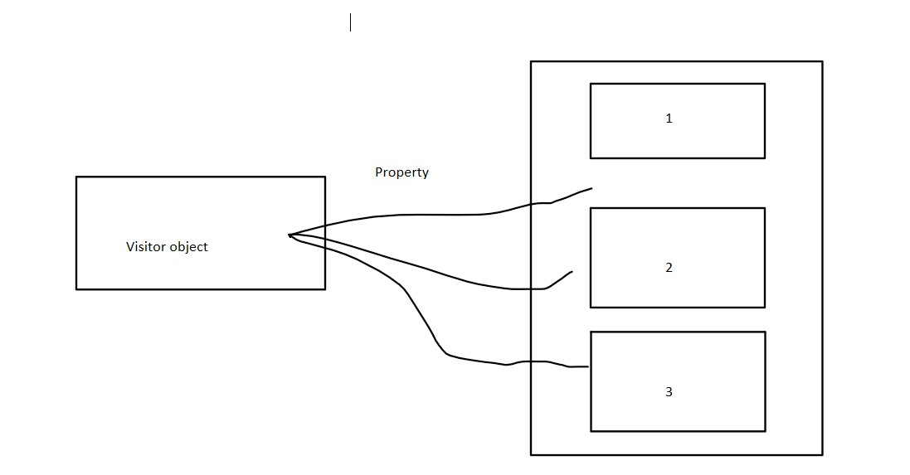
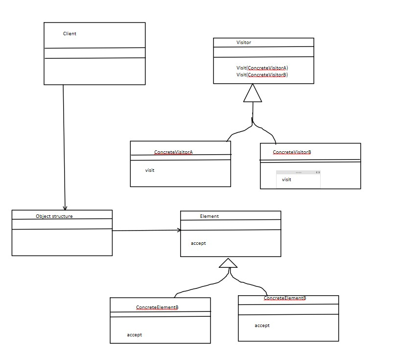
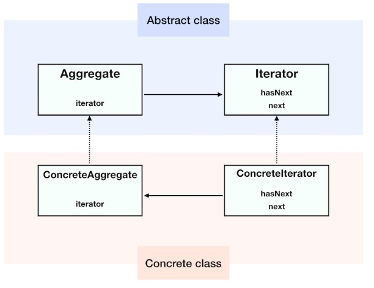

# Lecture 10

## Visitor Design Pattern

    a. Represent an operation to be performed on the elements of object
    b. Visitor let's you define a new operation without changing the class elements on which it operates
    c. We use a visitor which changes the executing algorithm of an element object

## State Design Pattern

    a. It is behavioural design pattern that lets an object alter its behaviour when its internal state changes. It appears as if the object changed its class
    b. Here class Behaviour changes based on its state. This type of design pattern comes under behviour pattern
    c. State pattern is know as object pattern

## Iterator design pattern

    a. It is used ti access the elements of an aggregate object sequentially wwithout exposing its underlying implimentation
    b. In OOP this pattern is used to traverse a container and access the containers elements
    c. Used when there are multiple traversal of objects

## Memento Design Pattern

    a. It is used to restore the state of object to previous state. Memento pattern falls under behavioural pattern
    b. It uses three actors
        a. State of an object that has to be restored
        b. Originator creates and stores in memento objects and caretaker restores object state
    c. It is used in undo/redo operations

