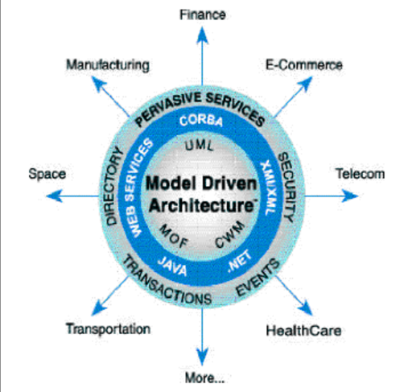

# Lecture 17

## MDA

  

  

### Types of viewpoints MDA

1. Computational Independant Viewpoint

2. Platform Independent Viewpoint

3. Platform Specific Viewpoint

### Types of MDA

1. Computational Independant Model (CIM)

2. Platform Independent Model (PIM)

3. Platform Specific Model (PSM)

Note: They get converted to other MDAs with the help of automation

CORBA converts to c++

EJB converts to java

### Conversion

