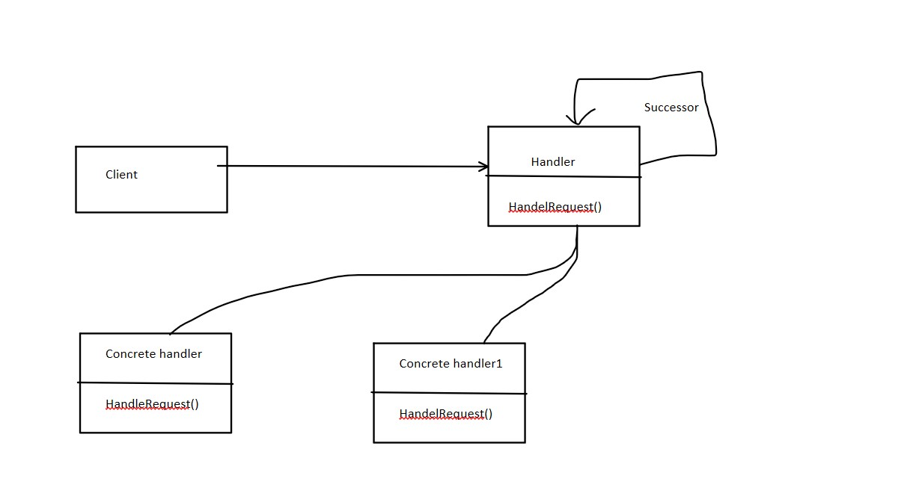
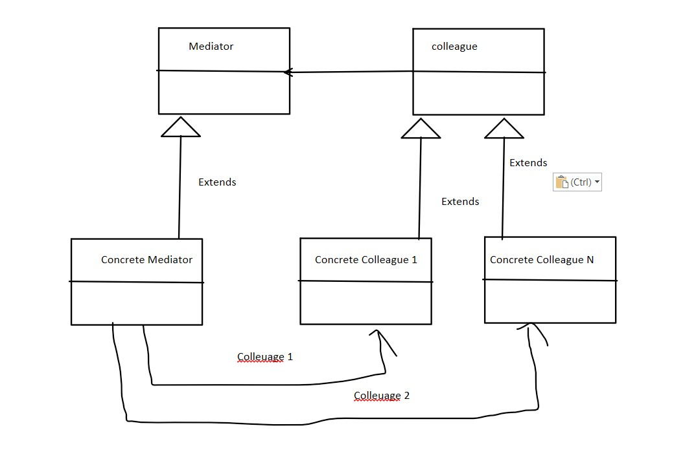

# Lecture 8

The *Behavioural design pattern*

1. Chain of responsibility pattern

        a. There is a handler that handels the respnsibility of the objects which are in process

    

        b. Request can be handeled with one handler or many handlers
        c. Example
            i. One full note of 200 rs can paid the sum of 200 rs (One handler)
            ii. Multiple notes of 10,20,50 can pay the sum of 200 rs (Multiple handlers)
        d. This design pattern is to be used when sender doesn't have enough idea about it.

2. Mediator

        a. It says that "to define an object that encapsulates how a set of object interacts"
        b. Used to reduce communication complexity between multiple objects
        c. It is more generic

    
