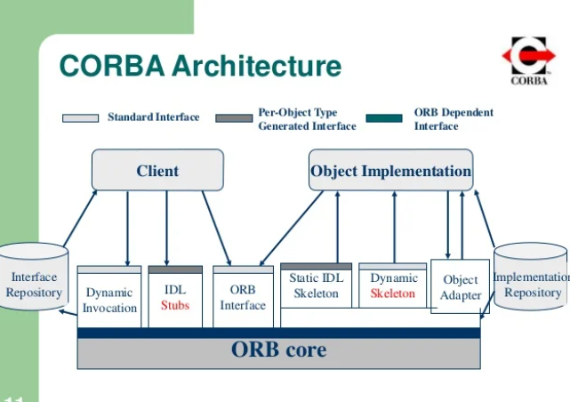
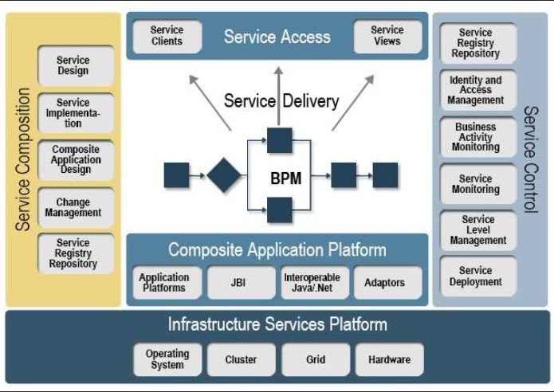

# Lecture 16

## RPC ( Remote Procedure Call )

RPC example is suppose there is a program run on one computer & it calls the function which is on another computer

## CORBA

* Distributed object based system

* Provides inter-operability

* CORBA Architecture

  

* Communication takes place in IDL langauge here

* Communication is between client & server!

## Broker

* It is responsible for co-ordinating request

## SOA ( Service Oriented Architecture )

* SOA combines large number of facilities from existing services to form application

* It is like a service mergering platform

* It is a blackbox for its consumers, meaning the consumer does not have to be aware of service's inner working

  
