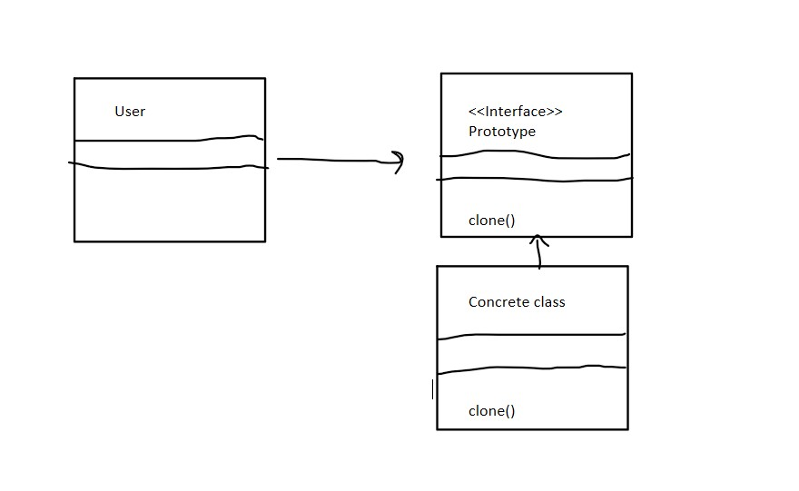

# Lecture 5

The *Creational Design Pattern* Type

1. Prototype Design pattern

        a. Here we are cloning the existing object instead of creating a new instance
        b. We can customized it 
        c. We can add or remove objects at runtime

        Example:

    

    

    The **Advantage**:

        a. We can add or delete object at runtime

2. Builder Design

        a. It helps us build complex java object in an easy and readable manner
        b. It is used when we want to hide internal complex structure from external entities which use interface to create object
        c. It separates object construction from its representation
        d. It has 3 major parts
            i. Product (This is the actual object that we are trying to construct)
            ii. Builder (Builds complex part)
            iii. Executor (Executes complex part)
    Example

    

3. Factory Design Pattern

        a. Define an interface or abs class for creating an object but let the subclasses decide which class to instantiate
        b. The main purpose is to return objects at runtime
        c. Helps us to separate the object creation code from the one which is using it.
        d. Reuses the same memory

    Example

    

4. Abstract Factory Design Pattern

        a. Similar to Factory Design Pattern
        b. Add another level of abstraction layer to factory design pattern
        c. It creates factory of factory i.e super factory

    Example

    
