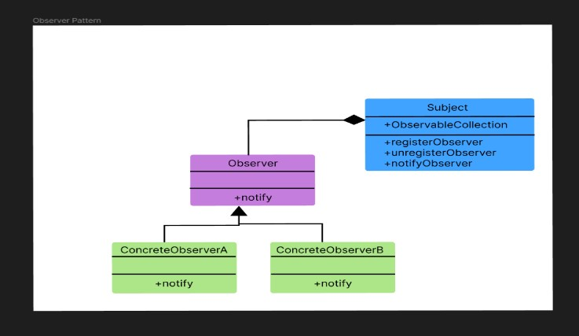

# Lecture 9

## Observer

        a. Observer is a behavioral design pattern. It specifies communication between objects: observables and observers. An observable is an object which notifies observers about the changes in its state
        b. We can implement the code using two classes in java. One is Observer/Observable, Other is PCL (PropertyChangeListener)
        c.Observer Pattern *looks* like this

