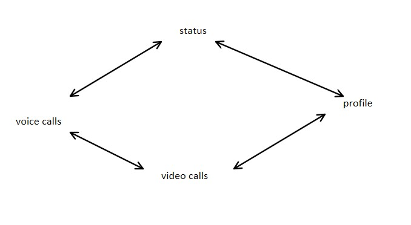
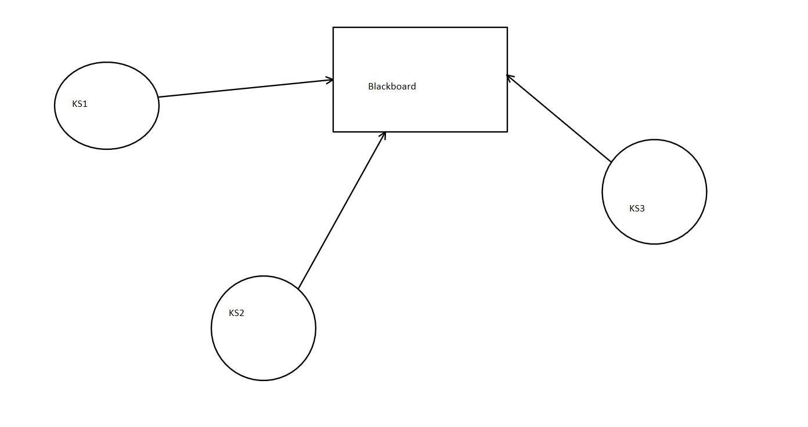
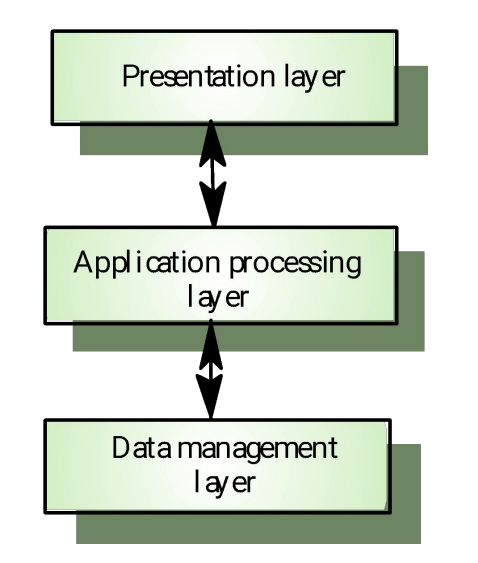
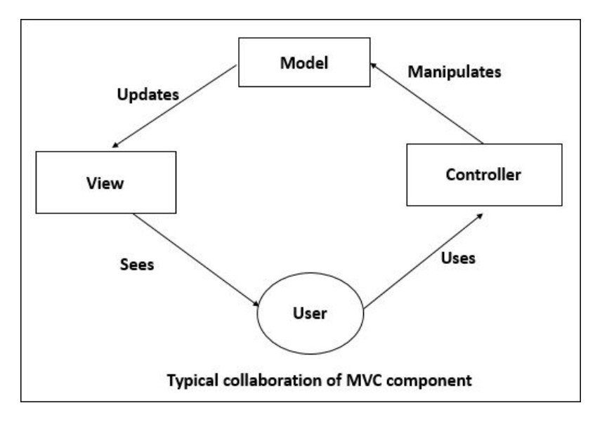
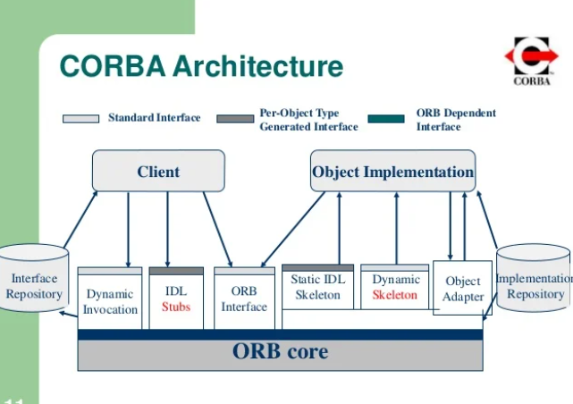
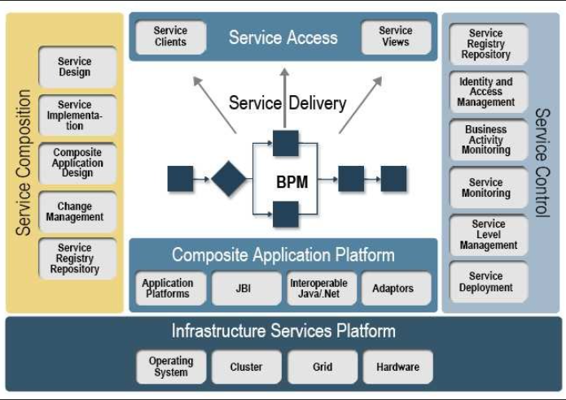

# Unit 2 Architectural Design

## Architecture

Architecture is nothing but a blue print that defines a system

## Software Architecture

    a. It is blueprint for the system
    b. Abstraction to manage system and establish communication and co-ordination among components
    c. It refers to the fundamental structure of the software and the disciplines to create such software

Example of whatsapp functions

Note: **All software architecture are software design but not all software design are software architecture**

    d. Software architecture affects quality of software. They are directly proportional
    e. Why use software architecture?
        i. It helps in real world complex world
        ii We can distrubute work between team members
        iii. Helps in understanding the system
    f. Users of software Architecture
        i. Project Managers
        ii. Software Dev
        iii. Tester
        iv. Anyone who wants to make an improvement by looking at architecture

## Software Design

It is **mechanism to transform user requirements into something useful**

Objectives

    i. Correctness
    ii. Completeness
    iii. Efficient

## Architectural Design vs Software Design

| Software Design | Architectural Design |
| - | - |
| Sub modules are present | Only overall model is designed |
| Implmentation is there somewhat | Implimentation is hidden |

## Architectural Design

* System strucuring

* Control Modelling

* Modular decomposition

## Subsystem & modules

* Sub system: It is a system own its own doesn't depend on other sub system

* Module: It is a component which provides services but it cannot provide services

## Architectural Design Process

1. Understand the problem

2. Identify design elements

3. Evaluate the Design architecture

4. Transform the architecture

### Types of Architectures

* Bussiness architecture: Design the bussiness strategy

* Application architecture: servers as a blueprint for individual application system

* Information technology architecture: Define hardware and software for that system

## Architecture Modules

* It involves high level structure of software system abstraction by using decomposition

* Its parts are

        a. UML
            i. Pictorial language use to make blueprints
            ii. Divided into two sub categories
                I. Structural (class diagram,object diagram,component diagram, Package diagram, Deployment diagram)
                II. Behavioural (Sequence diagram, State diagram, Activity diagram)

## Architectural View Model (4+1 view model)

* It is used to describe the system from the viewpoint of different stakeholders

* The 4 + 1 view model was designed by philippe to describe the architecture of software

* It is a multiple view model

### Types of views

1. Logical view

    a. Shows the component (object) or system as well as their interaction

    b. Viewer are end-users, analyst

    c. Considers functional requirements

    d. UML diagram (class, state, object, communication diagram)

2. Process

    a. Shows process and how processes communicate

    b. Integrators & developers are viewers

    c. Considers non functional requirements

    d. Activity diagram is drawn

3. Development

    a. Gives abuilding block of system and describe static organization system modules

4. Physical

    a. Shows installation, configuration of software

5. Scenario

    a. Shows design is complete by performing validation

## ADL (Architecture Description language)

* It provides syntax and semantics for defining architecture of software

* It defines interfaces between components

* An architecture description language is a formal specification language

## Software Architecture Styles

* Types

    a. Data Centered architecture

        i. It has two distinct components
            I. A central datastructure
            II. A collection of client software
        ii. Main purpose is to achieve integrality of data
        iii. Processes are individually executed by client components
        iv. Stored data is accessed in order to perform operations on it
        v. It adds scalability & supports modification
        vi. Hospital management system is perfect example of it

        I. Blackboard Architecture Style

            i.  Provides Scalibity which provides ease to update knowledge source
            ii. Supports reusablity of knowledge source
            iii. Example
    

        II. Repository Architecture Style

            i. Consists of a central data store and a collection of independent components that operate on it
            ii. The components can communicate only through the data store and do not have direct interaction with each other
            iii.  Repository architecture style is commonly used in database systems, library information systems, compilers, and computer-aided software engineering environments

    b. Data flow architecture

        i. It is applied when input data is converted into a series of manipulative components into output data
        ii. It's types
            I. Batch sequential (Provides simple division on subsystem only problem is low throughtput)
            II. Pipe and filter architecture (It transforms the data stream, processes it and writes the transformed data stream over a pipe for next filter to process. Has two types passive and active filter)
            III. Process Control (The flow of data comes from a set of variables, which controls the execution of process)
        iii. Some advantages of this architecture are
            I. It supports reusability & it is maintainable.
            II. It supports concurrent execution

    c. Logical architecture

        i. Logical architecture in software is a type of structural design that describes the organization and interaction of the software components without specifying the physical implementation details

        ii. Logical architecture shows the logical structure of the system, such as subsystems, classes, layers, and interfaces

        iii. Logical architecture helps to plan and communicate the system design before developing and deploying it

        iv. Logical architecture can be represented by diagrams that use different symbols and notations to show the software components and their relationships

    d. Layered Architecture

        i. Organizes the system into layers with related functionality associated with each layer.
        ii. It is an n-tier architecture pattern where the components are organized in horizontal layers
        iii. A layer provides services to the layer above it.
        iv. Components are interconnected but do not depend on each other
        v. It has three types of layers
            I. Presentation layer (Concerned with presenting the results of a computation to system users and with collecting user inputs)
            II. Application processing layer ( Concerned with providing application specific functionality e.g., in a banking system, banking functions such as open account, close account, etc.)
            III. Data management layer (Concerned with managing the system database)

   This is how the layer communicate amongst themselves

   

    e. Hierarchical Architecture

        i. Hierarchical architecture views the whole system as a hierarchy structure, in which the software system is decomposed into logical modules or subsystems at different levels in the hierarchy
        ii. Hierarchical decomposition is a powerful abstraction mechanism
        iii. It is divided into 

            I. Main-subroutine: This style divides a software system into subroutines by using top-down refinement according to desired functionality. The subroutines can be reused and shared by multiple callers. Data can be passed as parameters to subroutines by value or by reference.

            II. Master-slave: This style applies the ‘divide and conquer’ principle and supports fault computation and computational accuracy. It consists of a master component that distributes tasks to slave components that provide duplicate services. The master chooses a result among slaves by a certain selection strategy.

            III. Virtual machine: This style simulates a physical machine or an abstract computing model by providing an interface that hides the implementation details. It consists of a virtual machine component that interprets instructions from an application component and executes them on a physical machine component.

    f. Interaction-Oriented Architecture

        1. Interaction-oriented architecture has two major styles
            I. Model-View-Controller (MVC)

                a. It is an independent user interface and captures the behavior of application problem domain

                b. View can be used to represent any output of information in graphical form such as diagram or chart

            II. Presentation-Abstraction-Control (PAC)

                a. Each agent has three component ( Presentation, abstraction & control )

                b. The presentation component − Formats the visual and audio presentation of data

                c. The abstraction component − Retrieves and processes the data

                d. The control component − Handles the task such as the flow of control and communication between the other two components

                e. Advantages: (Support for multi-tasking and multi-viewing, Support for agent reusability)

                g. Disadvantages: (Overhead due to the control bridge between presentation and abstraction, Difficult to determine the right number of agents)

    The Model-View-Controller diagram

    

## Distributed system architecture

* Components are present on different platforms & several components can co-operate with one another over a communication network in order to achieve a specific objective objective or goal

### Parallel & Distributed system

| Parallel | Distributed |
| - | - |
| Shared memory | Separate memory |
| Communication via shared memory | Communication via messages |

## Distributed systems architectures

### Clent server Architecture

* Client: The one who requests

* Server: It receives the request & replies the client

* Middlewares are in between client

* There are different types of client models

1. Multiprocessor architectures

    * Simplest distributed system model

    * System composed of multiple processes which may (but need not) execute on different processors

    * Architectural model of many large real-time systems

    A. Fat client models

        1. Server is the incharge of data

        2. More processing is delegated to the client

        3. Most suitable for new C/S systems where the capabilities of the client system are known in advance

        4. More complex than a thin client model especially for management

    B.Thin client models

        1. Applications processing & data management is carried out by server

        2. The client is simply responsible for running the presentation software.

        3. Used when legacy systems are migrated to client server architectures.

        4. A major disadvantage is that it places a heavy processing load on both the server and the network

2. DBMS Architecture

    1st-tier

    * The simple architecture is client server & database

    2nd-tier

    * Based on client server architecture application directly interact with database

    3rd-tier

    * Contains presentation layer, application layer & database

    * It is more scalable

3. Three tier architecture

    1. In a three-tier architecture, each of the application architecture layers may execute on a separate processor
    2. Allows for better performance than a thin-client approach and is simpler to manage than a fat-client approach
    3. A more scalable architecture - as demands increase, extra servers can be added

### Distributed object architectures

* There is no distinction in a distributed object architectures between clients and servers

* Each distributable entity is an object that

    • Provides services to other objects and receives services from other objects

* Object communication is through a middleware system called an object request broker (software bus)

* More complex to design than C/S systems

* Advantages

        1. It allows the system designer to delay decisions on where and how services should be provided
        2. It is a very open system architecture that allows new resources to be added to it as required
        3. The system is flexible and scalable
        4. It is possible to reconfigure the system dynamically

* Uses

        1. As a logical model that allows you to structure and organise the system.
        2. As a flexible approach to the implementation of client-server systems

## RPC ( Remote Procedure Call )

RPC example is suppose there is a program run on one computer & it calls the function which is on another computer

## CORBA

* Distributed object based system

* Provides inter-operability

* CORBA Architecture

  

* Communication takes place in IDL langauge here

* Communication is between client & server!

## Broker

* It is responsible for co-ordinating request

* ORB provides the mechanism required for distributed object to communicate with one another, whether locally or on remote devices, written in different language, or at different locations on a network

## Object Adapter

    •Different kind of object implementations.
    •Object residing in their own process and requiring activation
    •Others not requiring activation
    •OA helps the ORB to operate with different type of object

## Interface Repository

    • Contains interface regarding the interface to ORB objects.
    • Can be used by the ORB in 2 ways:
        • To Provide type- checking of request signatures whether a request was 
    issued through stub
        • To check correctness of inheritance gaps

## IDL

    • In java we cannot separate a class definition from its implementation as we 
    can in C++
    • CORBA allows the separation of definition & implementation
    • CORBA uses IDL for defining interface between clients and servers.
    • ORB vendors provide specific IDL compiles for supported language

## SOA ( Service Oriented Architecture )

* SOA combines large number of facilities from existing services to form application

* It is like a service mergering platform

* It is a blackbox for its consumers, meaning the consumer does not have to be aware of service's inner working

  

## Component based concurrent & Real time software architecture with case studies

Note that these are UML diagrams that helps us explain the architecture of the system

Class Diagram

	As visible to us anti-virus scanner or anti-virus will have user, bit defender we can also divide some functions further into classes such as Scanning class, Anti malware Class and  Anti-Spyware class

Use case diagram

	In order to describe our use cases  it can be divided into 4 basic tasks: select, clean text, perform analysis and update the anti-virus database. We can further provide advanced analysis and a simple quick scan functionality.  For advanced analysis users can report certain files. We can save a certain infected file if we want to. We can also see infected files.

State Transition Diagram

	How this antivirus works together as a whole. Firstly the most important step as we know is to check for updates both in terms of software version and in the directories of the system. It checks for both internet and pc protection. If real time protection is activated then it checks every file, scans them if they are protected then it declares them safe and exits if it is unsafe it declares them unsafe and reports to the user as expected. It also has the ability to scan links and url as web protection.

